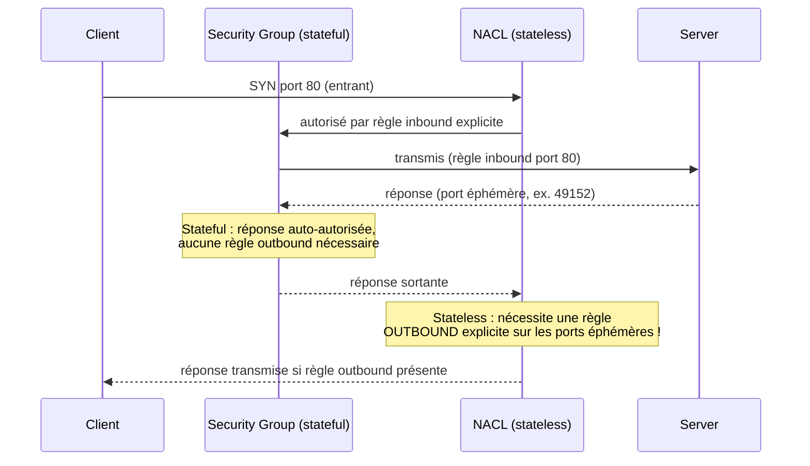
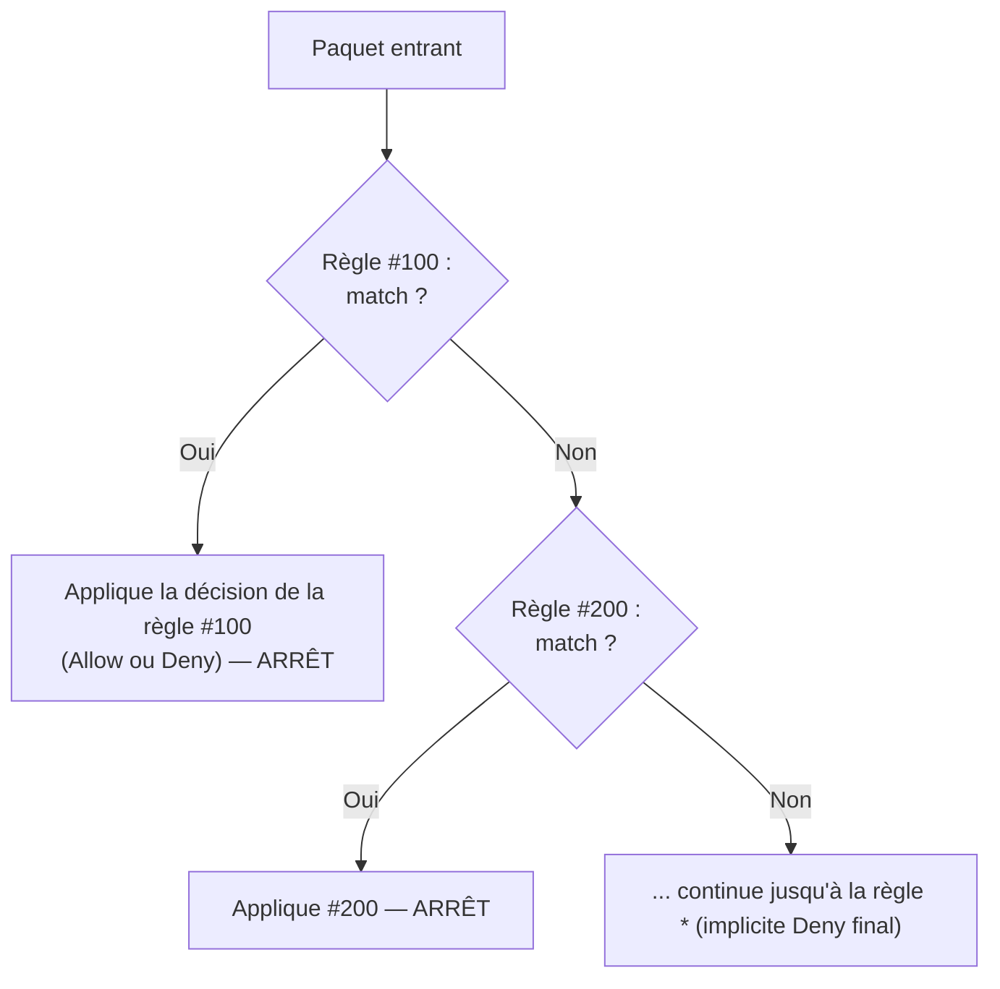

# Deux pare-feux, deux comportements radicalement différents

Security Groups et NACL (Network ACL) filtrent tous les deux du trafic réseau — mais leur comportement diffère sur un point que l'examen exploite à chaque session : **stateful vs stateless**.

## Comparatif complet

| | **Security Group** | **Network ACL (NACL)** |
|---|---|---|
| **Niveau** | instance (ENI) | subnet |
| **État** | **stateful** — le trafic retour est automatiquement autorisé | **stateless** — le trafic retour doit être **explicitement** autorisé |
| **Règles** | uniquement `Allow` (pas de Deny) | `Allow` **et** `Deny` |
| **Évaluation** | **toutes** les règles sont évaluées, la plus permissive gagne | les règles sont évaluées **dans l'ordre des numéros**, la première qui matche s'applique et arrête l'évaluation |
| **Association** | une instance peut avoir plusieurs SG | un subnet a exactement une NACL active |
| **Défaut** | tout refusé sauf ce qu'on autorise explicitement | la NACL par défaut autorise tout le trafic entrant/sortant |

> 🎯 **LE piège d'examen —** un Security Group est **stateful** : si une requête entrante est autorisée, la **réponse sortante correspondante est automatiquement autorisée**, sans règle sortante à écrire. Une NACL est **stateless** : autoriser le trafic entrant sur le port 80 **n'autorise pas automatiquement la réponse sortante** — il faut une règle sortante explicite, notamment pour les **ports éphémères**.

## Les ports éphémères : la conséquence concrète du piège

Quand un client se connecte à un serveur sur le port 80, sa machine ouvre la connexion depuis un **port source aléatoire** (dit *éphémère*, typiquement dans la plage `1024-65535`, souvent `32768-65535` sur Linux moderne). Le serveur répond **vers ce port éphémère**, pas vers le port 80.

> 🎯 **Piège d'examen —** pour une NACL, il faut donc une règle **outbound** autorisant la plage de ports éphémères (souvent `1024-65535`, à ajuster selon le client) en plus de la règle inbound sur le port 80 — sinon la réponse du serveur est bloquée en sortie et le client ne reçoit jamais rien, alors que la requête initiale semblait passer. C'est un classique de dépannage réseau à l'examen : « le serveur reçoit la requête (visible dans les logs applicatifs) mais le client ne reçoit jamais de réponse » → penser NACL outbound manquante sur les ports éphémères.

## Ordre d'évaluation des règles NACL

> 🎯 **Piège d'examen —** contrairement aux Security Groups (où toutes les règles sont évaluées et la plus permissive gagne), une **NACL évalue les règles par numéro croissant** et s'arrête à la **première** qui matche. Une règle `Deny` numérotée `50` bloquera un trafic même si une règle `Allow` numérotée `500` l'aurait autorisé — l'ordre des numéros compte.

## VPC Flow Logs

Les **VPC Flow Logs** capturent les métadonnées du trafic IP entrant/sortant au niveau d'un VPC, d'un subnet, ou d'une ENI (adresse source/destination, port, protocole, action ACCEPT/REJECT) — **pas le contenu** des paquets. Ils se livrent vers CloudWatch Logs ou S3, et sont l'outil de référence pour diagnostiquer « le trafic est-il bloqué par un SG ou une NACL, et où précisément ? ».

> 🎯 **Piège d'examen —** Flow Logs enregistrent des **métadonnées de connexion**, pas le contenu applicatif (donc pas utilisables pour inspecter le contenu d'une requête HTTP — c'est le rôle de WAF ou d'un outil de logging applicatif).

## À retenir

- Security Group = stateful, niveau instance, `Allow` uniquement, toutes les règles évaluées.
- NACL = stateless, niveau subnet, `Allow` **et** `Deny`, évaluées **dans l'ordre des numéros**, la première qui matche gagne.
- NACL exige des règles **outbound explicites** pour les ports éphémères — sinon la réponse à une requête entrante autorisée est bloquée en sortie.
- VPC Flow Logs = métadonnées de trafic (pas le contenu), pour diagnostiquer des blocages SG/NACL.
