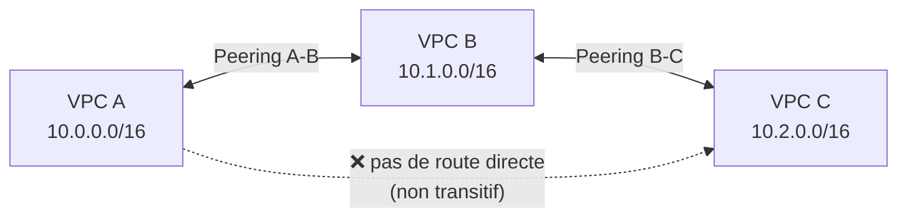
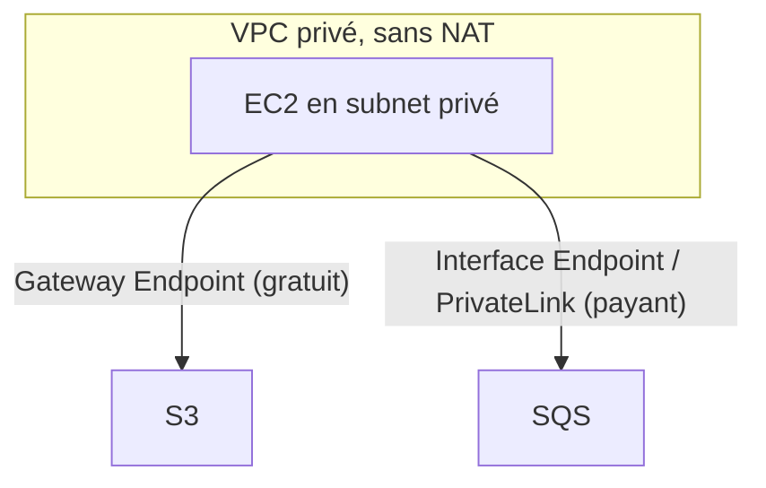
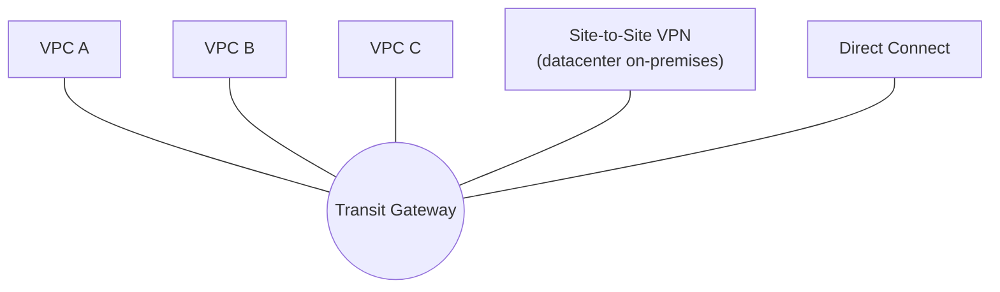

# Connecter plusieurs VPC entre eux

Un compte AWS a rarement un seul VPC : environnements séparés, équipes séparées, comptes séparés. Trois mécanismes permettent de les relier, avec des comportements très différents à bien distinguer.

## VPC Peering : direct, mais non transitif

Le **VPC Peering** relie deux VPC directement (même compte ou comptes différents, même région ou cross-region), comme si leurs CIDR faisaient partie du même réseau — à condition que les plages CIDR **ne se chevauchent pas**.

> 🎯 **LE piège d'examen —** le VPC Peering **n'est pas transitif**. Si A est peeré avec B, et B est peeré avec C, **A ne peut PAS communiquer avec C** à travers B — il faudrait un peering **direct** A-C. Avec beaucoup de VPC à interconnecter, le nombre de connexions peering explose (relation en étoile complète, N×(N-1)/2 connexions) — c'est précisément le problème que **Transit Gateway** résout (voir plus bas).

## VPC Endpoints : rester sur le réseau privé AWS

Un **VPC Endpoint** permet à des ressources d'un VPC d'atteindre un service AWS **sans passer par Internet** (pas d'IGW, pas de NAT Gateway nécessaire pour ce trafic).

| Type | Services concernés | Coût | Fonctionnement |
|---|---|---|---|
| **Gateway Endpoint** | **S3** et **DynamoDB** uniquement | **gratuit** | ajoute une entrée dans la route table du subnet |
| **Interface Endpoint** (PrivateLink) | la majorité des autres services (SQS, SNS, Kinesis, API Gateway, services tiers via PrivateLink...) | **payant** (facturé à l'heure + par Go traité) | crée une ENI avec une IP privée dans le subnet |

> 🎯 **LE piège de coût d'examen —** pour accéder à **S3 ou DynamoDB** depuis un subnet privé, toujours préférer un **Gateway Endpoint** (gratuit) plutôt qu'un Interface Endpoint (qui existe techniquement pour S3 aussi, mais qui facture inutilement quelque chose de gratuit par ailleurs). Un scénario qui optimise les coûts réseau d'un VPC privé accédant beaucoup à S3 attend explicitement la réponse « Gateway Endpoint », pas une simple NAT Gateway (qui, elle, est payante et route via Internet) ni un Interface Endpoint (payant, inutile ici).

## Transit Gateway : le hub-and-spoke transitif

**Transit Gateway (TGW)** est un routeur central (« hub ») auquel on rattache des VPC, des VPN, des connexions Direct Connect (« spokes ») — et contrairement au peering, le routage à travers un Transit Gateway **est transitif**.

> 🎯 **Piège d'examen —** avec un Transit Gateway, **VPC A peut atteindre VPC C** via le TGW sans peering direct — c'est transitif, contrairement au VPC Peering. Un scénario avec **plus de 3-4 VPC** à interconnecter, ou avec un besoin de connecter aussi des sites on-premises à tous les VPC de façon centralisée, pointe presque toujours vers **Transit Gateway** plutôt que vers une multiplication de peerings.

## Comparatif de synthèse

| | **VPC Peering** | **Transit Gateway** |
|---|---|---|
| **Transitif** | ❌ non | ✅ oui |
| **Topologie** | maillage (mesh), coûteux à grande échelle | hub-and-spoke, centralisé |
| **Cross-region** | oui | oui (avec des TGW inter-régions à connecter) |
| **Cas d'usage** | 2-3 VPC à relier ponctuellement | de nombreux VPC/sites, gestion centralisée du routage |

## À retenir

- VPC Peering = connexion directe **non transitive** ; A-B et B-C ne donnent jamais A-C.
- Gateway Endpoint = **gratuit**, uniquement pour S3/DynamoDB. Interface Endpoint (PrivateLink) = **payant**, pour la plupart des autres services.
- Transit Gateway = hub-and-spoke **transitif**, la solution qui scale pour de nombreux VPC/sites, contrairement au peering en mesh.
