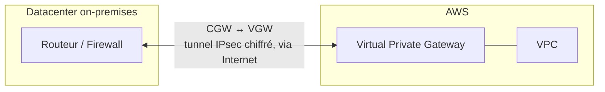
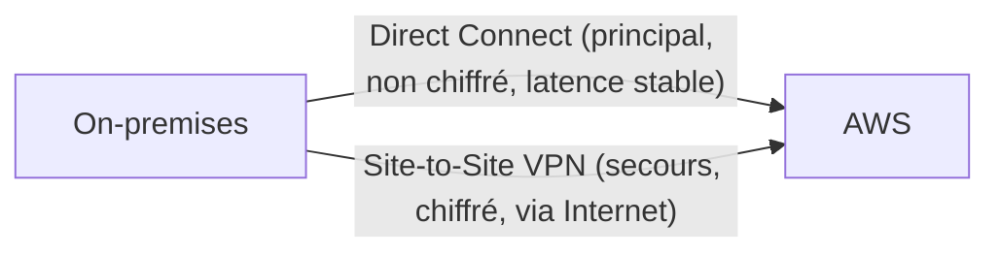
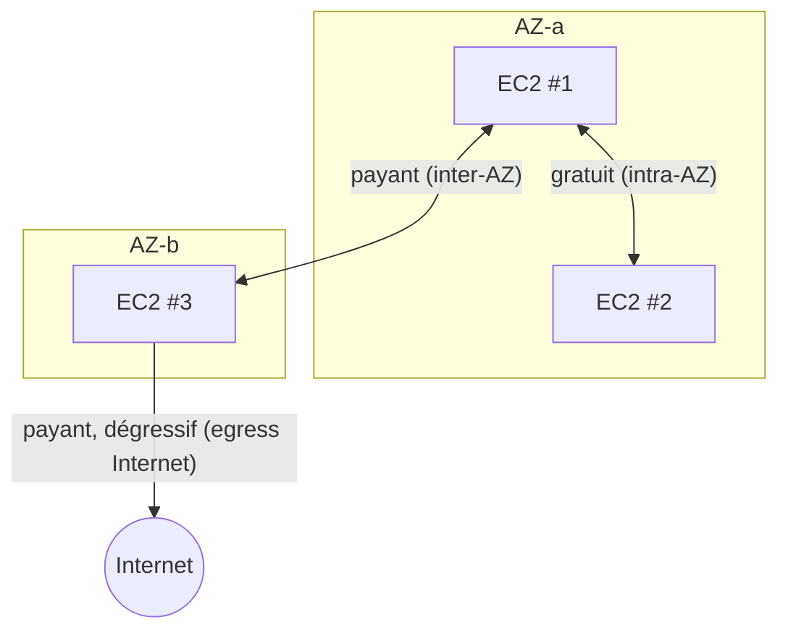

# Relier AWS à l'on-premises, et compter ce que ça coûte

Dernière brique du réseau AWS : comment un datacenter d'entreprise se connecte à un VPC, et — sujet sous-estimé mais très présent à l'examen — combien coûte réellement le trafic réseau selon son chemin.

## Site-to-Site VPN

Une connexion **Site-to-Site VPN** chiffre le trafic entre un VPC et un réseau on-premises, **via Internet** :

- **Virtual Private Gateway (VGW)** — la passerelle côté AWS, attachée au VPC.
- **Customer Gateway (CGW)** — la représentation côté AWS du routeur/firewall physique on-premises.

- Mise en place **rapide** (heures/jours), chiffré nativement (IPsec), mais **la latence dépend d'Internet** — pas de garantie de bande passante ni de latence stable.

## Direct Connect (DX)

**Direct Connect** est une connexion **réseau physique dédiée** entre un datacenter on-premises et AWS, **ne passant pas par Internet public**.

| | **Site-to-Site VPN** | **Direct Connect** |
|---|---|---|
| **Chiffrement natif** | ✅ oui (IPsec) | ❌ non (à ajouter soi-même, ex. VPN par-dessus DX) |
| **Latence** | variable (dépend d'Internet) | **stable et prévisible** |
| **Bande passante** | limitée par la connexion Internet | dédiée, jusqu'à plusieurs dizaines/centaines de Gbps |
| **Délai de mise en place** | heures/jours | **semaines à plusieurs mois** (câblage physique via un partenaire) |
| **Coût** | faible | plus élevé (frais de port + trafic sortant réduit) |

> 🎯 **Piège d'examen —** Direct Connect a un **délai de mise en place de plusieurs semaines à plusieurs mois** (raccordement physique). Un scénario qui demande une connectivité hybride **immédiate** ne peut **pas** attendre Direct Connect — il faut démarrer avec un Site-to-Site VPN, et migrer vers Direct Connect une fois disponible. Autre piège : Direct Connect ne chiffre **pas** nativement le trafic — la bonne pratique pour des données sensibles est de superposer un **VPN par-dessus** Direct Connect (ou d'utiliser Direct Connect + un VPN **de secours** en cas de coupure de la ligne dédiée, garantissant une continuité chiffrée même si le lien physique tombe).

## IPv6 et Egress-Only Internet Gateway

Un VPC peut activer un bloc **IPv6** en plus d'IPv4 (dual-stack). Les adresses IPv6 attribuées sont **publiques par conception** (pas de notion d'IP privée en IPv6 dans un VPC AWS) — pour permettre à une instance IPv6 de **sortir** vers Internet sans être **joignable depuis** Internet (équivalent IPv6 d'un comportement NAT sortant-seul), on utilise un **Egress-Only Internet Gateway**.

> 🎯 **Piège d'examen —** une **NAT Gateway ne fonctionne qu'en IPv4**. Pour la même logique de sortie-uniquement en IPv6, il faut un **Egress-Only Internet Gateway** — ce n'est pas une simple option de configuration de la NAT Gateway existante, c'est une ressource distincte.

## Network Firewall

**AWS Network Firewall** est un pare-feu réseau managé (couches 3-7) à déployer **au niveau du VPC**, pour du filtrage plus avancé qu'un Security Group/NACL : inspection de paquets avec état (stateful), règles basées sur des domaines, intégration avec des flux de threat intelligence (règles Suricata-compatibles).

> 🎯 **Piège d'examen —** Network Firewall s'utilise pour du filtrage **centralisé et avancé au niveau du trafic VPC-à-VPC ou VPC-à-Internet** (ex. bloquer certains domaines sortants pour tout un VPC) — un besoin que ni les Security Groups (niveau instance) ni les NACL (règles simples par port/protocole) ne couvrent.

## Coûts réseau : le tableau à connaître

| Trajet | Coût |
|---|---|
| **Intra-AZ** (même AZ) | **gratuit** |
| **Inter-AZ** (même région, AZ différentes) | payant (dans les deux sens en général) |
| **Inter-région** | payant, plus cher que l'inter-AZ |
| **Sortie vers Internet (egress)** | payant, dégressif par palier de volume |
| **Entrée depuis Internet (ingress)** | **gratuit** |

> 🎯 **Piège d'examen —** répartir des instances sur plusieurs AZ améliore la **disponibilité** mais introduit un **coût de trafic inter-AZ** qui n'existe pas en intra-AZ — un compromis résilience/coût que l'examen fait explicitement peser dans certains scénarios (ex. « le trafic entre le serveur applicatif et la base de données génère un coût inter-AZ inattendu »).

## À retenir

- VPN = rapide à mettre en place, chiffré nativement, latence variable (Internet). Direct Connect = latence stable, délai de mise en place de semaines/mois, **non chiffré nativement** (VPN par-dessus ou en secours recommandé).
- Egress-Only IGW = équivalent NAT pour IPv6 (NAT Gateway = IPv4 seulement).
- Network Firewall = filtrage avancé centralisé au niveau VPC, au-delà des Security Groups/NACL.
- Coûts réseau : intra-AZ gratuit, inter-AZ et inter-région payants, ingress gratuit, egress payant et dégressif.
