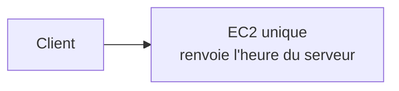
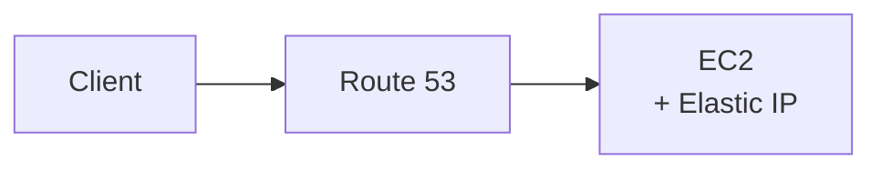
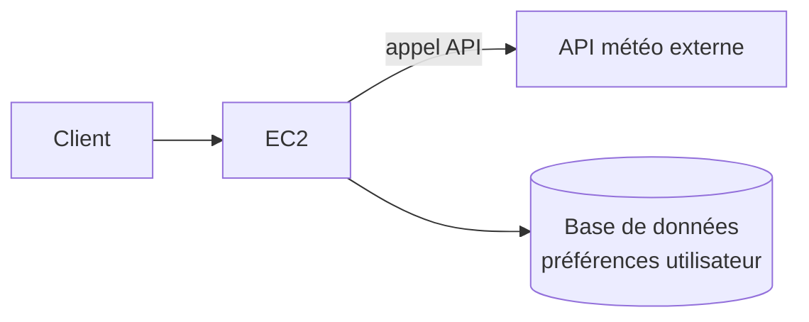
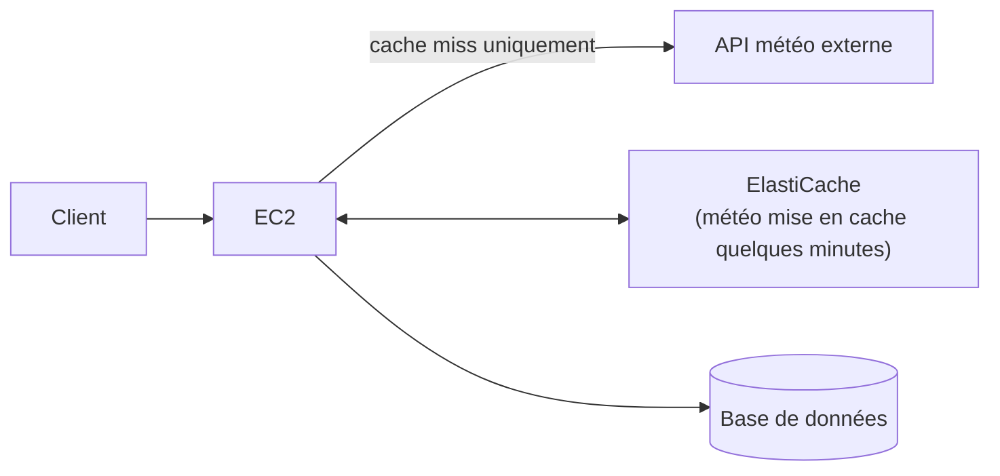
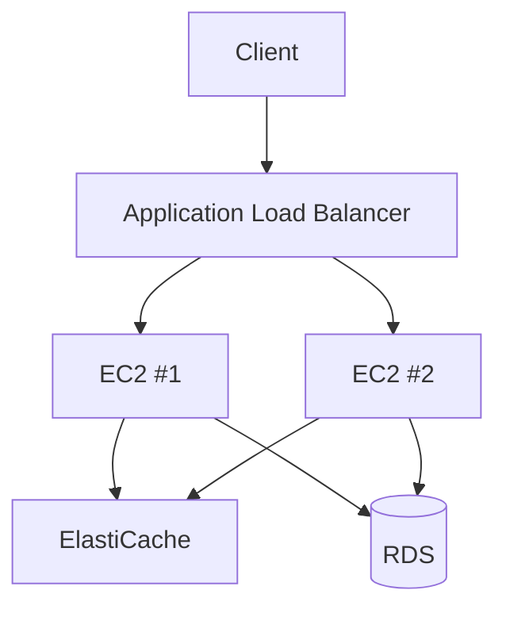
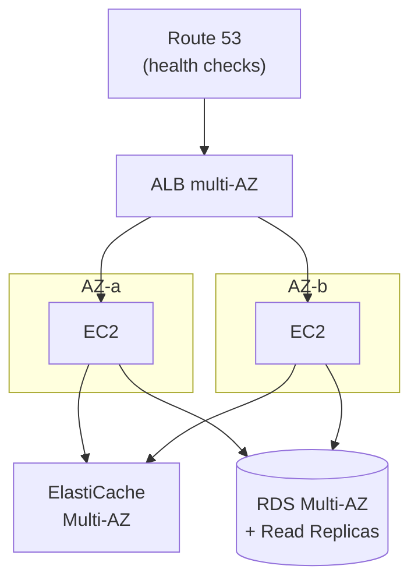

# L'exercice mental classique de l'examen

Le SAA-C03 aime poser une série de questions qui font **évoluer une même application**, étape par étape, vers plus de trafic et plus d'exigences de disponibilité. Refaisons cet exercice avec deux applications simples : **« Quelle heure est-il »** (stateless, aucune donnée à conserver) et **« Quels vêtements porter »** (a besoin d'un appel à une API météo externe et des préférences utilisateur — donc potentiellement stateful).

## Étape 1 — une application stateless, un seul serveur

L'application **« Quelle heure est-il »** ne stocke rien : chaque requête est indépendante (**stateless**). Un seul serveur EC2 suffit à la démo, mais c'est un **SPOF** (Single Point Of Failure) — si l'instance tombe, le service est indisponible.

## Étape 2 — DNS et Elastic IP

On ajoute un nom de domaine (Route 53) pointant vers une **Elastic IP** — l'IP reste stable même si l'instance est recréée. Toujours un SPOF, mais déjà plus pratique à opérer (pas besoin de changer le DNS à chaque redéploiement).

## Étape 3 — introduire du state : l'application « Quels vêtements porter »

Cette seconde application a besoin (1) d'appeler une API météo externe à chaque requête (latence, coût, risque de panne tierce) et (2) de connaître les préférences de l'utilisateur (stockées en base) — elle n'est **plus stateless**. Deux problèmes à anticiper avant de scaler : la **base de données devient un SPOF** aussi, et **appeler l'API météo à chaque requête est lent et redondant**.

## Étape 4 — introduire un cache

**ElastiCache** évite d'appeler l'API météo à chaque requête (la météo ne change pas seconde par seconde) — réduit la latence perçue et le coût d'appels externes.

## Étape 5 — passer à plusieurs instances : Load Balancer + Auto Scaling

Avec plusieurs instances derrière un **ALB** géré par un **Auto Scaling Group**, un nouveau problème stateful apparaît : si l'utilisateur doit rester sur **la même instance** pendant une session (panier, formulaire multi-étapes), comment le garantir ? Trois options, avec des compromis différents (voir section suivante).

## Étape 6 — la haute disponibilité complète

L'architecture finale répartit **tout** sur au moins deux AZ : ALB (nativement multi-AZ), instances applicatives (Auto Scaling Group multi-AZ), cache (ElastiCache avec réplication), base de données (RDS Multi-AZ pour le failover, Read Replicas pour la charge de lecture). Aucun composant ne doit plus être un SPOF.

> 🎯 **Piège d'examen —** l'ordre logique de résolution des problèmes suit toujours ce schéma : (1) identifier le SPOF, (2) ajouter de la redondance (multi-AZ), (3) ajouter du cache pour réduire la charge/latence sur les dépendances externes, (4) ajouter du scaling horizontal (ALB + ASG), (5) gérer explicitement le state partagé entre instances (sessions). Un scénario d'examen qui décrit un seul serveur qui « commence à ramer » attend généralement les étapes 5-6, **pas** juste « augmenter la taille de l'instance » (scaling vertical, limité et toujours SPOF).

## Gérer les sessions entre plusieurs instances

| Solution | Fonctionnement | Limite |
|---|---|---|
| **Stickiness (session affinity) sur l'ALB** | l'ALB route toujours le même client vers la même instance (cookie) | si l'instance tombe, la session est **perdue** ; répartition de charge moins uniforme |
| **ElastiCache** (Redis/Memcached) | les sessions sont stockées dans un cache partagé, accessible par toutes les instances | rapide, mais une session peut être perdue en cas d'éviction/panne du cache non répliqué |
| **DynamoDB** | les sessions sont stockées dans une base **durable** partagée, accessible par toutes les instances | légèrement plus de latence qu'un cache mémoire, mais **la session survit** à la perte d'une instance ou d'un nœud de cache |

> 🎯 **Piège d'examen —** la **stickiness** résout un problème de routage, pas de durabilité : si l'instance cible tombe, la session est perdue quoi qu'il arrive. Pour une session **qui doit survivre** à la panne d'une instance individuelle, il faut externaliser l'état vers un **magasin partagé** (ElastiCache pour la vitesse, DynamoDB pour la durabilité) — jamais compter sur la stickiness seule comme mécanisme de résilience.

## À retenir

- Progression classique : stateless → DNS/Elastic IP → introduction de state (DB/API externe) → cache → scaling horizontal (ALB+ASG) → multi-AZ complet.
- Un scénario « le serveur unique ne suit plus » attend une redondance horizontale + multi-AZ, pas juste un plus gros serveur.
- Sessions partagées entre plusieurs instances : stickiness (routage, pas de durabilité) vs ElastiCache (rapide) vs DynamoDB (durable) — la stickiness seule ne protège jamais d'une panne d'instance.
