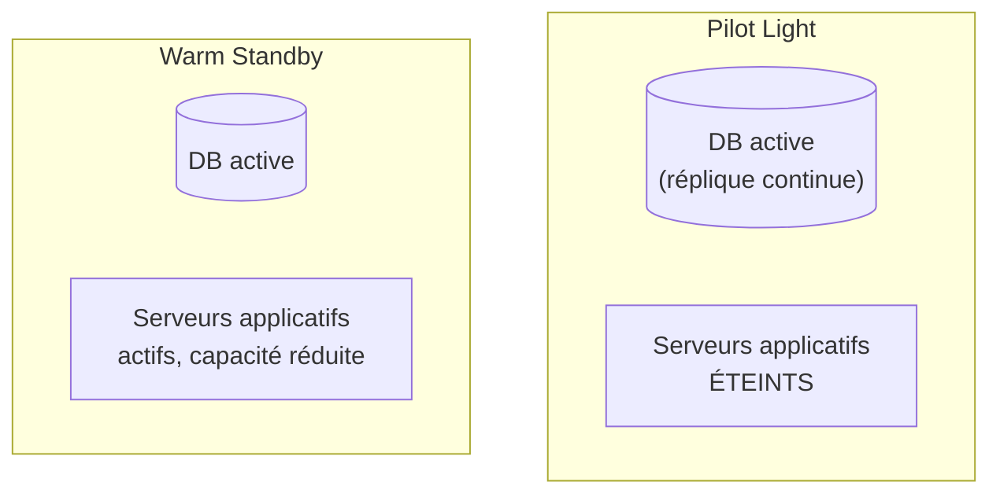

# Se préparer au pire, à un coût maîtrisé

Le **Disaster Recovery (DR)** planifie la reprise d'activité après un sinistre majeur (panne région entière, corruption de données, erreur humaine catastrophique). C'est l'un des sujets les plus classiques du SAA-C03 : deux métriques, quatre stratégies, un compromis coût/rapidité à chaque fois.

## RTO et RPO : les deux métriques qui pilotent tout

| Métrique | Question à laquelle elle répond |
|---|---|
| **RTO (Recovery Time Objective)** | combien de **temps** peut-on tolérer d'indisponibilité avant que le service soit rétabli ? |
| **RPO (Recovery Point Objective)** | combien de **données** peut-on se permettre de perdre (mesuré en temps depuis la dernière sauvegarde valide) ? |

> 🎯 **Piège d'examen —** RTO parle de **durée d'indisponibilité**, RPO parle de **perte de données**. Un RPO de 1 heure signifie qu'on accepte de perdre jusqu'à 1 heure de données (donc des sauvegardes/réplications au moins toutes les heures) — ce n'est **pas** un temps de restauration. Une question qui échange les deux définitions est un piège classique.

## Les 4 stratégies DR, du moins cher au plus rapide

| Stratégie | Principe | RTO/RPO typiques | Coût |
|---|---|---|---|
| **Backup & Restore** | sauvegardes régulières (snapshots EBS/RDS, AWS Backup) stockées, **rien ne tourne** dans la région de secours en attendant | **heures** | le plus faible |
| **Pilot Light** | les composants critiques (souvent la base de données) tournent **en continu**, à échelle minimale, dans la région de secours ; le reste (serveurs applicatifs) est **éteint**, prêt à être démarré | **dizaines de minutes** | faible-moyen |
| **Warm Standby** | une version **réduite mais fonctionnelle** de l'architecture complète tourne en permanence dans la région de secours (moins d'instances/capacité qu'en prod), prête à **scaler** rapidement en cas de bascule | **minutes** | moyen-élevé |
| **Multi-Site Active/Active** | l'architecture complète tourne **simultanément** dans plusieurs régions, se partageant déjà le trafic réel | **quasi nul** (bascule immédiate) | le plus élevé |

> 🎯 **Piège d'examen —** la différence entre **Pilot Light** et **Warm Standby** est la plus testée : dans le Pilot Light, **seule la donnée** (souvent une réplique de base de données) est active en continu, le reste est éteint et doit être **démarré** (Auto Scaling, lancement d'instances) au moment de la bascule — d'où un RTO plus long que le Warm Standby, où une version **déjà fonctionnelle** (juste réduite en capacité) tourne en permanence et n'a besoin que de **scaler**, pas de démarrer depuis zéro.

## Choisir la bonne stratégie : le compromis coût/rapidité

Le choix dépend toujours du **RTO/RPO exigé par le métier** :

- Un site vitrine peu critique tolère un **RTO de plusieurs heures** → Backup & Restore suffit, le moins cher.
- Une application de paiement critique exige un **RTO de quelques minutes** → Warm Standby ou Multi-Site Active/Active, malgré le coût.

> 🎯 **Piège d'examen —** un scénario qui exige un **RTO proche de zéro** mais présente un **budget très serré** est une contradiction volontaire : il n'existe pas de solution DR gratuite avec un RTO quasi nul. L'examen teste ici la capacité à **prioriser l'exigence métier explicite** (le RTO/RPO donné dans l'énoncé) plutôt que de choisir par réflexe une stratégie « prestigieuse » (Multi-Site) sans que le besoin l'exige réellement — la bonne réponse est souvent la stratégie **la moins chère qui respecte quand même le RTO/RPO donné**, pas systématiquement la plus poussée.

## À retenir

- RTO = durée d'indisponibilité tolérée ; RPO = quantité de données perdues tolérée (mesurée en temps depuis la dernière sauvegarde).
- 4 stratégies, du moins cher/plus lent au plus cher/plus rapide : Backup & Restore → Pilot Light → Warm Standby → Multi-Site Active/Active.
- Pilot Light = seule la donnée est active en continu (le reste démarre à la bascule) ; Warm Standby = une version réduite mais **déjà fonctionnelle** tourne en permanence (elle scale, ne démarre pas de zéro).
- Toujours choisir la stratégie **la moins chère qui respecte le RTO/RPO exigé** — ni plus, ni moins.
