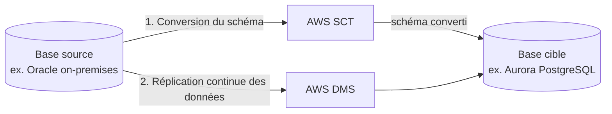

# Trois familles de migration, trois outils

Migrer vers AWS ne se résume pas à « copier des fichiers » : une base de données, un serveur entier, ou plusieurs pétaoctets de données froides ne se migrent pas avec le même outil.

## DMS (Database Migration Service) et SCT

**DMS** migre une base de données source vers une base cible **avec un minimum d'interruption** (le service continue de tourner pendant la migration, via une réplication continue jusqu'au basculement final) :

- **Migration homogène** — même moteur des deux côtés (ex. MySQL → MySQL sur RDS) : DMS suffit seul.
- **Migration hétérogène** — moteurs différents (ex. Oracle → Aurora PostgreSQL) : le **schéma** doit d'abord être converti par **SCT (Schema Conversion Tool)**, puis DMS migre les **données**.

> 🎯 **Piège d'examen —** DMS migre les **données**, jamais le **schéma** dans une migration hétérogène — c'est le rôle de SCT, en amont. Une question qui décrit une migration Oracle → PostgreSQL avec « DMS seul, sans SCT » décrit une migration incomplète (le schéma cible n'existe pas encore).

### Migrer vers RDS/Aurora

Au-delà de DMS, des migrations plus simples existent : un `mysqldump`/`pg_dump` classique vers une instance RDS neuve (pour de petits volumes, avec interruption de service acceptable), ou une **snapshot restaurée** directement en RDS/Aurora si la source est déjà sur EC2 avec le même moteur.

## AWS Backup : centraliser les sauvegardes

**AWS Backup** centralise les politiques de sauvegarde de plusieurs services (EBS, RDS, DynamoDB, EFS, FSx...) en un seul endroit :

- **Backup plans** — règles de fréquence et de rétention appliquées automatiquement aux ressources taguées.
- **Vault Lock** — verrouille un coffre de sauvegarde en mode **WORM** (Write Once Read Many) : même un compte root ne peut plus supprimer les sauvegardes avant l'expiration de la politique de rétention — utile pour une conformité réglementaire stricte (protection contre un ransomware ou un admin compromis).

## MGN (Application Migration Service)

**MGN** migre des serveurs entiers (« lift-and-shift ») — physiques, virtuels ou déjà sur un autre cloud — vers AWS, en répliquant en continu le disque du serveur source vers AWS, jusqu'à un **cutover** (bascule) avec une interruption minimale.

> 🎯 **Piège d'examen —** MGN remplace l'ancien service **SMS (Server Migration Service)**, aujourd'hui retiré — si l'examen mentionne encore SMS, la réponse moderne attendue reste **MGN**.

## Transferts massifs de données : le comparatif

| Outil | Volume typique | Connectivité | Cas d'usage |
|---|---|---|---|
| **DataSync** | To à Po, transferts **récurrents** | via Internet ou Direct Connect | synchronisation continue on-premises ↔ AWS (NFS/SMB ↔ S3/EFS/FSx) |
| **Snowball Edge** | jusqu'à plusieurs dizaines de To par appareil | **hors ligne** (transport physique du boîtier) | gros volume **ponctuel**, bande passante réseau insuffisante ou indisponible |
| **Snowmobile** | jusqu'à l'**exaoctet** (camion semi-remorque) | hors ligne | migration de datacenter entier |
| **Direct Connect** | tout volume, **en continu** | ligne dédiée | trafic hybride permanent (pas un simple transfert ponctuel) |

> 🎯 **Piège d'examen —** la règle de décision classique : si le temps de transfert **par le réseau existant** dépasse ce qu'une solution physique (Snowball) prendrait (transport + traitement), **Snowball devient plus rapide qu'Internet**. AWS documente cette règle informelle : au-delà d'environ **une semaine** de temps de transfert réseau estimé pour le volume concerné, Snowball devient compétitif. DataSync, lui, est fait pour des transferts **récurrents** (pas un aller simple ponctuel) — un scénario qui décrit une synchronisation continue on-premises/S3 attend DataSync, pas Snowball.

## VMware Cloud on AWS

**VMware Cloud on AWS** permet de faire tourner un environnement **VMware vSphere** existant directement sur une infrastructure AWS bare-metal dédiée — utile pour une migration progressive (« lift-and-shift » sans reconstruire les VM) d'un datacenter VMware vers AWS, avec un accès natif ensuite aux autres services AWS depuis ce même environnement.

## À retenir

- DMS migre les **données** (avec interruption minimale) ; SCT convertit le **schéma** en amont pour les migrations hétérogènes.
- AWS Backup centralise les sauvegardes multi-services ; Vault Lock = rétention WORM incontournable, même par le root.
- MGN = migration de serveurs entiers (lift-and-shift), remplace l'ancien SMS.
- DataSync = transferts **récurrents** ; Snowball/Snowmobile = transferts **massifs ponctuels hors ligne** quand le réseau est trop lent ou indisponible ; Direct Connect = connectivité **continue**, pas un simple transfert.
