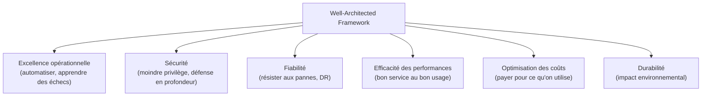

# Zoomer arrière : les principes, le reste de l'écosystème, et comment répondre le jour J

Dernière leçon du parcours : le cadre de référence AWS pour évaluer une architecture, un tour rapide des services encore utiles à l'examen mais non couverts ailleurs, et une méthode concrète pour lire les questions du SAA-C03.

## CloudFormation : l'Infrastructure as Code AWS

**CloudFormation** décrit une infrastructure entière (VPC, EC2, RDS, IAM...) dans un fichier **template** (YAML/JSON) versionnable, pour la créer/modifier/détruire de façon **reproductible et automatisée**, plutôt qu'à la main dans la console.

```yaml
Resources:
  WebServer:
    Type: AWS::EC2::Instance
    Properties:
      InstanceType: t3.micro
      ImageId: ami-0123456789abcdef0
```

- Un **stack** est une instance déployée d'un template ; le **changeset** prévisualise l'impact d'une modification avant de l'appliquer.
- CloudFormation gère les **dépendances** entre ressources et le **rollback automatique** en cas d'échec de déploiement.

> 🎯 **Piège d'examen —** CloudFormation ne s'oppose pas à Elastic Beanstalk : CloudFormation décrit **l'infrastructure** (bas niveau, contrôle total), Beanstalk **orchestre le déploiement applicatif** (haut niveau, PaaS-like) et utilise en réalité CloudFormation **en interne**.

## Elastic Beanstalk, en une ligne

**Elastic Beanstalk** est une plateforme (PaaS) qui déploie automatiquement une application (code source + configuration) en provisionnant EC2/ALB/Auto Scaling/RDS pour toi — on garde le contrôle fin en option, mais l'essentiel est géré.

## L'écosystème restant utile à l'examen

| Service | Rôle |
|---|---|
| **SES (Simple Email Service)** | envoi d'emails transactionnels/marketing à grande échelle |
| **Pinpoint** | campagnes de notifications multi-canal (email, SMS, push) ciblées |
| **Batch** | exécution de jobs batch conteneurisés à grande échelle, provisionnant automatiquement le calcul nécessaire (EC2/Fargate) |
| **AppFlow** | intégration de flux de données managée entre AWS et des SaaS (Salesforce, Slack...), sans code d'intégration à écrire |
| **Amplify** | framework + hébergement pour construire rapidement des applications web/mobile connectées à des services AWS (auth, API, storage) |
| **Trusted Advisor** | recommandations automatiques sur coût, sécurité, résilience, performance, quotas de service — certaines vérifications ne sont disponibles qu'avec un support Business/Enterprise |

> 🎯 **Piège d'examen —** **Trusted Advisor** est souvent confondu avec Config/GuardDuty : Trusted Advisor donne des **recommandations générales de bonnes pratiques** (ex. « ce security group autorise 0.0.0.0/0 sur le port 22 », « cette Reserved Instance expire bientôt ») sur 5 catégories (coût, sécurité, résilience, performance, quotas de service) — ce n'est ni un outil de conformité continue personnalisable (Config), ni un outil de détection de menaces actives (GuardDuty).

## Le Well-Architected Framework : les 6 piliers



| Pilier | Question centrale |
|---|---|
| **Excellence opérationnelle** | peut-on déployer, surveiller et améliorer le système de façon automatisée et réversible ? |
| **Sécurité** | les accès suivent-ils le moindre privilège, les données sont-elles protégées à tous les niveaux ? |
| **Fiabilité** | le système résiste-t-il aux pannes (matérielles, AZ, région) et se rétablit-il selon le RTO/RPO défini ? |
| **Efficacité des performances** | utilise-t-on le bon type de ressource pour le bon usage, et cela évolue-t-il avec la charge ? |
| **Optimisation des coûts** | paie-t-on pour ce qui est réellement utilisé, sans sur-provisionnement ? |
| **Durabilité** *(6ᵉ pilier, ajouté plus récemment)* | l'architecture minimise-t-elle son empreinte environnementale (efficacité énergétique, choix de région, dimensionnement) ? |

> 🎯 **Piège d'examen —** les 6 piliers **s'opposent parfois entre eux** (plus de résilience coûte souvent plus cher ; plus de sécurité peut ralentir un déploiement) — l'examen ne demande jamais de maximiser un pilier au détriment de tous les autres, mais de trouver le **meilleur compromis pour le contexte métier donné dans l'énoncé**.

## Stratégie de lecture des questions à l'examen

1. **Lire la question en entier avant de lire les réponses** — beaucoup de contexte (contrainte de coût, RTO/RPO, criticité) change la bonne réponse.
2. **Repérer les mots-clés qualificatifs** : « **MOST** cost-effective », « **LEAST** operational overhead », « **MINIMUM** changes », « immediately », « without downtime » — ils désignent souvent **plusieurs réponses techniquement correctes**, mais une seule qui respecte le mot-clé précis.
3. **Éliminer d'abord les réponses absurdes** (violent une bonne pratique connue : root utilisé au quotidien, Access Key en dur, subnet public pour une base de données...) — il en reste généralement 2 sur 4, plus faciles à départager.
4. **Se méfier de l'option qui semble « la plus impressionnante techniquement »** — l'examen teste souvent la capacité à choisir la solution **suffisante et adaptée au contexte**, pas la plus sophistiquée disponible (ex. Multi-Site Active/Active alors qu'un Warm Standby suffirait au RTO donné).
5. **Ne jamais changer une réponse sur une intuition tardive** sans une raison concrète relue dans l'énoncé — la première lecture attentive est souvent la bonne.

## À retenir

- CloudFormation = IaC bas niveau ; Beanstalk = PaaS haut niveau qui utilise CloudFormation en interne — pas des concurrents.
- Trusted Advisor = recommandations de bonnes pratiques sur 5 catégories (coût, sécurité, résilience, performance, quotas), pas un outil de conformité ni de détection de menaces.
- Well-Architected = 6 piliers (opérationnel, sécurité, fiabilité, performance, coût, durabilité) — toujours un compromis contextuel, jamais une maximisation isolée d'un seul pilier.
- À l'examen : lire en entier, repérer MOST/LEAST, éliminer les pratiques absurdes, choisir la solution **suffisante**, pas la plus impressionnante.
