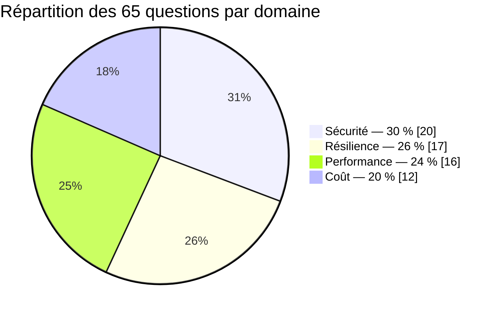

# Test blanc — AWS Certified Solutions Architect – Associate (SAA-C03)

Ce test blanc reproduit le **format réel** de l'examen de certification AWS SAA-C03. La
règle du jeu : si tu le réussis dans les mêmes conditions que le vrai examen (temps limité,
sans recherche, sans pause), tu es prêt·e à passer — et à valider — la certification.

## 1. Le format réel de l'examen

| | |
|---|---|
| Nombre de questions | **65** |
| Durée | **130 minutes** (2 h 10) |
| Score | Échelle **100 à 1000** |
| Seuil de réussite | **720 / 1000**, soit environ **72 %** — c'est-à-dire viser **~47 bonnes réponses sur 65** |
| Questions notées | **~50** questions comptent réellement pour le score |
| Questions non notées | **~15** questions supplémentaires, **invisibles et non identifiables**, servent à AWS pour calibrer de futures versions de l'examen. Impossible de savoir lesquelles — traite **chaque question** comme si elle comptait |
| Type de réponse | QCM à une seule bonne réponse **et** QCM à choix multiples (« Select TWO », « Select THREE ») — d'après les retours de candidats (estimation non officielle), environ **15 %** des questions réelles demandent plusieurs réponses |
| Aménagement non-anglophone | Si l'anglais n'est pas ta langue maternelle, tu peux demander lors de l'inscription un **temps supplémentaire de 30 minutes** (« ESL accommodation », gratuit sur demande) |

> **Important pour ce test blanc** : pour simplifier la correction automatique sur la
> plateforme, **toutes les questions ci-dessous n'ont qu'une seule bonne réponse**. Le jour
> de l'examen réel, garde le réflexe de bien lire la consigne : une question « Select TWO »
> mal traitée (une seule case cochée) est automatiquement fausse, même si l'une des deux
> réponses cochées est correcte.

## 2. Les 4 domaines de l'examen (et leur poids)

| Domaine officiel SAA-C03 | Poids | Question type | Questions dans ce test |
|---|---|---|---|
| **Design Secure Architectures** | 30 % | IAM, KMS, VPC, chiffrement, WAF/Shield/GuardDuty… | 20 |
| **Design Resilient Architectures** | 26 % | Multi-AZ, réplicas, DR (RTO/RPO), Auto Scaling, Route 53… | 17 |
| **Design High-Performing Architectures** | 24 % | Caching, CDN, DynamoDB/RDS scaling, découplage… | 16 |
| **Design Cost-Optimized Architectures** | 20 % | Classes de stockage, Spot/RI/Savings Plans, serverless… | 12 |

> Repère : la **sécurité pèse le plus lourd** (près d'1 question sur 3). Ne néglige jamais
> IAM (rôles, policies, resource-based policies) et le chiffrement (KMS) — ce sont les
> sujets les plus fréquemment testés, souvent en filigrane dans des questions d'un autre
> domaine (ex. une question de résilience peut avoir un distracteur qui expose des
> identifiants en clair).

## 3. Méthode : lire une question scénario

L'examen réel ne pose presque jamais de question « sèche » de cours. Il pose un
**scénario** de 2 à 5 phrases, puis une question qui se termine souvent par un **adverbe
qui décide de la bonne réponse**. Repère-le en premier, avant même de lire les options :

| Adverbe / expression | Ce qu'il change |
|---|---|
| **MOST cost-effective** | Écarte les solutions techniquement correctes mais chères (Multi-AZ permanent, cluster dédié, RI courte durée…) |
| **LEAST operational overhead** | Écarte tout ce qui demande de gérer des serveurs, écrire du code custom, opérer un cron — privilégie le **managé/serverless** |
| **MOST resilient / highly available** | Écarte les architectures mono-AZ, mono-région, sans redondance |
| **MOST secure** | Écarte les solutions publiques, les accès trop larges, les secrets en dur |
| **MOST performant / lowest latency** | Écarte tout ce qui ajoute un aller-retour réseau ou une couche non nécessaire |

**Exemple** : *« Une entreprise e-commerce héberge son application sur des instances EC2
derrière un ALB. Le trafic double pendant les soldes puis retombe. Quelle solution répond
au besoin avec le **MOINS de surcharge opérationnelle** ? »*

Ici, plusieurs réponses peuvent « marcher » techniquement (ajouter des instances à la
main, planifier un scaling manuel un jour à l'avance, utiliser un Auto Scaling Group avec
une politique de scaling automatique…). Le **MOINS de surcharge opérationnelle** élimine
tout ce qui demande une intervention humaine récurrente : la bonne réponse est presque
toujours l'option **la plus automatisée/managée**, ici un **Auto Scaling Group avec une
politique de scaling dynamique** (target tracking), pas une intervention manuelle.

> **Repère** : quand deux réponses semblent « correctes », c'est presque toujours l'adverbe
> de la question qui les départage — pas une différence de correction technique.

## 4. Stratégie de gestion du temps

- **130 minutes / 65 questions ≈ 2 minutes par question.** Si une question te prend plus
  de 2-3 minutes, **marque-la** (flag « mark for review » dans l'examen réel) et **passe à
  la suivante** — tu pourras y revenir à la fin.
- Fais un **premier passage complet** en répondant à tout ce qui te semble clair. Ne laisse
  jamais une question sans réponse (aucune pénalité pour une mauvaise réponse) : si tu
  hésites vraiment, élimine les distracteurs absurdes et choisis la moins mauvaise option
  avant de marquer la question pour révision.
- Garde **15-20 minutes** en fin de session pour revenir sur les questions marquées.
- Ne change pas ta première réponse sans une **raison précise** (un mot du scénario que tu
  avais mal lu la première fois) — le premier instinct est souvent le bon.

## 5. Consigne pour ce test blanc

1. Passe-le **en une seule fois**, sans pause, sans recherche externe, **chronométré à
   130 minutes**.
2. Réponds aux **65 questions**, dans l'ordre.
3. Vise **au moins 47 / 65** (≈ 72 %, le seuil réel de réussite).
4. Une fois terminé, relis **toutes les explications**, y compris celles des questions
   réussies — chaque distracteur explique pourquoi un service ou une option, pourtant
   plausible, ne répond pas au besoin exact du scénario.

Si tu valides ce test dans ces conditions, tu es prêt·e à réserver ta session d'examen
réelle. Bonne chance.
