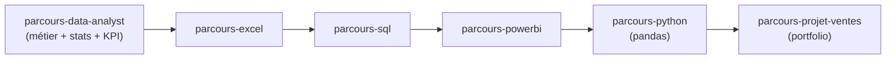

# Bienvenue — ce parcours est ton point de départ

Ce parcours est le **HUB** du cursus Data-Analyst : il pose les **fondations transverses**
(le métier, les statistiques utiles, les KPI par domaine) et te sert d'**index** vers les
parcours-briques qui t'amènent à l'employabilité, avec un **projet portfolio** à la clé.

Tu as déjà la théorie (SQL, Python, BI, ML). Ce qui te manque pour une offre d'emploi,
c'est la **pratique appliquée** et un **portfolio** qu'on peut montrer. Le cursus est
conçu exactement pour ça.

## La carte du cursus

## L'ordre conseillé

Suis-les dans cet ordre — chaque brique réutilise la précédente :

1. **`parcours-data-analyst`** (ici) — le métier, le vocabulaire, les stats utiles, les
   KPI par domaine. La boussole avant les outils.
2. **`parcours-excel`** — explorer, nettoyer, les TCD. L'outil que tout le monde demande.
3. **`parcours-sql`** — extraire et agréger depuis la base. La compétence socle.
4. **`parcours-powerbi`** — modéliser et publier des **dashboards** interactifs.
5. **`parcours-python`** — la **jambe pandas** : automatiser, gros volumes, vers le ML.
6. **`parcours-projet-ventes`** — le **projet final** Vente/Achat, de bout en bout,
   à mettre dans ton portfolio.

> **À retenir —** les briques s'appellent par leur **slug** (tu les retrouves dans le
> catalogue). Une seule méthode (filtrer → grouper → agréger → comparer) revient partout ;
> seuls l'outil et les KPI changent.

## Ce que tu vas apprendre dans ce HUB

- **Module 1 — Le métier** : rôle, workflow, vocabulaire (dimension, mesure, KPI,
  granularité), panorama des outils et domaines.
- **Module 2 — Statistiques utiles** : moyenne vs médiane, dispersion, pourcentages vs
  points de %, taux de variation, et les pièges qui font dire n'importe quoi à un chiffre.
- **Module 3 — KPI par domaine métier** : Vente/Achat, Logistique, RH, Finance — les
  indicateurs concrets qu'on te demandera de calculer.

> **Repère —** dans ce HUB, tu pratiques la **logique d'analyse** en TS sur des tableaux
> d'objets (l'équivalent d'une table). C'est la même logique qu'en SQL, Excel ou pandas —
> tu la transposeras outil par outil dans les parcours suivants.
