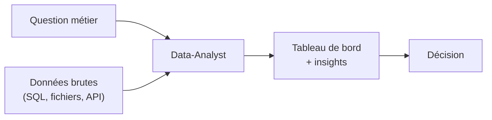

# Étape 1 — Le métier de Data-Analyst

Tu as déjà la théorie (SQL, modélisation, BI). Ce parcours est là pour combler ce qui
manque sur une offre d'emploi : **la pratique appliquée** et un **portfolio**. On commence
par cadrer le métier — pas en académique, mais comme une recruteuse le voit.

> **Objectif de l'étape —** savoir décrire le rôle, parler le bon vocabulaire (KPI,
> dimension, mesure, granularité) et situer chaque outil du marché.

## Ce que fait vraiment un·e Data-Analyst

Un·e Data-Analyst **transforme des données brutes en décisions**. Ce n'est pas du Data
Engineering (construire des pipelines) ni du Data Science (modèles prédictifs avancés).
C'est le pont entre la donnée et le métier.

## Les livrables concrets

Sur le terrain, on te demandera surtout :

- un **tableau de bord** (Power BI, parfois Excel) qui se met à jour ;
- une **analyse ponctuelle** : « pourquoi le CA a baissé en mars ? » ;
- un **rapport** ou une présentation avec des **recommandations** ;
- des **requêtes SQL** réutilisables, parfois une vue ou un export récurrent ;
- du **nettoyage / préparation** de données (souvent 60-80 % du temps réel).

## Les 3 qualités qui font la différence à l'embauche

1. **Rigueur** : un chiffre faux détruit la confiance. On vérifie ses totaux.
2. **Sens métier** : comprendre *pourquoi* on demande ce chiffre, pas juste le sortir.
3. **Restitution** : savoir raconter une donnée simplement (storytelling).

> **À retenir —** ton métier n'est pas « produire des graphiques », c'est **aider à
> décider**. Chaque livrable doit répondre à une question métier claire.
