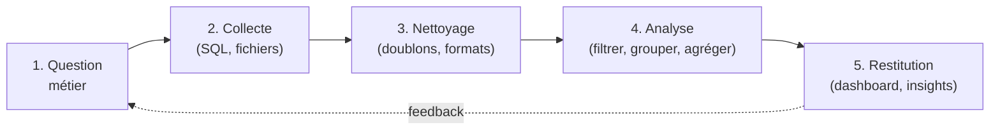

# Le workflow : de la question à la décision

Toute mission d'analyse suit le même fil. Le connaître t'évite de foncer sur les chiffres
avant d'avoir compris la question — l'erreur de débutant la plus fréquente.

## 1. Cadrer la question

Avant tout : **que veut-on vraiment savoir ?** « Le CA » ne suffit pas. CA de quoi, sur
quelle période, comparé à quoi ? Reformule en une phrase précise et fais-la valider.

## 2. Collecter

Identifier les **sources** (base SQL, exports Excel, API). Quel niveau de détail ?
Quelle fraîcheur ? On rapatrie le strict nécessaire.

## 3. Nettoyer

L'étape qu'on sous-estime toujours. Doublons, valeurs manquantes, dates au mauvais format,
catégories mal orthographiées (`Office` vs `office `). **Données sales = conclusions
fausses.**

## 4. Analyser

Le cœur : **filtrer → grouper → agréger → calculer**. C'est exactement la même logique en
SQL (`WHERE`/`GROUP BY`), en Excel (TCD) et en pandas (`groupby`). Tu la pratiqueras en
JS/TS dans ce parcours, parce que c'est elle qui compte, pas l'outil.

## 5. Restituer

Le bon graphique, le bon message, des recommandations. Un chiffre sans contexte ne sert à
rien : il faut **comparer** (vs mois dernier, vs objectif, vs autre région).

> **Repère —** si tu sautes l'étape 1, tu produiras un joli dashboard… qui ne répond pas à
> la question. Toujours commencer par *pourquoi*.
