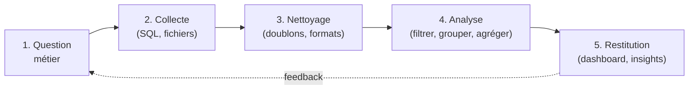

# Le workflow : de la question à la décision

Toute mission d'analyse suit le même fil. Le connaître t'évite de foncer sur les chiffres
avant d'avoir compris la question — l'erreur de débutant la plus fréquente.




## 1. Cadrer la question

Avant tout : **que veut-on vraiment savoir ?** « Le CA » ne suffit pas. CA de quoi, sur
quelle période, comparé à quoi ? Reformule en une phrase précise et fais-la valider.

**Exemple concret —** un manager te demande : « Est-ce que nos ventes vont bien ? »
Tu reformules : « Souhaitez-vous le CA total de janvier 2024, comparé à janvier 2023,
par région ? » La réponse à cette question précise est utile ; la réponse à la question
floue ne l'est pas.

## 2. Collecter

Identifier les **sources** (base SQL, exports Excel, API). Quel niveau de détail ?
Quelle fraîcheur ? On rapatrie le strict nécessaire.

**Exemple concret —** pour analyser le chiffre d'affaires par région, tu as besoin de
la table `orders` (date, montant, région) mais pas des tables `users` ou `logs`. Limiter
le périmètre fait gagner du temps et réduit les erreurs.

## 3. Nettoyer

L'étape qu'on sous-estime toujours — et qui prend souvent **60 à 80 % du temps réel**.
Doublons, valeurs manquantes, dates au mauvais format, catégories mal orthographiées
(`Office` vs `office ` avec espace). **Données sales = conclusions fausses.**

**Exemple concret —** une colonne `region` contient `nord`, `Nord`, `NORD` et
`Nord ` (avec espace). Sans nettoyage, tu obtiens 4 lignes au lieu d'une dans ton TCD.
Le CA « Nord » sera faussement fragmenté.

| Avant nettoyage | Après nettoyage |
|---|---|
| `nord` / `Nord` / `NORD` / `Nord ` → 4 groupes | `Nord` → 1 groupe |
| Doublons de commandes → CA gonflé | Doublons supprimés → CA exact |
| `31/01/2024` interprété comme texte | `2024-01-31` reconnu comme date |

## 4. Analyser

Le cœur : **filtrer → grouper → agréger → calculer**. C'est exactement la même logique en
SQL (`WHERE`/`GROUP BY`), en Excel (TCD) et en pandas (`groupby`). Tu la pratiqueras en
JS/TS dans ce parcours, parce que c'est elle qui compte, pas l'outil.

**Exemple concret —** « CA par région, janvier 2024, trié décroissant » :

```ts
const jan2024 = orders.filter(o => o.date.startsWith('2024-01'))
const byRegion = jan2024.reduce((acc, o) => {
  acc[o.region] = (acc[o.region] ?? 0) + o.amount
  return acc
}, {} as Record<string, number>)
// { Nord: 15000, Sud: 9200, Est: 4800 }
```

## 5. Restituer

Le bon graphique, le bon message, des recommandations. Un chiffre sans contexte ne sert à
rien : il faut **comparer** (vs mois dernier, vs objectif, vs autre région).

**Exemple concret —** « Le CA Nord de janvier 2024 est de 15 000 € » est un fait.
« Le CA Nord est de 15 000 €, soit +18 % vs janvier 2023 (12 700 €) et 3 pp au-dessus
de l'objectif — il tire la performance nationale » est une **restitution**.

> **À retenir —** le workflow est un **cycle** : la restitution génère de nouvelles
> questions, qui relancent une collecte ciblée. Un·e analyste chevronné·e boucle vite
> sur les étapes 1-2 ; c'est l'étape 3 (nettoyage) qui prend du temps, pas l'analyse.
> Si tu sautes l'étape 1, tu produiras un joli dashboard… qui ne répond pas à la
> question. Toujours commencer par *pourquoi*.
