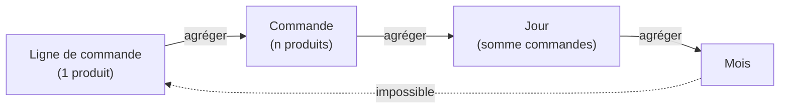

# Le vocabulaire qu'on attend de toi

En entretien comme en réunion, ces mots reviennent sans cesse. Les employer juste te
crédibilise immédiatement.

## Donnée, dimension, mesure

Prends une table de ventes :

| order_id | order_date | region | category | quantity | amount |
|---|---|---|---|---|---|
| 1001 | 2024-01-15 | Nord | Office | 2 | 120,00 € |
| 1002 | 2024-01-20 | Sud  | Hardware | 1 | 300,00 € |
| 1003 | 2024-02-05 | Nord | Office | 5 | 300,00 € |

- **Mesure** : une valeur **numérique qu'on agrège** (somme, moyenne). Ici `quantity`,
  `amount`.
- **Dimension** : un axe **par lequel on découpe** la mesure. Ici `region`, `category`,
  `order_date`. Souvent du texte ou une date.

> « CA **par** région **et par** mois » = la mesure `amount`, découpée selon les
> dimensions `region` et `order_date` (au niveau mois).

**Exemple chiffré —** somme des `amount` par `region` sur les 3 lignes ci-dessus :

| region | CA agrégé |
|---|---|
| Nord | 120 + 300 = **420 €** |
| Sud  | **300 €** |

La même colonne `amount` (mesure) donne un résultat différent selon la dimension de
découpage choisie (`region`, `category`, ou `order_date`).

## KPI vs métrique

- Une **métrique** est n'importe quelle valeur mesurée (nombre de visites, CA, panier
  moyen).
- Un **KPI** (*Key Performance Indicator*) est une métrique **choisie parce qu'elle pilote
  une décision** et qu'on la suit dans le temps, souvent **comparée à un objectif**.

> Tous les KPI sont des métriques, mais toutes les métriques ne sont pas des KPI. Le CA
> mensuel comparé à l'objectif est un KPI ; « nombre de lignes dans la table » est juste
> une métrique technique.

**Exemple —** « CA mensuel = 85 000 € » est une métrique. « CA mensuel = 85 000 €,
**objectif = 80 000 €**, progression = +6,25 % → cible dépassée » est un **KPI** :
il pilote la décision « maintenir la stratégie commerciale actuelle ».

## Granularité

La **granularité** = le niveau de détail d'une ligne. Une ligne = une commande ? une ligne
de commande ? un jour ? un mois ?

- Fine (une ligne par produit vendu) → on peut tout agréger ensuite.
- Grossière (déjà un total par mois) → on ne peut **plus** redescendre.

**Exemple chiffré —** si ton export est déjà agrégé « CA janvier = 50 000 € », tu ne
peux pas retrouver le CA du 15 janvier. Il faudrait repartir des lignes brutes.

> **À retenir —** on peut toujours **agréger** du fin vers le grossier, jamais l'inverse.
> En cas de doute, garde la donnée **la plus fine possible**.
