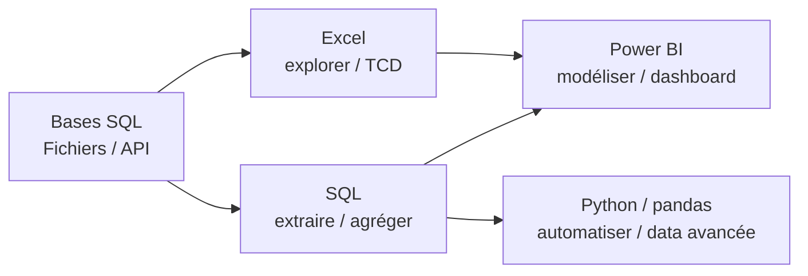

# Types de données, outils, domaines

## Les types de données qu'on manipule

| Type | Exemple | Piège fréquent |
|---|---|---|
| Numérique | `amount = 120.50` | virgule vs point décimal |
| Texte / catégorie | `category = 'Office'` | espaces, casse, fautes |
| Date / heure | `order_date = 2024-01-15` | format `JJ/MM/AAAA` mal interprété |
| Booléen | `is_returned = true` | stocké en `0/1` ou `Oui/Non` |
| Identifiant | `order_id = 1` | numérique ≠ à sommer ! |

> **Repère —** un identifiant numérique (`order_id`, code client) ne se **somme jamais**.
> C'est une dimension déguisée en nombre.

**Exemple chiffré du piège** — trois commandes `order_id = 1001, 1002, 1003` d'un montant
de 50 € chacune. `SUM(order_id)` renvoie `3006` : un nombre qui ne veut **rien dire**, alors
que `SUM(amount) = 150 €` est le seul total qui a du sens.

Même piège avec les dates stockées en **texte** au format `JJ/MM/AAAA` : trier
`"03/01/2024"` (3 janvier), `"15/02/2024"` (15 février), `"04/03/2024"` (4 mars)
**alphabétiquement** donne l'ordre `03/01`, `04/03`, `15/02` — le 15 février se retrouve
classé **après** le 4 mars, simplement parce que le caractère `'1'` de `"15"` bat le `'0'`
de `"03"`/`"04"`. L'ordre chronologique réel (`03/01` → `15/02` → `04/03`) est cassé. Il
faut convertir la colonne en vrai type **date** (ou la stocker en `AAAA-MM-JJ`, qui trie
correctement même en texte) avant tout tri ou filtre.

## Les outils du marché et où chacun sert

```mermaid
flowchart LR
    Sources["Bases SQL\nFichiers / API"] --> SQL["SQL\nextraire / agréger"]
    Sources --> Excel["Excel\nexplorer / TCD"]
    SQL --> BI["Power BI\nmodéliser / dashboard"]
    Excel --> BI
    SQL --> Py["Python / pandas\nautomatiser / data avancée"]
```

- **Excel** : exploration rapide, petits volumes, TCD, prototypes. Incontournable, demandé
  partout.
- **SQL** : extraire et agréger depuis la base. La compétence socle du métier.
- **Power BI** (ou Tableau) : modéliser, créer des **dashboards** interactifs partagés.
- **Python / pandas** : automatiser, traiter de gros volumes, aller vers le ML. Voir le
  parcours **`parcours-python`** (la jambe pandas) dans le catalogue.

## Panorama des domaines

Le même savoir-faire s'applique partout — seuls les KPI changent :

- **Vente / Achat** : chiffre d'affaires, marge, panier moyen, saisonnalité.
- **Logistique** : taux de rupture, délai de livraison, rotation de stock.
- **RH** : turnover, absentéisme, masse salariale.
- **Finance** : DSO (délai de paiement), budget vs réel, trésorerie.

> **À retenir —** tu apprends une **méthode** (filtrer/grouper/agréger/comparer), pas un
> domaine. Choisis-en un pour ton portfolio (ici : Vente/Achat) afin de parler « métier »
> en entretien.
