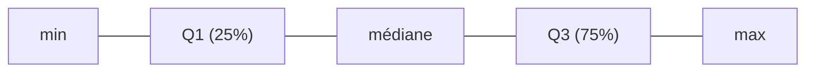

# La dispersion : « autour de la moyenne, ça varie de combien ? »

Un résumé par une seule valeur (moyenne ou médiane) cache l'essentiel : **la variabilité**.
Deux équipes peuvent avoir le même CA moyen avec des réalités très différentes.

## Le piège des deux moyennes identiques

| Magasin | Ventes/jour | Moyenne |
|---|---|---|
| A | `100, 100, 100, 100` | **100** |
| B | `10, 190, 5, 195` | **100** |

Même moyenne, mais B est **instable**. La moyenne seule ne le dit pas — il faut une mesure
de **dispersion**.

## Les mesures, de la plus simple à la plus parlante

- **Étendue** (*range*) = `max − min`. Rapide, mais ultra-sensible à un seul extrême.
- **Écart-type** (*standard deviation*) = la dispersion « moyenne » autour de la moyenne.
  Plus il est grand, plus les valeurs sont éparpillées.
- **Quantiles / quartiles** : on coupe la série triée en parts égales. Le **Q1** (25 %),
  la **médiane** (Q2, 50 %), le **Q3** (75 %). L'**écart interquartile** (Q3 − Q1) résume
  la dispersion du « cœur » des données, **sans** se laisser piéger par les extrêmes.



## L'écart-type en mots

Imagine les écarts de chaque valeur à la moyenne. On les met au carré (pour éviter que les
+ et les − s'annulent), on en prend la moyenne, puis la racine. Résultat : une dispersion
exprimée **dans la même unité** que les données (€, jours…).

> **Repère —** « CA moyen 100, écart-type 5 » = très stable. « CA moyen 100, écart-type
> 90 » = un mois peut faire 10 comme 190. Le même moyenne, deux décisions opposées.

## Calcul de l'écart-type — formule complète

Pour `n` valeurs `x₁ … xₙ` de moyenne `μ` :

```
variance  = Σ(xᵢ − μ)² / n
écart-type = √variance
```

**Exemple chiffré —** délais de livraison (jours) : `2, 3, 3, 4, 4, 4, 5, 7`

- Moyenne `μ = 32 / 8 = 4`
- Écarts² : `(2-4)²=4, (3-4)²=1, (3-4)²=1, (4-4)²=0, (4-4)²=0, (4-4)²=0, (5-4)²=1, (7-4)²=9`
- Variance `= (4+1+1+0+0+0+1+9) / 8 = 16/8 = 2`
- Écart-type `= √2 ≈ 1,41 jour`

→ On peut dire : « le délai moyen est de **4 jours**, avec un écart-type de **1,4 jour** »,
soit une variabilité très contenue. Si l'écart-type était **3 jours**, certains colis
arriveraient en 1 jour, d'autres en 7 — même moyenne, expérience client radicalement
différente.

## En pratique pour l'analyste

- Toujours accompagner une moyenne d'une **mesure de dispersion** (au moins min/max).
- Pour des données avec extrêmes : préfère **médiane + interquartile** à moyenne +
  écart-type.
- Un *boxplot* (boîte à moustaches) visualise tout ça d'un coup : médiane, Q1/Q3, extrêmes.

**Tableau de bord type :**

| KPI | Valeur | Dispersion | Interprétation |
|---|---|---|---|
| Délai livraison | 4 j (moy.) | σ = 1,4 j | Stable, peu de surprises |
| Panier moyen | 80 € (moy.) | σ = 55 € | Grande hétérogénéité → segmenter |
| Taux conversion | 3 % (moy.) | σ = 0,2 pp | Homogène entre canaux |

> **À retenir —** une moyenne sans dispersion, c'est une photo sans mise au point. La
> question n'est pas seulement « combien en moyenne ? » mais « **à quel point ça varie ?** »
