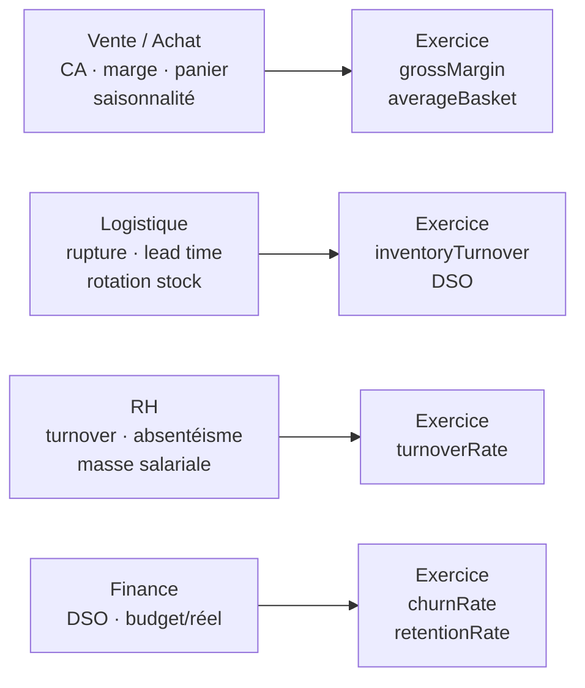

# KPI par domaine : la carte avant les détails

Avant de plonger dans chaque domaine, visualise l'**arbre complet** des indicateurs que tu
vas rencontrer. Même méthode partout — seuls les KPI changent.

## Ce que tu vas apprendre dans ce module

## Le fil conducteur : formule + piège + interprétation

Pour chaque KPI, retiens **trois** choses :

1. **La formule** — mémorisable en une ligne.
2. **Le piège** — la définition exacte qui change tout (ex. panier moyen = CA / commandes
   *distinctes*, pas lignes).
3. **L'interprétation** — que décide-t-on avec ce chiffre, et dans quel sens est-ce « bon » ?

> **À retenir —** un analyste qui donne la formule **et** l'interprétation **et** le piège
> d'un KPI marque des points en entretien. Celui qui donne juste le chiffre reste technicien.
