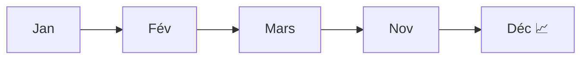

# Vente / Achat : les KPI qu'on te demandera en premier

C'est le domaine le plus courant — et celui de ton projet portfolio
(**`parcours-projet-ventes`**). Maîtrise ces quatre KPI et tu parles déjà « métier ».

## Chiffre d'affaires (CA / revenue)

La somme des ventes **hors taxes**, sur une période et un périmètre donnés.

```
revenue = somme(unitPrice × quantity)
```

> Toujours préciser le périmètre : CA **de quoi**, **sur quelle période**, **comparé à
> quoi** (mois précédent, objectif, année N-1).

## Marge brute (gross margin)

Ce qui reste après le **coût d'achat** des produits vendus. C'est l'indicateur de
**rentabilité**, bien plus parlant que le seul CA.

```
gross margin (%) = (revenue − cost) / revenue × 100
```

Un gros CA à marge faible peut être moins intéressant qu'un CA modeste à forte marge.

## Panier moyen (average basket / AOV)

Le montant moyen **par commande** (pas par ligne !).

```
average basket = CA total / nombre de commandes distinctes
```

> **Repère —** attention à la **granularité** : si une commande a plusieurs lignes,
> compte les **`orderId` distincts** au dénominateur, pas le nombre de lignes.

## Saisonnalité

Beaucoup de ventes suivent un **rythme** (Noël, soldes, rentrée). Pour la repérer :

- comparer **mois à mois** (`MoM`) mais surtout **année sur année** (`YoY`, vs même mois
  N-1) pour neutraliser l'effet saison ;
- calculer une **moyenne mobile** pour lisser le bruit et voir la tendance de fond.



> **À retenir —** un CA ne se lit jamais seul : compare-le (vs objectif, vs N-1), regarde
> la **marge** derrière, et raisonne **par commande** pour le panier.
