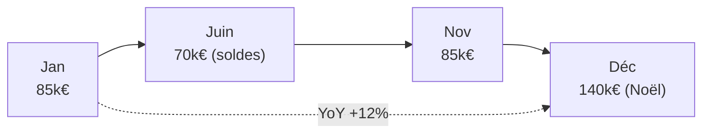

# Vente / Achat : les KPI qu'on te demandera en premier

C'est le domaine le plus courant — et celui de ton projet portfolio
(**`parcours-projet-ventes`**). Maîtrise ces quatre KPI et tu parles déjà « métier ».

## Chiffre d'affaires (CA / revenue)

La somme des ventes **hors taxes**, sur une période et un périmètre donnés.

```
revenue = somme(unitPrice × quantity)
```

**Exemple chiffré —** 3 lignes de commande en janvier :

| order_id | unitPrice | quantity | line revenue |
|---|---|---|---|
| 1001 | 60 € | 3 | 180 € |
| 1002 | 120 € | 1 | 120 € |
| 1003 | 45 € | 4 | 180 € |

→ `revenue = 180 + 120 + 180 = **480 €**`

> Toujours préciser le périmètre : CA **de quoi**, **sur quelle période**, **comparé à
> quoi** (mois précédent, objectif, année N-1).

## Marge brute (gross margin)

Ce qui reste après le **coût d'achat** des produits vendus. C'est l'indicateur de
**rentabilité**, bien plus parlant que le seul CA.

```
gross margin (%) = (revenue − cost) / revenue × 100
```

**Exemple chiffré —** produit A vs produit B :

| Produit | CA | Coût | Marge brute | Marge % |
|---|---|---|---|---|
| A | 100 000 € | 95 000 € | 5 000 € | **5 %** |
| B | 30 000 € | 18 000 € | 12 000 € | **40 %** |

→ B rapporte **plus** en valeur de marge (12 000 €) alors que son CA est 3× plus faible.
**Un gros CA à marge faible peut être moins intéressant qu'un CA modeste à forte marge.**

## Panier moyen (average basket / AOV)

Le montant moyen **par commande** (pas par ligne !).

```
average basket = CA total / nombre de commandes distinctes
```

**Exemple chiffré —** 3 lignes mais seulement 2 commandes distinctes :

| order_id | amount (ligne) |
|---|---|
| 1001 | 30 € |
| 1001 | 20 € ← même commande |
| 1002 | 100 € |

→ CA total = 150 €, commandes distinctes = 2 → panier moyen = **75 €** (et non 50 €).

> **Repère —** attention à la **granularité** : si une commande a plusieurs lignes,
> compte les **`orderId` distincts** au dénominateur, pas le nombre de lignes.

## Saisonnalité

Beaucoup de ventes suivent un **rythme** (Noël, soldes, rentrée). Pour la repérer :

- comparer **mois à mois** (`MoM`) mais surtout **année sur année** (`YoY`, vs même mois
  N-1) pour neutraliser l'effet saison ;
- calculer une **moyenne mobile** pour lisser le bruit et voir la tendance de fond.

**Exemple chiffré —** CA décembre vs novembre :

| Mois | CA | MoM | YoY (vs déc. N-1) |
|---|---|---|---|
| Novembre | 85 000 € | — | — |
| Décembre | 140 000 € | **+64,7 %** | **+12 %** |

→ La hausse MoM est spectaculaire, mais c'est la **saisonnalité Noël**. La vraie tendance
est le +12 % YoY, qui montre que les ventes progressent **malgré** l'effet saisonnier.



> **À retenir —** un CA ne se lit jamais seul : compare-le (vs objectif, vs N-1), regarde
> la **marge** derrière, et raisonne **par commande** pour le panier.
