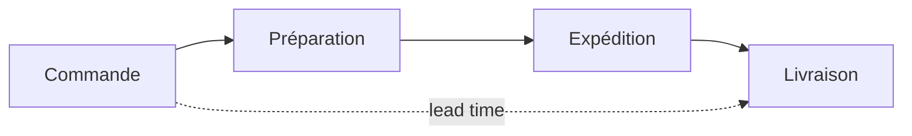

# Logistique : les KPI du flux physique

Ici on pilote la **disponibilité** et la **vitesse**. Trois indicateurs structurants.

## Taux de rupture (stock-out rate)

La part de la demande **non servie faute de stock**. Une rupture = une vente perdue **et**
un client mécontent.

```
stock-out rate (%) = lignes en rupture / lignes totales × 100
```

Un taux bas est l'objectif, mais zéro rupture peut cacher du **surstock** coûteux : c'est
un arbitrage.

## Délai de livraison (lead time)

Le temps entre la commande et la réception. On suit la **moyenne**… mais la **médiane** et
le **Q3** disent mieux la réalité vécue (un retard exceptionnel gonfle la moyenne).

```
lead time (jours) = deliveryDate − orderDate
```

> **Repère —** sur des délais, regarde la **distribution**, pas seulement la moyenne :
> « 90 % des colis en moins de 4 jours » est plus actionnable qu'« en moyenne 3,2 jours ».

## Rotation de stock (inventory turnover)

Combien de fois le stock est **renouvelé** sur la période. Plus elle est élevée, moins le
capital dort en entrepôt.

```
turnover = coût des ventes / stock moyen
```

- Rotation **haute** → stock fluide, peu de capital immobilisé (mais risque de rupture).
- Rotation **basse** → surstock, produits qui dorment, risque d'obsolescence.



> **À retenir —** disponibilité (rupture), rapidité (lead time) et efficacité du capital
> (rotation) se **tirent** mutuellement : améliorer l'un dégrade souvent un autre. Le rôle
> de l'analyste est d'éclairer l'**arbitrage**.
