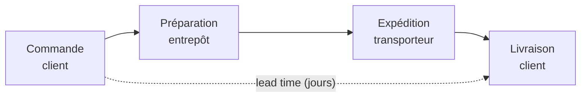

# Logistique : les KPI du flux physique

Ici on pilote la **disponibilité** et la **vitesse**. Trois indicateurs structurants.

## Taux de rupture (stock-out rate)

La part de la demande **non servie faute de stock**. Une rupture = une vente perdue **et**
un client mécontent.

```
stock-out rate (%) = lignes en rupture / lignes totales × 100
```

**Exemple chiffré —** sur 500 lignes de commande du mois, 12 sont en rupture :

```
stock-out rate = 12 / 500 × 100 = 2,4 %
```

Un taux bas est l'objectif, mais **zéro rupture peut cacher du surstock coûteux** : c'est
un arbitrage entre niveau de service et capital immobilisé.

## Délai de livraison (lead time)

Le temps entre la commande et la réception. On suit la **moyenne**… mais la **médiane** et
le **Q3** disent mieux la réalité vécue (un retard exceptionnel gonfle la moyenne).

```
lead time (jours) = deliveryDate − orderDate
```

**Exemple chiffré —** 8 livraisons en jours : `2, 3, 3, 3, 4, 4, 5, 22`

| Indicateur | Valeur | Lecture |
|---|---|---|
| Moyenne | 5,75 j | Gonflée par la valeur 22 |
| Médiane | 3,5 j | Plus représentative |
| Q3 (75e percentile) | 4 j | « 75 % livrés en ≤ 4 jours » |

→ Dire « **médiane 3,5 j et Q3 à 4 j** » est plus honnête et actionnable que « en moyenne
5,75 jours ».

> **Repère —** sur des délais, regarde la **distribution**, pas seulement la moyenne :
> « 90 % des colis en moins de 4 jours » est plus actionnable qu'« en moyenne 3,2 jours ».

## Rotation de stock (inventory turnover)

Combien de fois le stock est **renouvelé** sur la période. Plus elle est élevée, moins le
capital dort en entrepôt.

```
turnover = coût des ventes (COGS) / stock moyen
stock moyen = (stock début de période + stock fin de période) / 2
```

**Exemple chiffré —** exercice annuel :

- Coût des ventes (COGS) : 360 000 €
- Stock début d'année : 40 000 €, stock fin : 80 000 €
- Stock moyen = (40 000 + 80 000) / 2 = 60 000 €
- **Rotation = 360 000 / 60 000 = 6×** (le stock se renouvelle 6 fois par an, soit
  environ toutes les 2 mois)

| Rotation | Signal | Risque |
|---|---|---|
| Élevée (≥ 8×) | Flux fluide, peu de capital immobilisé | Rupture si demande pic |
| Basse (≤ 2×) | Surstock, produits dorment | Obsolescence, coût de stockage |



> **À retenir —** disponibilité (rupture), rapidité (lead time) et efficacité du capital
> (rotation) se **tirent** mutuellement : améliorer l'un dégrade souvent un autre. Le rôle
> de l'analyste est d'éclairer l'**arbitrage**.
