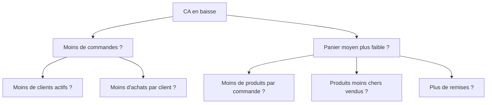

# Questions sens métier : cadrer, choisir, raconter

Ces questions évaluent ta capacité à **penser comme une analyste**, pas seulement à
coder. Elles sont souvent posées sous forme de mini-cas ou de mises en situation. Réfléchis
d'abord, puis déplie.

---

## Cadrer une demande

### Q1 — Ton manager te dit : « Donne-moi les ventes de ce mois. » Que fais-tu ?

<!--correction-->

Tu ne te précipites pas sur le clavier. Tu **poses d'abord les questions de cadrage** :

1. **Périmètre** — toutes les lignes de business, ou un segment précis (pays, canal, produit) ?
2. **Définition** — « ventes » = CA HT ? nombre de commandes ? quantités ?
3. **Comparaison** — par rapport à quoi ? mois précédent, objectif, même mois N-1 ?
4. **Granularité** — un total ou un détail par semaine / région / commercial ?
5. **Format de livrable** — un chiffre par e-mail, un tableau, un slide, un dashboard ?

> **Réponse modèle en entretien** : « Avant de requêter, je veux m'assurer de répondre à
> la bonne question. J'ai quelques points à clarifier : périmètre, définition de la métrique,
> référence de comparaison… »
>
> Ce réflexe montre que tu évites de produire un chiffre juste mais inutile.

---

### Q2 — Comment choisirais-tu le bon KPI pour mesurer la performance d'une équipe commerciale ?

<!--correction-->

Pas de KPI universel — le bon KPI dépend de **l'objectif stratégique** de l'équipe.

Démarche en trois temps :

1. **Quel est l'objectif ?** Croissance du CA, fidélisation, nouveaux clients, marge…
2. **Sur quoi l'équipe a-t-elle un levier direct ?** (Elle ne contrôle peut-être pas le prix)
3. **Est-il mesurable sans ambiguïté et régulièrement ?**

**Exemples de KPI selon l'objectif :**

| Objectif | KPI pertinent | Piège à éviter |
|---|---|---|
| Croissance CA | CA mensuel vs objectif | CA seul sans comparaison |
| Nouveaux clients | Nombre de nouveaux clients / mois | Confondre leads et clients actifs |
| Rentabilité | Marge brute % par commercial | Optimiser CA au détriment de la marge |
| Fidélisation | Taux de rétention / répétition d'achat | Taux de rétention sur période trop courte |

> En entretien : montrer que tu **questionnes l'objectif avant de proposer un KPI** est
> plus valorisé que de réciter une liste. Un bon KPI est **actionnable** : si ça baisse,
> on sait quoi changer.

---

## Raconter un résultat

### Q3 — Comment présentes-tu un résultat d'analyse à une personne non-technique ?

<!--correction-->

La règle des **trois temps** :

1. **L'insight en une phrase** — commence par la conclusion, pas par la méthode.
   > « En février, notre chiffre d'affaires a chuté de 35 % par rapport à janvier. »

2. **Le « pourquoi »** (si tu le sais) — explique ce qui l'explique, avec des chiffres
   simples et concrets, sans jargon.
   > « Cette baisse vient principalement de la région Nord, qui représente 60 % du CA
   > et a vu ses commandes réduites de moitié. »

3. **La recommandation ou la prochaine étape** — qu'est-ce qu'on fait avec ça ?
   > « Je propose d'analyser si c'est saisonnier (même baisse en février N-1 ?) ou
   > si c'est nouveau. »

> **Piège à éviter** : commencer par « j'ai créé un pivot table dans Excel, puis j'ai
> fait une jointure SQL… ». Le livrable, c'est l'**insight**, pas la méthode.

---

### Q4 — On te dit : « Le CA a baissé ce mois. Pourquoi ? » Tu n'as pas encore les données. Comment procèdes-tu ?

<!--correction-->

Tu structures ton raisonnement **avant** de requêter — c'est ce que l'intervieweur veut
voir.

**Décomposition logique du CA :**

```
CA = nombre de commandes × panier moyen
   = (nombre de clients × fréquence d'achat) × (prix moyen × quantité moyenne)
```

Tu enquêtes dimension par dimension :



Ensuite : segment par segment (région, canal, catégorie, période) pour **isoler** la source.

> Ce raisonnement structuré — décomposer → isoler → tester — s'appelle **root-cause
> analysis**. Le montrer en entretien est un signal fort de maturité analytique.

---

### Q5 — Quelle est la différence entre une corrélation et une causalité ? Donne un exemple concret.

<!--correction-->

**Corrélation** : deux variables bougent ensemble (l'une monte quand l'autre monte).
**Causalité** : l'une **provoque** l'autre.

**Exemple classique** : les ventes de glaces et les noyades sont corrélées — toutes deux
augmentent en été. Mais les glaces ne causent pas les noyades : c'est la **chaleur** (variable confondante) qui explique les deux.

**Exemple métier** : « nos clients qui reçoivent des emails promo achètent 30 % de plus. »
Cela ne prouve pas que l'email **cause** l'achat — les clients les plus engagés ouvrent peut-être plus les emails **et** achètent plus, indépendamment.

> En entretien : « corrélation ≠ causalité » est un réflexe attendu. La suite attendue :
> « Pour établir la causalité, il faudrait un **test A/B** ou une analyse de cohortes
> contrôlées. »

---

> **À retenir** — Les questions « sens métier » évaluent trois choses : (1) tu **cadres**
> avant d'agir, (2) tu **décomposes** un problème avant de coder, (3) tu **communiques**
> l'insight avant la méthode. Ces trois réflexes valent autant que la maîtrise SQL en
> entretien junior.
