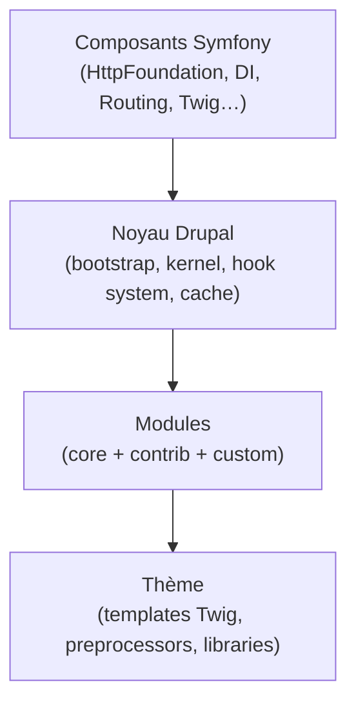
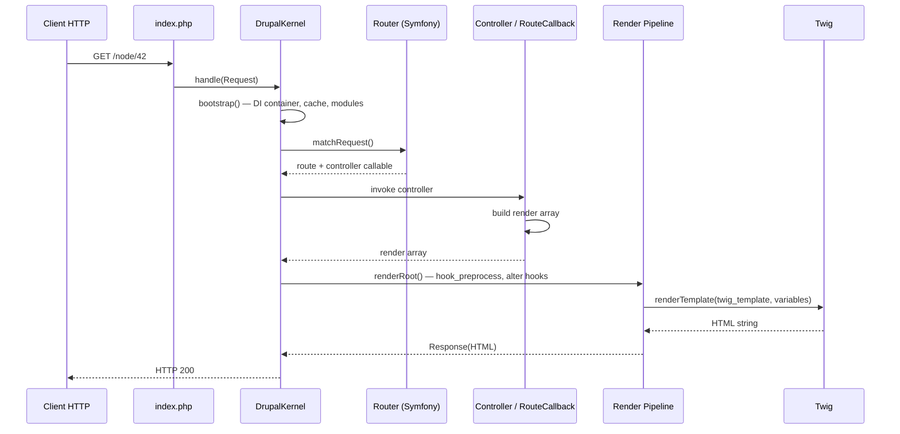
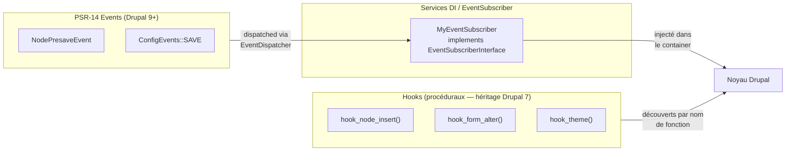

# Drupal vu par un développeur Symfony

Tu arrives sur un projet Drupal avec 13 ans de PHP/Symfony. Bonne nouvelle : depuis
Drupal 8, le noyau est **bâti sur les composants Symfony** — HttpFoundation, Routing,
DependencyInjection, EventDispatcher, Console, Twig. Les concepts te sont familiers ;
c'est **la couche au-dessus** qui diffère.

## Ce que tu connais déjà (identique ou quasi-identique)

| Symfony | Drupal | Remarque |
|---|---|---|
| `Request` / `Response` | idem (HttpFoundation) | Même objet |
| Routing YAML/Annotation | `*.routing.yml` | Syntaxe proche |
| Twig | idem | Même moteur, extensions supplémentaires |
| Service container YAML | `*.services.yml` | Même syntaxe DI |
| Console (`bin/console`) | `drush` + `bin/drupal` | Drush = artisan de Drupal |
| `EventDispatcher` | `EventDispatcher` + **hooks** | Drupal ajoute le système de hooks |
| Doctrine ORM | **Entity API** + **Field API** | Pas de Doctrine ; API propriétaire |
| Bundle | **Module** | Même idée, syntaxe différente |

## Ce qui est spécifique à Drupal

Quatre couches s'empilent au-dessus des composants Symfony :



1. **Le système de hooks** : mécanisme d'extension procédural (`hook_form_alter`,
   `hook_node_insert`…) qui coexiste avec l'EventDispatcher. Pense-y comme des
   *event listeners* dont le nom est conventionnel.
2. **L'Entity API + Field API** : tout est entité (nœud, utilisateur, terme de
   taxonomie, bloc de contenu custom…). Les champs sont configurables par interface.
3. **Le système de plugins** : remplace l'héritage direct pour les composants
   extensibles (blocs, formats d'image, filtres de texte, types de widget de champ…).
4. **Configuration Management** : export/import YAML de la configuration entière
   (types de contenu, vues, blocs, permissions…).

## Cycle de vie d'une requête HTTP

Comprendre le bootstrap Drupal te permet de savoir *où* intervenir sans tâtonner.



Points clés pour un développeur Symfony :
- Le **DrupalKernel** remplace l'`AppKernel`. Il n'y a pas de bundles ; les modules
  s'enregistrent via leur `.info.yml`.
- Le **render array** est un tableau PHP intermédiaire entre le controller et Twig —
  c'est l'équivalent d'un `ViewModel` Symfony, mais avec une gestion du cache intégrée
  (`#cache`), des attachements JS/CSS (`#attached`) et des thèmes (`#theme`).
- Les **alter hooks** (`hook_form_alter`, `hook_theme_suggestions_alter`…) sont appelés
  par le render pipeline, pas par le controller — tu ne vois pas ces appels dans le
  routing.

## Mappings Symfony → Drupal : la table de correspondance complète

| Concept Symfony | Équivalent Drupal | Différence notable |
|---|---|---|
| Bundle | Module | Pas de `registerBundles()` ; déclaration via `.info.yml` |
| `EventDispatcher` + Listener | Hooks procéduraux + PSR-14 Events | Les hooks sont découverts par nom de fonction ; les events PSR-14 depuis D9+ |
| Doctrine `EntityRepository` | `EntityTypeManager` + `Storage` | Pas de DQL ; QueryBuilder Drupal ou `entityQuery()` |
| Doctrine `EntityManager::flush()` | `$entity->save()` | Pas d'unité de travail ; sauvegarde immédiate |
| `FormType` + `FormFactory` | Form API (tableaux PHP) + `FormBuilder` | Le formulaire produit aussi son rendu |
| Twig seul | Twig + Render arrays | Le render array est l'étape intermédiaire avant Twig |
| `config/packages/*.yaml` | `config/sync/*.yml` + `settings.php` | La config Drupal est en base, exportable en YAML |
| `APP_ENV` | `$settings['environment']` + Config Split | Pas de variable native ; convention de projet |
| `bin/console` | `drush` (commandes Drush) | Drush est un outil tiers, mais standard de facto |

### EventDispatcher vs Hooks vs PSR-14 Events

C'est la confusion la plus fréquente pour un Symfoniste. Les trois mécanismes coexistent :



**Règle pratique en agence** : utilise les hooks pour les points d'extension du noyau
qui n'ont pas encore d'équivalent PSR-14 (`hook_form_alter`, `hook_preprocess_*`…).
Utilise les EventSubscribers PSR-14 pour tes propres événements et pour les modules
contrib modernes (Webform, Commerce…). Les deux peuvent coexister dans le même module.

### Doctrine Repository → EntityTypeManager

```php
// Symfony / Doctrine
$articles = $em->getRepository(Article::class)
    ->findBy(['published' => true], ['createdAt' => 'DESC'], 10);

// Drupal equivalent
$ids = \Drupal::entityTypeManager()
    ->getStorage('node')
    ->getQuery()
    ->accessCheck(TRUE)
    ->condition('type', 'article')
    ->condition('status', 1)
    ->sort('created', 'DESC')
    ->range(0, 10)
    ->execute();

$nodes = \Drupal::entityTypeManager()
    ->getStorage('node')
    ->loadMultiple($ids);
```

Points d'attention :
- `getStorage('node')` = repository pour le type d'entité `node`.
- **`accessCheck(TRUE)` est obligatoire** depuis D10 — sans lui, une exception est levée.
- Il n'y a pas de jointure SQL directe dans l'API ; pour des requêtes complexes, utilise
  `\Drupal\Core\Database\Database::getConnection()` directement.

## La règle d'or : « configuration vs contenu »

En Symfony, tout est code (ou env). En Drupal, on distingue :

- **Configuration** : structure du site (types de contenu, champs, vues, blocs,
  permissions, langues…) — exportable en YAML, versionnée dans Git.
- **Contenu** : données (nœuds, utilisateurs, termes…) — en base de données.

> **À retenir** — Comprendre cette frontière dès le départ t'évite le piège classique
> en agence : modifier de la configuration directement en prod sans l'exporter, rendant
> les déploiements suivants risqués.

## Structure d'un projet Drupal type en agence

```
project/
├─ composer.json           # PHP dependencies (Drupal + contrib modules)
├─ composer.lock
├─ web/                    # docroot
│  ├─ core/                # noyau (ne jamais modifier)
│  ├─ modules/
│  │  ├─ contrib/          # third-party modules installed by Composer
│  │  └─ custom/           # your custom modules
│  ├─ themes/
│  │  ├─ contrib/
│  │  └─ custom/
│  └─ sites/default/
│     ├─ settings.php
│     └─ files/            # uploads (excluded from VCS)
└─ config/
   └─ sync/                # YAML export of the configuration
```

> **À retenir** — Ne jamais modifier `web/core/`. Les correctifs sur le core se font via
> le mécanisme de patches Composer (`cweagans/composer-patches`), pas en éditant les
> fichiers directement. C'est le premier piège en reprise de projet.

## Commandes Drush indispensables pour démarrer

```bash
# Vider tous les caches (à faire après chaque modif de code, config ou template)
drush cr

# Voir le statut du site et la version Drupal
drush status

# Activer un module
drush en my_module

# Désactiver un module
drush pmu my_module

# Lancer les update hooks après composer update
drush updb --yes

# Exporter la configuration active vers config/sync/
drush cex --yes

# Importer la configuration depuis config/sync/ vers la base
drush cim --yes

# Voir les différences de configuration entre base et fichiers YAML
drush config:status
```

> **Piège agence** : `drush cr` vide les caches PHP (services, routes, plugins) mais
> **pas** le cache navigateur. Si tu ne vois pas tes changements de CSS/JS, pense
> à désactiver l'agrégation des assets dans `/admin/config/development/performance`.

## ⚠️ Piège agence : reprendre un projet D7 ou D8

Si on te confie un projet en **Drupal 7**, tu n'es pas dans la même base de code.
D7 n'utilise pas les composants Symfony, pas de PSR-4, pas d'injection de dépendances.
Tout est procédural. La seule voie viable est la **migration via Migrate API** (voir
module 07).

Si le projet est en **Drupal 8** : D8 est EOL depuis novembre 2021. Il partage
l'architecture D9/D10 mais avec des APIs deprecated massivement. Avant tout travail :

```bash
# Scan des deprecated sur le code custom
composer require --dev mglaman/phpstan-drupal
./vendor/bin/phpstan analyse web/modules/custom --level=deprecation
```

Les deprecated les plus fréquents en reprise D8 :
- `\Drupal::entityManager()` → `\Drupal::entityTypeManager()`
- `drupal_set_message()` → `\Drupal::messenger()->addMessage()`
- Annotations `@Block(...)` → Attributs PHP 8 `#[Block(...)]` (D10.2+)
- `hook_entity_type_alter()` avec des classes non-namespaced

Ne commence pas à ajouter des fonctionnalités avant d'avoir résolu ces deprecated :
ils bloquent la montée de version et accumulent de la dette technique.
