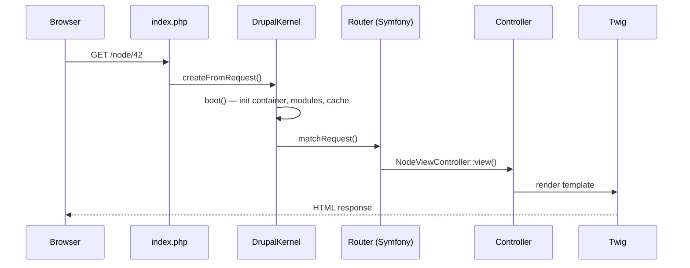

# Bootstrap, noyau et cycle de vie d'une requête

## Le DrupalKernel

Drupal expose un `DrupalKernel` qui implémente `HttpKernelInterface` de Symfony.
Le fichier `web/index.php` est minimal :

```php
// web/index.php — Drupal entry point (do not modify)
use Drupal\Core\DrupalKernel;
use Symfony\Component\HttpFoundation\Request;

$autoloader = require_once 'autoload.php';

$kernel = DrupalKernel::createFromRequest(
    Request::createFromGlobals(),
    $autoloader,
    'prod'
);
$response = $kernel->handle(Request::createFromGlobals());
$response->send();
$kernel->terminate(Request::createFromGlobals(), $response);
```

C'est exactement le même patron que `public/index.php` en Symfony. La différence :
`DrupalKernel` **bootstrap** beaucoup plus de choses (base de données, cache, modules…)
avant de déléguer au routeur.

## Phases du bootstrap



## Le conteneur de services

Drupal compile son propre conteneur DI à partir de :
- `web/core/core.services.yml` (services du noyau)
- `web/modules/*/[module].services.yml` (services des modules)
- `web/sites/default/services.yml` (surcharges locales)

La syntaxe est **identique** à Symfony :

```yaml
# my_module/my_module.services.yml
services:
  my_module.my_service:
    class: Drupal\my_module\MyService
    arguments:
      - '@entity_type.manager'
      - '@logger.factory'
```

Pour récupérer un service dans un contexte procédural (hooks, formulaires non-OO) :

```php
// Procedural context — hooks, .module files
/** @var \Drupal\Core\Entity\EntityTypeManagerInterface $etm */
$etm = \Drupal::service('entity_type.manager');

// Cleaner: use static helper methods
$node = \Drupal::entityTypeManager()
    ->getStorage('node')
    ->load(42);
```

> **À retenir Symfony↔Drupal** — Dans un service ou un controller Drupal, **injecte
> toujours par le constructeur** (comme en Symfony). L'appel statique `\Drupal::service()`
> n'est acceptable que dans du code procédural (fichiers `.module`) ou les tests unitaires
> qui ne peuvent pas bénéficier de l'injection.

## Surcharger un service (décorateur / remplacement)

Comme en Symfony, tu peux remplacer ou décorer un service du noyau :

```yaml
# my_module/my_module.services.yml
services:
  # Replace the core breadcrumb builder
  breadcrumb:
    class: Drupal\my_module\MyBreadcrumbBuilder
    tags:
      - { name: breadcrumb_builder, priority: 100 }
```

Le mécanisme de `priority` est identique à Symfony : la valeur la plus haute gagne.

## Hooks vs EventDispatcher

Drupal utilise **deux** mécanismes d'extension qui coexistent :

### 1. Hooks (héritage procédural, D7+)

Un hook est une **fonction** dont le nom suit la convention `MODULENAME_HOOKNAME`.
Drupal la découvre automatiquement :

```php
// my_module/my_module.module
/**
 * Implements hook_node_insert().
 *
 * Called after a node is inserted into the database.
 */
function my_module_node_insert(\Drupal\node\NodeInterface $node): void {
    // Log or notify whenever a new node is created
    \Drupal::logger('my_module')->info(
        'New node created: @title',
        ['@title' => $node->getTitle()]
    );
}
```

### 2. EventDispatcher (Symfony, D8+)

Les events Drupal fonctionnent **exactement** comme en Symfony :

```php
// src/EventSubscriber/MyNodeSubscriber.php
namespace Drupal\my_module\EventSubscriber;

use Drupal\core_event_dispatcher\Event\Entity\EntityInsertEvent;
use Drupal\core_event_dispatcher\CoreEvents;
use Symfony\Component\EventDispatcher\EventSubscriberInterface;

final class MyNodeSubscriber implements EventSubscriberInterface {

    public static function getSubscribedEvents(): array {
        return [
            CoreEvents::ENTITY_INSERT => ['onEntityInsert', 0],
        ];
    }

    public function onEntityInsert(EntityInsertEvent $event): void {
        $entity = $event->getEntity();
        // Process entity insert event
    }
}
```

> **Règle en agence** : préfère les **EventSubscribers** pour tout nouveau code — ils
> sont testables unitairement (injection de dépendances, pas de `\Drupal::` statique).
> Les hooks restent nécessaires pour certains points d'extension sans équivalent event
> (`hook_form_alter`, `hook_theme`, `hook_install`…).
