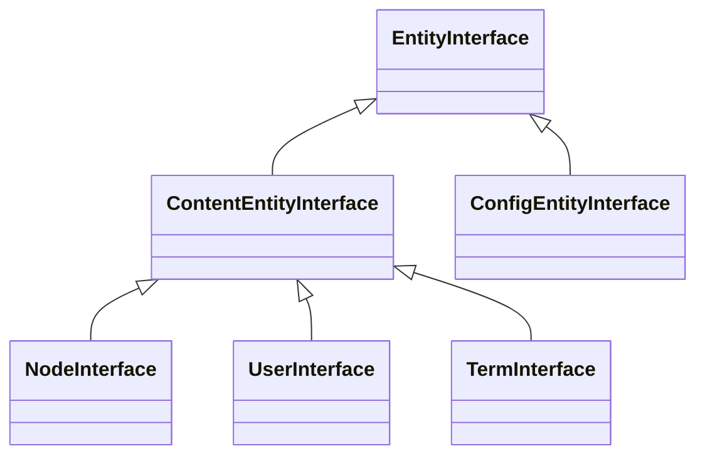

# Entity API : le remplacement de Doctrine

En Symfony, tu utilises Doctrine ORM : classes annotées/attributées, EntityManager,
repositories, QueryBuilder. Drupal n'utilise pas Doctrine. À la place, il propose
l'**Entity API** — un système propriétaire, plus limité mais parfaitement intégré à
la Field API, aux formulaires, au cache, aux permissions et à l'internationalisation.

## Hiérarchie des entités



- **ContentEntity** : données éditables (nœuds, utilisateurs, termes, fichiers,
  blocs de contenu, entités custom…). Stockées dans des tables SQL générées.
- **ConfigEntity** : configuration (types de contenu, vocabulaires, vues…). Stockées
  dans la config (YAML / base). Exportables via `drush cex`.

## Charger des entités

```php
// Load a single node by ID
/** @var \Drupal\node\NodeInterface $node */
$node = \Drupal::entityTypeManager()
    ->getStorage('node')
    ->load(42);

// Load multiple nodes
$nodes = \Drupal::entityTypeManager()
    ->getStorage('node')
    ->loadMultiple([1, 2, 3]);

// Load by condition (EntityQuery — equivalent of Doctrine QueryBuilder)
$ids = \Drupal::entityTypeManager()
    ->getStorage('node')
    ->getQuery()
    ->accessCheck(TRUE)             // always set this explicitly
    ->condition('type', 'article')
    ->condition('status', 1)
    ->condition('field_category.entity.name', 'Tech') // join via entity reference
    ->sort('created', 'DESC')
    ->range(0, 20)
    ->execute();

$articles = \Drupal::entityTypeManager()
    ->getStorage('node')
    ->loadMultiple($ids);
```

> **Pont Doctrine** — `getQuery()` est l'équivalent de `createQueryBuilder()`.
> La méthode `->condition()` est l'équivalent de `->andWhere()`. Le résultat
> de `->execute()` retourne des **IDs**, pas des objets — il faut un `loadMultiple()`
> ensuite. C'est délibéré : Drupal peut appliquer le cache d'entités.

## Créer et sauvegarder des entités

```php
// Create a new node programmatically
$node = \Drupal::entityTypeManager()
    ->getStorage('node')
    ->create([
        'type'        => 'article',
        'title'       => 'My programmatic article',
        'status'      => 1,
        'uid'         => 1,           // author
        'body'        => [
            'value'  => '<p>Hello world</p>',
            'format' => 'full_html',
        ],
        'field_tags'  => [['target_id' => 5]], // entity reference
    ]);

$node->save(); // triggers hook_node_insert() / EntityInsertEvent
```

## Accéder aux champs

```php
// Read a field value
$title = $node->getTitle();              // typed accessor (Node-specific)
$body  = $node->get('body')->value;      // field API (generic)
$tags  = $node->get('field_tags');       // FieldItemListInterface

// Iterate a multi-value field
foreach ($node->get('field_tags') as $item) {
    /** @var \Drupal\taxonomy\TermInterface $term */
    $term = $item->entity;   // entity reference — loads the referenced entity
    echo $term->getName();
}

// Write a field value
$node->set('field_summary', 'Short description');
$node->save();
```

## Définir une entité custom (sans UI, en code)

Pour des entités métier complexes, crée un module custom avec une annotation `@ContentEntityType` :

```php
// src/Entity/Product.php
namespace Drupal\my_module\Entity;

use Drupal\Core\Entity\ContentEntityBase;
use Drupal\Core\Entity\EntityTypeInterface;
use Drupal\Core\Field\BaseFieldDefinition;

/**
 * @ContentEntityType(
 *   id = "product",
 *   label = @Translation("Product"),
 *   base_table = "product",
 *   entity_keys = {
 *     "id" = "id",
 *     "label" = "name",
 *     "uuid" = "uuid",
 *   },
 *   handlers = {
 *     "storage" = "Drupal\Core\Entity\Sql\SqlContentEntityStorage",
 *   },
 * )
 */
class Product extends ContentEntityBase {

    public static function baseFieldDefinitions(EntityTypeInterface $entity_type): array {
        $fields = parent::baseFieldDefinitions($entity_type);

        $fields['name'] = BaseFieldDefinition::create('string')
            ->setLabel(t('Name'))
            ->setRequired(TRUE)
            ->setSetting('max_length', 255);

        $fields['price'] = BaseFieldDefinition::create('decimal')
            ->setLabel(t('Price'))
            ->setRequired(TRUE);

        $fields['category'] = BaseFieldDefinition::create('entity_reference')
            ->setLabel(t('Category'))
            ->setSetting('target_type', 'taxonomy_term')
            ->setSetting('handler_settings', ['target_bundles' => ['product_category' => 'product_category']]);

        return $fields;
    }
}
```

Après création, exécute `drush entity:updates` ou `drush updb` pour créer les tables SQL.

> **À retenir** — L'Entity API remplace Doctrine dans Drupal. Pas de mapping YAML/XML,
> pas d'EntityManager, mais `entityTypeManager()->getStorage()`. Pour les cas simples
> (types de contenu créés en UI), tu n'écris jamais de classe — Drupal génère tout.
> Les entités custom en code sont pour les besoins métier qui ne rentrent pas dans le
> modèle nœud/terme.
