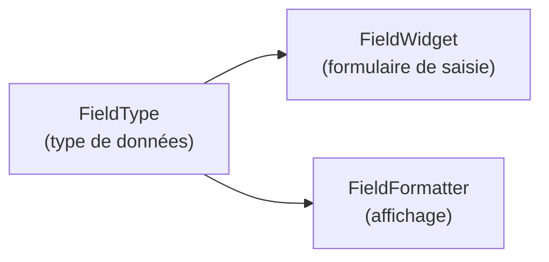

# Field API et types de contenu

La **Field API** est la couche qui gère les champs attachés aux entités. C'est ce
qui permet à un éditeur de créer un type de contenu « Article » avec un champ
« Tags » (référence taxonomique), un champ « Image mise en avant » (image), un champ
« Résumé » (texte long)… le tout sans écrire une ligne de code.

## Les trois couches d'un champ



- **FieldType** : définit le schéma de données (ex. `string`, `integer`,
  `entity_reference`, `image`, `datetime`…)
- **FieldWidget** : comment le champ est saisi dans les formulaires d'édition
  (ex. sélecteur, input text, date picker…)
- **FieldFormatter** : comment le champ est affiché sur le site (ex. image
  affichée en thumbnail, label du terme comme lien, date formatée…)

## Modèle de stockage

Drupal crée **automatiquement** les tables SQL pour les champs :

```
node__field_tags       — table pour le champ field_tags sur les nœuds
node__field_image      — table pour le champ field_image sur les nœuds
node__body             — table pour le champ body
```

Chaque table a une structure générique (`entity_id`, `revision_id`, `langcode`,
`delta`, `field_tags_target_id`…). Tu ne manipules jamais ces tables directement
— tu passes par l'Entity API.

## Accéder aux champs Field API en PHP

```php
// A node with a field_image field (Image type) and field_tags (Entity reference)

/** @var \Drupal\node\NodeInterface $node */

// Simple field — string
$summary = $node->get('field_summary')->getString();

// Image field — access sub-properties
$image_field = $node->get('field_image')->first();
if ($image_field) {
    $file_id  = $image_field->target_id;
    $alt_text = $image_field->alt;
    /** @var \Drupal\file\FileInterface $file */
    $file = $image_field->entity;
    $uri  = $file->getFileUri();   // e.g. public://2024-01/photo.jpg
}

// Multi-value entity reference — load all referenced terms
$tags = [];
foreach ($node->get('field_tags') as $item) {
    $tags[] = $item->entity->getName();
}

// Date field
$date_string = $node->get('field_date')->value;  // ISO 8601 string
```

## Créer des champs en code (BaseFieldDefinition)

Pour les entités custom, les champs sont définis directement en PHP via des
`BaseFieldDefinition`. Pour les types de contenu créés en UI, les champs sont
stockés dans la configuration (YAML exporté).

```php
// Defining base fields in a custom entity class
public static function baseFieldDefinitions(EntityTypeInterface $entity_type): array {
    $fields = parent::baseFieldDefinitions($entity_type);

    // Text field with UI display options
    $fields['title'] = BaseFieldDefinition::create('string')
        ->setLabel(t('Title'))
        ->setRequired(TRUE)
        ->setDisplayOptions('view', ['label' => 'hidden', 'type' => 'string'])
        ->setDisplayOptions('form', ['type' => 'string_textfield'])
        ->setDisplayConfigurable('form', TRUE)
        ->setDisplayConfigurable('view', TRUE);

    // Boolean field
    $fields['is_featured'] = BaseFieldDefinition::create('boolean')
        ->setLabel(t('Featured'))
        ->setDefaultValue(FALSE);

    // Entity reference to user
    $fields['author'] = BaseFieldDefinition::create('entity_reference')
        ->setLabel(t('Author'))
        ->setSetting('target_type', 'user');

    // Timestamp
    $fields['published_at'] = BaseFieldDefinition::create('timestamp')
        ->setLabel(t('Published at'));

    return $fields;
}
```

## Types de contenu vs entités custom

| Cas | Solution recommandée |
|---|---|
| Contenu éditorial (articles, pages, actualités) | Type de contenu via UI → champs configurables |
| Données structurées simples (FAQ, témoignages) | Type de contenu + Paragraphs contrib |
| Données métier complexes (produits, commandes) | Entité custom en code |
| Données de configuration (paramètres du site) | ConfigEntity |

## Paragraphs : blocs de contenu composable

Le module contrib **Paragraphs** est omniprésent en agence. Il ajoute un type de
champ `paragraphs` qui permet d'attacher des blocs structurés hétérogènes à un nœud :

```
Article
├─ field_content (paragraphs)
│  ├─ [0] TextBlock — body: "Introduction..."
│  ├─ [1] ImageBlock — image: photo.jpg, caption: "Alt text"
│  └─ [2] CallToAction — label: "Download", url: "/pdf"
```

Chaque type de paragraphe est lui-même un bundle avec ses propres champs, son widget
de saisie et ses templates Twig. En agence, tu trouveras souvent 10 à 30 types de
paragraphes par site.

> **À retenir** — Le modèle de contenu Drupal est entièrement piloté par la Field API.
> Chaque champ a trois aspects : stockage (FieldType), saisie (FieldWidget), affichage
> (FieldFormatter). En agence, la grande majorité du modèle est configurée en UI et
> exportée en YAML — tu n'écris du code de champ que pour des entités custom.
