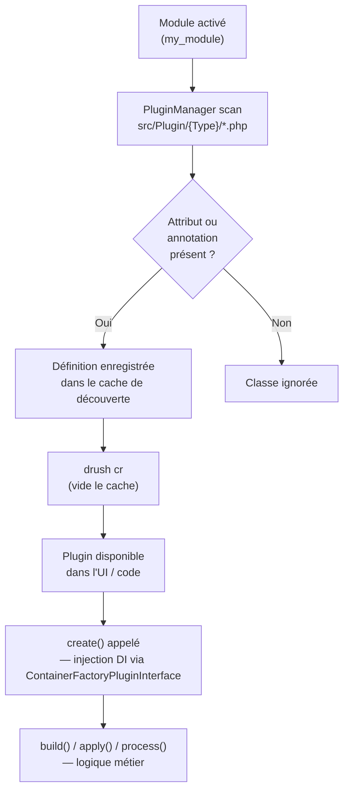

# Comprendre le système de plugins

Le **système de plugins** est le troisième pilier d'extension de Drupal (après les
services DI et les hooks). Si tu connais le pattern **Strategy** en PHP, c'est exactement
ça : un type de plugin définit une interface ; les implémentations sont découvertes
automatiquement par un **PluginManager** via des **annotations** (ou attributs PHP 8.x).

## Plugins vs Services vs Hooks

| Mécanisme | Quand l'utiliser |
|---|---|
| **Service DI** | Logique métier réutilisable avec injection ; remplace/décore un service existant |
| **Hook** | Points d'extension procéduraux du noyau (`hook_form_alter`, `hook_theme`…) |
| **Plugin** | Famille de composants interchangeables du même type (blocs, formatters, widgets, processeurs de file d'image…) |

> **Pont Symfony** — Les plugins ressemblent aux **tagged services** Symfony avec un
> `CompilerPass` qui les découvre. La différence : Drupal utilise des annotations/
> attributs sur les classes plutôt que des tags YAML.

## Cycle de découverte et d'instanciation

Comprendre ce cycle t'évite de chercher pourquoi ton plugin "ne s'affiche pas" :



**Conséquence pratique** : après avoir créé ou renommé un plugin, tu dois toujours
faire `drush cr`. Le cache de découverte est agressif — c'est la cause numéro 1 de
« mon plugin n'apparaît pas ».

## Anatomie d'un plugin : l'exemple Block

Les blocs Drupal sont des plugins. Chaque bloc custom hérite de `BlockBase` :

```php
// src/Plugin/Block/FeaturedArticlesBlock.php
namespace Drupal\my_module\Plugin\Block;

use Drupal\Core\Block\BlockBase;
use Drupal\Core\Block\Attribute\Block;
use Drupal\Core\StringTranslation\TranslatableMarkup;

#[Block(
    id: 'my_module_featured_articles',
    admin_label: new TranslatableMarkup('Featured Articles'),
    category: new TranslatableMarkup('Custom'),
)]
final class FeaturedArticlesBlock extends BlockBase {

    /**
     * {@inheritdoc}
     */
    public function build(): array {
        // Return a render array — the block content
        return [
            '#theme' => 'item_list',
            '#title' => $this->t('Featured Articles'),
            '#items' => $this->getFeaturedTitles(),
            '#cache' => [
                'tags' => ['node_list:article'],
                'max-age' => 300,
            ],
        ];
    }

    private function getFeaturedTitles(): array {
        // Simplified: in practice, inject EntityTypeManager
        $ids = \Drupal::entityQuery('node')
            ->accessCheck(TRUE)
            ->condition('type', 'article')
            ->condition('field_featured', 1)
            ->range(0, 5)
            ->execute();

        return array_map(
            fn ($node) => $node->getTitle(),
            \Drupal::entityTypeManager()->getStorage('node')->loadMultiple($ids)
        );
    }
}
```

Le PluginManager `block.manager` découvre automatiquement toutes les classes dans
`src/Plugin/Block/` des modules actifs, grâce à l'attribut `#[Block(...)]`.

## Injection de dépendances dans un plugin

Les plugins qui ont besoin de services utilisent `ContainerFactoryPluginInterface` :

```php
namespace Drupal\my_module\Plugin\Block;

use Drupal\Core\Block\BlockBase;
use Drupal\Core\Block\Attribute\Block;
use Drupal\Core\Entity\EntityTypeManagerInterface;
use Drupal\Core\Plugin\ContainerFactoryPluginInterface;
use Drupal\Core\StringTranslation\TranslatableMarkup;
use Symfony\Component\DependencyInjection\ContainerInterface;

#[Block(
    id: 'my_module_latest_news',
    admin_label: new TranslatableMarkup('Latest News'),
)]
final class LatestNewsBlock extends BlockBase implements ContainerFactoryPluginInterface {

    public function __construct(
        array $configuration,
        string $plugin_id,
        mixed $plugin_definition,
        private readonly EntityTypeManagerInterface $entityTypeManager,
    ) {
        parent::__construct($configuration, $plugin_id, $plugin_definition);
    }

    public static function create(
        ContainerInterface $container,
        array $configuration,
        string $plugin_id,
        mixed $plugin_definition,
    ): static {
        return new static(
            $configuration,
            $plugin_id,
            $plugin_definition,
            $container->get('entity_type.manager'),
        );
    }

    public function build(): array {
        $storage = $this->entityTypeManager->getStorage('node');
        // ... build the render array
        return ['#markup' => $this->t('Latest news block')];
    }
}
```

## Cas d'agence : bloc de listing actualités avec injection propre

Voici un exemple concret que tu rencontreras dans presque tous les projets d'agence —
un bloc qui liste les dernières actualités, avec cache par tags et injection correcte
de l'`EntityTypeManager` :

```php
// src/Plugin/Block/LatestNewsBlock.php
namespace Drupal\agency_news\Plugin\Block;

use Drupal\Core\Block\BlockBase;
use Drupal\Core\Block\Attribute\Block;
use Drupal\Core\Cache\Cache;
use Drupal\Core\Entity\EntityTypeManagerInterface;
use Drupal\Core\Plugin\ContainerFactoryPluginInterface;
use Drupal\Core\StringTranslation\TranslatableMarkup;
use Symfony\Component\DependencyInjection\ContainerInterface;

#[Block(
    id: 'agency_news_latest',
    admin_label: new TranslatableMarkup('Latest News'),
    category: new TranslatableMarkup('Agency'),
)]
final class LatestNewsBlock extends BlockBase implements ContainerFactoryPluginInterface {

    public function __construct(
        array $configuration,
        string $plugin_id,
        mixed $plugin_definition,
        private readonly EntityTypeManagerInterface $entityTypeManager,
    ) {
        parent::__construct($configuration, $plugin_id, $plugin_definition);
    }

    public static function create(ContainerInterface $container, array $configuration, string $plugin_id, mixed $plugin_definition): static {
        return new static($configuration, $plugin_id, $plugin_definition,
            $container->get('entity_type.manager'),
        );
    }

    public function build(): array {
        $storage = $this->entityTypeManager->getStorage('node');

        $ids = $storage->getQuery()
            ->accessCheck(TRUE)
            ->condition('type', 'news')
            ->condition('status', 1)
            ->sort('created', 'DESC')
            ->range(0, 5)
            ->execute();

        $nodes = $storage->loadMultiple($ids);

        $items = array_map(fn($node) => [
            '#type'  => 'link',
            '#title' => $node->getTitle(),
            '#url'   => $node->toUrl(),
        ], $nodes);

        return [
            '#theme'    => 'item_list',
            '#items'    => $items,
            '#title'    => $this->t('Latest News'),
            // Cache invalidated when any news node changes
            '#cache'    => [
                'tags'    => Cache::mergeTags(['node_list:news'], ['block_view']),
                'contexts'=> ['languages'],
                'max-age' => Cache::PERMANENT,
            ],
        ];
    }

    public function getCacheTags(): array {
        return Cache::mergeTags(parent::getCacheTags(), ['node_list:news']);
    }
}
```

Points à retenir de cet exemple :
- `accessCheck(TRUE)` est obligatoire depuis Drupal 10.
- Le cache tag `node_list:news` est invalidé automatiquement quand un nœud de type
  `news` est créé, modifié ou supprimé — pas besoin de vider le cache manuellement.
- `#cache` dans le render array est **préférable** à `getCacheTags()` seul car il
  couvre aussi les contextes (`languages`, `user.roles`…).

```bash
# Après création du plugin :
drush cr

# Vérifier que le bloc apparaît dans l'UI :
# /admin/structure/block → placer le bloc dans une région
```

## Principaux types de plugins Drupal

| Type | Namespace convention | Usage |
|---|---|---|
| `Block` | `Plugin/Block/` | Blocs de page |
| `FieldType` | `Plugin/Field/FieldType/` | Type de données custom |
| `FieldWidget` | `Plugin/Field/FieldWidget/` | Widget de saisie custom |
| `FieldFormatter` | `Plugin/Field/FieldFormatter/` | Formateur d'affichage custom |
| `Filter` | `Plugin/Filter/` | Filtre de format de texte |
| `ImageEffect` | `Plugin/ImageEffect/` | Effet de style d'image |
| `QueueWorker` | `Plugin/QueueWorker/` | Traitement de file d'attente |
| `Action` | `Plugin/Action/` | Action sur entités (bulk) |
| `Condition` | `Plugin/Condition/` | Condition de visibilité de bloc |
| `Deriver` | Dériver un plugin en plusieurs instances dynamiques |

> **À retenir** — Quand tu veux ajouter un composant d'un type déjà connu (un nouveau
> type de bloc, un nouveau formatter, un nouveau filtre de texte), c'est un plugin.
> La convention de namespace `Plugin/<TypeDuPlugin>/` + l'attribut ou l'annotation
> suffisent — pas de YAML supplémentaire à déclarer.

## ⚠️ Pièges agence sur les plugins

**Annotations vs Attributs PHP 8** : les projets en Drupal 8/9 utilisent les annotations
DocBlock (`@Block(id="...")`). Depuis Drupal 10.2, les attributs PHP 8 (`#[Block(...)]`)
sont la norme. En reprise de projet D9, les deux fonctionnent — mais ne mélange pas les
deux dans le même fichier.

**`\Drupal::` dans un plugin** : utiliser le service locator statique `\Drupal::service()`
dans un plugin est une anti-pratique. Tout service doit être injecté via
`ContainerFactoryPluginInterface`. Le code legacy en agence en abuse — refactorise-le
quand tu touches au fichier.

**Plugins non découverts après composer update** : si un contrib module installe de
nouveaux types de plugins, un `drush cr` est nécessaire. En CI/CD, intègre toujours
`drush cr` après `composer install`.

**Plugins D7 "blocks" dans une reprise** : en Drupal 7, les blocs sont déclarés via
`hook_block_info()`. Ces hooks n'existent plus en D9/D10. La Migrate API convertit le
contenu des blocs, mais pas leur logique PHP — tu dois réécrire chaque bloc D7 en
plugin de bloc D10.
