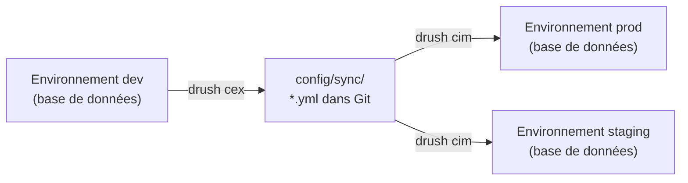
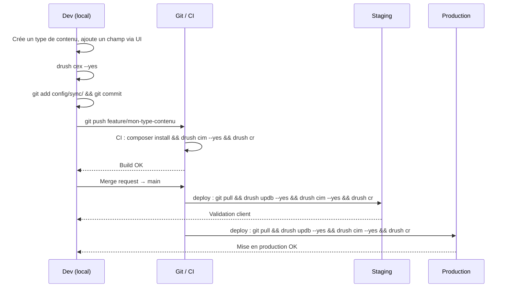
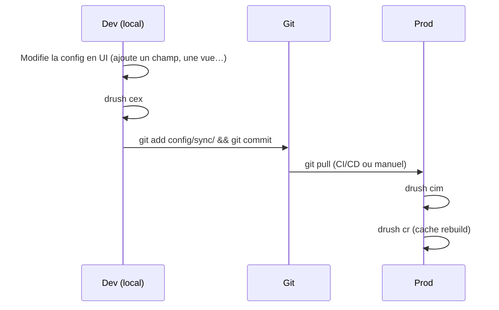

# Le système de configuration Drupal

Le **Config Management System** (CMS) de Drupal est l'équivalent des migrations
Doctrine en Symfony — mais pour la **structure du site** (types de contenu, champs,
vues, blocs, permissions, langues…) plutôt que pour le schéma SQL.

## Principes fondamentaux



- `drush cex` (**c**onfig **ex**port) — exporte la configuration active de la base
  vers `config/sync/` en YAML
- `drush cim` (**c**onfig **im**port) — importe la configuration du YAML vers la base

## Pipeline complet : de l'export au déploiement en production



L'ordre `updb` → `cim` → `cr` est **impératif** :
1. `drush updb` exécute les `hook_update_N` (modifications de schéma SQL).
2. `drush cim` applique la configuration structurelle.
3. `drush cr` invalide tous les caches (plugins, routes, thème).

## Structure des fichiers de configuration

```
config/sync/
├─ core.extension.yml              # active modules and themes
├─ node.type.article.yml           # type de contenu "Article"
├─ field.field.node.article.body.yml    # body field on Article
├─ field.storage.node.field_tags.yml    # field_tags field storage
├─ views.view.frontpage.yml        # vue "Frontpage"
├─ system.site.yml                 # site name, admin email…
└─ user.role.editor.yml            # "Editor" role + permissions
```

Chaque fichier YAML correspond à un objet de configuration. Le nom suit la convention
`{provider}.{type}.{identifiant}.yml`.

## Exemple de fichier de configuration

```yaml
# config/sync/node.type.article.yml
uuid: 8f3e2c1a-0d4b-4e9a-b7c6-123456789abc
langcode: en
status: true
dependencies:
  module:
    - node
name: Article
type: article
description: 'Use articles for timely content.'
help: ''
new_revision: true
preview_mode: 1
display_submitted: true
```

Tu ne modifies jamais ces fichiers manuellement (sauf cas très précis). Tu travailles
en UI sur l'environnement de dev, puis tu exportes.

## Workflow en agence : les 5 règles d'or



**Règle 1** — Toute modification de configuration part de l'environnement de dev,
jamais directement en prod.

**Règle 2** — `drush cex` avant chaque commit qui touche à la structure du site.

**Règle 3** — `drush cim` fait partie du script de déploiement (avec `--yes` en CI).

**Règle 4** — Jamais de configuration qui diverge entre les environnements sans
passer par Git.

**Règle 5** — `drush cr` (cache rebuild) après `drush cim` — la config est mise en
cache aggressivement.

## Settings override system

Certaines valeurs de configuration doivent différer par environnement (URL de base,
clés d'API, email…). Drupal propose le système de surcharge dans `settings.php` :

```php
// web/sites/default/settings.php

// Override configuration values per environment (not exported to YAML)
$config['system.site']['name'] = 'My Site (Dev)';
$config['smtp.settings']['smtp_host'] = 'mailhog';

// Database — never in Git
$databases['default']['default'] = [
    'driver'   => 'mysql',
    'database' => getenv('DB_NAME') ?: 'drupal',
    'username' => getenv('DB_USER') ?: 'drupal',
    'password' => getenv('DB_PASS') ?: 'drupal',
    'host'     => getenv('DB_HOST') ?: 'db',
    'port'     => 3306,
    'prefix'   => '',
];

// Disable config export for overridden values
$settings['config_readonly'] = FALSE; // set TRUE in prod
```

> **À retenir** — Les valeurs surchargées via `$config['...']` dans `settings.php`
> ne sont **jamais exportées** par `drush cex`. Elles servent à injecter des valeurs
> d'environnement sans polluer la configuration versionnée.

## Configuration Split : divergences légitimes entre envs

Le module contrib **Config Split** permet d'avoir des configurations différentes
par environnement (ex. modules de dev activés seulement en local) :

```yaml
# config/sync/config_split.config_split.dev.yml
label: Development
folder: ../config/dev
status: true
module:
  devel: 0
  kint: 0
  stage_file_proxy: 0
```

En prod, ces modules ne sont pas activés ; en dev, `drush cim` les active
automatiquement en lisant le split. [source: drupal.org/project/config_split]

### Arborescence complète avec Config Split

```
config/
├─ sync/                   # configuration de base (tous envs)
│  ├─ core.extension.yml
│  ├─ node.type.article.yml
│  └─ …
├─ dev/                    # surcharges environnement local
│  ├─ core.extension.yml   # + devel, kint, stage_file_proxy
│  └─ …
└─ prod/                   # surcharges production (optionnel)
   ├─ system.performance.yml  # cache CSS/JS agrégés
   └─ …
```

Pour activer Config Split selon l'environnement, dans `settings.php` :

```php
// web/sites/default/settings.php

// Activate the "dev" split only on local
if (getenv('APP_ENV') === 'dev') {
    $config['config_split.config_split.dev']['status'] = TRUE;
    $config['config_split.config_split.prod']['status'] = FALSE;
}

if (getenv('APP_ENV') === 'prod') {
    $config['config_split.config_split.dev']['status'] = FALSE;
    $config['config_split.config_split.prod']['status'] = TRUE;
}
```

```bash
# Installation du module
composer require drupal/config_split
drush en config_split
drush cex  # génère le fichier config_split.config_split.dev.yml dans config/sync/
```

## Commandes Config essentielles

```bash
# Exporter la configuration active vers config/sync/
drush cex --yes

# Importer la configuration de config/sync/ vers la base
drush cim --yes

# Voir les différences (avant un import)
drush config:status

# Lire la valeur d'une clé de configuration
drush config:get system.site name

# Modifier une valeur sans passer par l'UI (utile en CI)
drush config:set system.site name "Mon Site Staging" --yes

# Vider les caches après import
drush cr
```

## ⚠️ Piège agence : reprise de projet sans config synchronisée

En reprenant un site existant, tu trouveras souvent une config divergente :

```bash
# Check the current config diff between database and YAML files
drush config:status

# Output example:
# Name                          State
# node.type.landing_page        Only in DB         ← created in UI, never exported
# views.view.promotions         Different          ← modified in prod directly
# field.field.node.article.body Only in sync dir   ← exists in YAML but not in DB
```

Avant tout travail, commence par `drush config:status`. Si la config est en état
« Only in DB », l'exporter (`drush cex`) et commiter avant de commencer à travailler.

**Scénario classique en agence** : le client ou un précédent prestataire a modifié
la configuration directement en production (ajout d'un champ, changement de permissions,
création d'une vue). `config/sync/` est en retard. Si tu importes sans t'en rendre
compte, tu **perds ces modifications**.

Protocole de reprise :

```bash
# 1. Sauvegarder l'état actuel de la base (important !)
drush sql:dump > backup-before-sync.sql

# 2. Voir ce qui diverge
drush config:status

# 3. Exporter ce qui est "Only in DB" vers YAML, commiter
drush cex --yes
git add config/sync/
git commit -m "chore: sync config from production before work"

# 4. À partir de là, tout nouveau travail part du dev local
```

**Piège supplémentaire** : les UUID dans les fichiers YAML. Chaque objet de
configuration a un UUID unique par installation. Si tu copies des fichiers YAML
d'une installation vers une autre sans réinitialiser les UUID, `drush cim` peut
refuser ou créer des doublons. Laisse toujours Drupal gérer les UUID via
`drush cex` — ne copie jamais des fichiers YAML manuellement entre deux installations
différentes.
