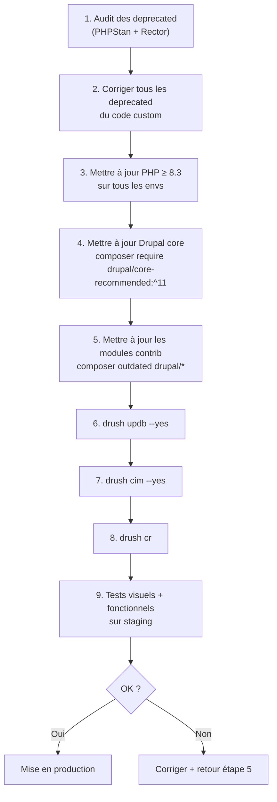

# Monter de Drupal 9/10 à Drupal 10/11

Les montées de version majeures Drupal (9→10, 10→11) sont prévisibles et
bien documentées. La clé : **supprimer les deprecated avant la montée**, pas pendant.
[source: drupal.org/docs/upgrading-drupal]

## Calendrier des versions (contexte 2025-2026)

| Version | Fin de support sécurité |
|---|---|
| Drupal 9 | Novembre 2023 (EOL) |
| Drupal 10 | Janvier 2026 |
| Drupal 11 | Actif (PHP 8.3+ requis) |

> Si tu reprends un site Drupal 9 en 2025 : **migration vers D11 directement**, D9
> n'est plus maintenu.

## Processus de montée D10 → D11



### Étape 1 : Scanner les deprecated avec PHPStan + Rector

```bash
# Install the deprecation checker
composer require --dev mglaman/phpstan-drupal:^1.3

# Or use the dedicated tool
composer require --dev drupal/core-dev --update-with-all-dependencies

# Run deprecation scan
./vendor/bin/phpstan analyse web/modules/custom --level=deprecation

# Alternatively, use Drupal Rector for automated fixes
composer require --dev palantirnet/drupal-rector
./vendor/bin/rector process web/modules/custom
```

Rector corrige automatiquement les appels deprecated les plus courants :
- `Drupal::entityManager()` → `Drupal::entityTypeManager()`
- Annotations `@Block(...)` → Attributs PHP 8 `#[Block(...)]`
- `drupal_set_message()` → `Drupal::messenger()->addMessage()`
- `file_create_url()` → `\Drupal::service('file_url_generator')->generateAbsoluteString()`
- `node_load()` / `user_load()` → `\Drupal::entityTypeManager()->getStorage('node')->load()`

## ⚠️ Pièges agence spécifiques aux reprises de version

### Reprise D9 : le piège des modules contrib sans version stable D10

Scénario fréquent : tu commences la montée vers D10, tout le code custom est propre,
mais un module contrib essentiel (par exemple un module métier spécifique) n'a pas de
release stable D10. Composer refuse de mettre à jour.

```bash
# Identifier les modules contrib bloquants
composer outdated "drupal/*" --direct

# Solution 1 : autoriser une version dev avec contrainte de stabilité minimale
composer require drupal/problematic_module:dev-5.x --prefer-stable

# Solution 2 : patcher depuis drupal.org (patch disponible en issue)
# Dans composer.json :
# "extra": {
#   "patches": {
#     "drupal/problematic_module": {
#       "D10 compatibility": "https://www.drupal.org/files/issues/2024-xxx-d10.patch"
#     }
#   }
# }
composer require cweagans/composer-patches
```

### Reprise D8 : les hooks supprimés en D9/D10

| Hook D7/D8 | Remplacement D10 |
|---|---|
| `hook_menu()` | `*.routing.yml` + `*.links.menu.yml` |
| `hook_block_info()` | Plugin `Block` avec attribut `#[Block(...)]` |
| `hook_permission()` | `*.permissions.yml` |
| `hook_entity_info()` | `hook_entity_type_build()` / `hook_entity_type_alter()` |
| `drupal_add_css()` / `drupal_add_js()` | `#attached['library']` dans render array |
| `theme()` | `\Drupal::theme()->render()` ou render array avec `#theme` |
| `l()` | `\Drupal\Core\Link::fromTextAndUrl()` |

### Update hooks qui échouent silencieusement

```bash
# Voir l'état de tous les update hooks avant de lancer
drush updatedb:status

# Lancer les updates avec verbose pour voir les erreurs
drush updb --yes -v

# Si un update hook échoue, vérifier les logs
drush watchdog:show --count=20 --severity=Error
```

Un update hook qui échoue partiellement peut laisser la base dans un état
inconsistant. Toujours avoir un dump de la base avant `drush updb` sur un projet
qu'on ne maîtrise pas encore.

```bash
# Sauvegarde avant montée de version
drush sql:dump --gzip > backup-pre-update-$(date +%Y%m%d).sql.gz

# Puis seulement :
drush updb --yes
```

### Étape 2 : Vérifier les contraintes PHP

```bash
# Check current PHP version
php -v

# Drupal 11 requires PHP 8.3+
# Update your server/Docker image before updating Drupal
```

### Étape 3 : Mettre à jour le core

```bash
# Update Drupal core (minor: 10.3.x → 10.4.x)
composer update drupal/core-recommended drupal/core-composer-scaffold --with-all-dependencies

# Major update (D10 → D11)
composer require drupal/core-recommended:^11 drupal/core-composer-scaffold:^11 --update-with-all-dependencies

drush updb --yes
drush cr
```

### Étape 4 : Vérifier la compatibilité des modules contrib

```bash
# Check outdated contrib modules
composer outdated "drupal/*"

# Check which modules need updating for D11
drush pm:list --status=enabled --no-core | grep -v "(OK)"

# Update individual modules
composer update drupal/paragraphs drupal/pathauto
```

Certains modules contrib n'ont pas de version D11 au moment de la migration. Options :
1. **Attendre** la release D11 du module
2. **Utiliser un patch** de la branche de dev
3. **Remplacer** par un module équivalent D11-compatible
4. **Fork** temporaire avec correctif

## Migrations D7 → D10/11 : Migrate API

Pour les projets encore en Drupal 7 (nombreux en agence), Drupal fournit la
**Migrate API** pour migrer le contenu :

```bash
# Enable migration modules
drush en migrate migrate_drupal migrate_drupal_ui

# Run the interactive migration wizard at /upgrade
# Or use migrate_tools for CLI migration

composer require drupal/migrate_tools
drush en migrate_tools

# List available migrations
drush migrate:status

# Run a specific migration
drush migrate:import d7_node_article

# Run all migrations
drush migrate:import --all

# Rollback a migration (for testing)
drush migrate:rollback d7_node_article
```

La Migrate API mappe automatiquement les types de contenu D7 vers D10. Les champs
custom et les modules non-standards nécessitent des plugins de migration custom.

## Script de déploiement type en production

Voici le script qu'un prestataire sérieux en agence utilise à chaque mise en production :

```bash
#!/usr/bin/env bash
# deploy.sh — Drupal production deployment script
set -euo pipefail

echo "=== Deploying Drupal ==="

# 1. Pull latest code
git pull origin main

# 2. Install PHP dependencies (no dev, optimized autoloader)
composer install --no-dev --optimize-autoloader

# 3. Put site in maintenance mode
drush state:set system.maintenance_mode 1 --input-format=integer
drush cr

# 4. Run database updates (hook_update_N)
drush updb --yes

# 5. Import configuration
drush cim --yes

# 6. Rebuild caches
drush cr

# 7. Take site out of maintenance mode
drush state:set system.maintenance_mode 0 --input-format=integer

echo "=== Deployment complete ==="
drush status
```

Ce script est à versionner dans le dépôt et à utiliser comme référence pour le CI/CD.
L'ordre des étapes est impératif — ne pas inverser `updb` et `cim`.

> **À retenir** — Pour une montée de version, la règle est : **corriger les deprecated
> d'abord, puis monter**. Ne jamais mettre à jour le core d'un coup sans audit. En agence,
> prévoir un environnement de staging dédié à la montée de version, séparé du
> flux de développement normal.
