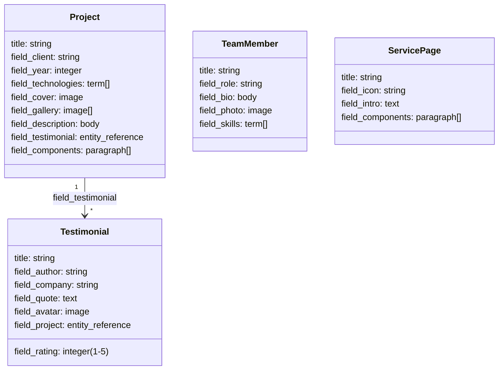
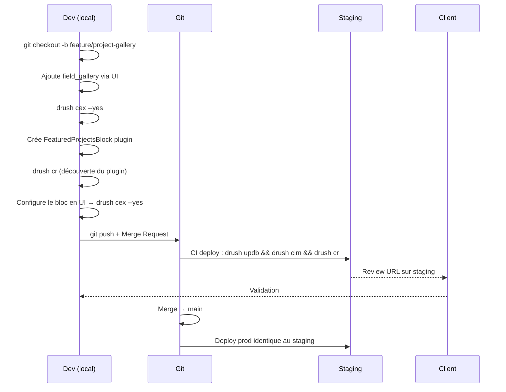

# Architecture du projet : site vitrine d'agence

Ce module fil rouge assemble tous les concepts du parcours dans un projet réaliste :
le **site vitrine d'une agence web** avec portfolio, témoignages et formulaire de
contact. C'est le type de projet que tu reprends ou développes le plus souvent en
mission.

## Modèle de contenu



## Vocabulaires de taxonomie

- **Technologies** : PHP, Symfony, Drupal, Vue.js, React, Docker…
- **Services** : Développement web, Conseil, Intégration API…
- **Team skills** : Backend, Frontend, DevOps, UX…

## Modules contrib requis

```bash
# Essential contrib modules for this project
composer require \
    drupal/paragraphs:^1.17 \
    drupal/metatag:^2.0 \
    drupal/pathauto:^1.12 \
    drupal/token:^1.13 \
    drupal/admin_toolbar:^3.4 \
    drupal/redirect:^1.9 \
    drupal/simple_sitemap:^4.1 \
    drupal/contact_storage:^1.3 \
    drupal/config_split:^2.0

drush en paragraphs metatag pathauto token admin_toolbar redirect simple_sitemap contact_storage config_split

# Export immediately after enabling modules — core.extension.yml must be versioned
drush cex --yes
git add config/sync/
git commit -m "chore: enable contrib modules for agency project"
```

## Module custom : `agency_core`

Un module custom centralise la logique métier :

```
web/modules/custom/agency_core/
├─ agency_core.info.yml
├─ agency_core.module         # hooks: preprocess, theme, form_alter
├─ agency_core.routing.yml    # routes custom
├─ agency_core.services.yml   # services DI
├─ agency_core.permissions.yml
├─ agency_core.links.menu.yml
├─ agency_core.install        # hook_update_N
└─ src/
   ├─ Controller/
   │  └─ ProjectController.php
   ├─ Form/
   │  └─ ContactForm.php
   ├─ Plugin/
   │  └─ Block/
   │     ├─ FeaturedProjectsBlock.php
   │     └─ TestimonialsSliderBlock.php
   ├─ EventSubscriber/
   │  └─ ProjectPublishSubscriber.php
   └─ Service/
      └─ ProjectService.php
```

## Configuration des URL avec Pathauto

```yaml
# config/sync/pathauto.pattern.project.yml
langcode: en
status: true
id: project
label: 'Project'
type: canonical_entities:node
pattern: 'projects/[node:field_client:value]/[node:title]'
selection_criteria:
  node_type:
    id: entity_bundle:node
    negate: false
    bundles:
      project: project
```

Les URL seront automatiquement générées : `/projects/client-name/project-title`.

## Flux de développement en agence : exemple sur un sprint



## Service ProjectService : logique métier injectable

```php
// src/Service/ProjectService.php
namespace Drupal\agency_core\Service;

use Drupal\Core\Entity\EntityTypeManagerInterface;
use Drupal\node\NodeInterface;

final class ProjectService {

    public function __construct(
        private readonly EntityTypeManagerInterface $entityTypeManager,
    ) {}

    /**
     * Returns featured projects ordered by year descending.
     *
     * @return \Drupal\node\NodeInterface[]
     */
    public function getFeaturedProjects(int $limit = 6): array {
        $storage = $this->entityTypeManager->getStorage('node');

        $ids = $storage->getQuery()
            ->accessCheck(TRUE)
            ->condition('type', 'project')
            ->condition('status', 1)
            ->condition('field_featured', 1)
            ->sort('field_year', 'DESC')
            ->range(0, $limit)
            ->execute();

        return $storage->loadMultiple($ids);
    }

    /**
     * Returns projects filtered by a technology term name.
     *
     * @return \Drupal\node\NodeInterface[]
     */
    public function getProjectsByTechnology(string $technology_name): array {
        $term_storage = $this->entityTypeManager->getStorage('taxonomy_term');
        $terms = $term_storage->loadByProperties([
            'vid'  => 'technologies',
            'name' => $technology_name,
        ]);

        if (empty($terms)) {
            return [];
        }

        $term = reset($terms);
        $storage = $this->entityTypeManager->getStorage('node');

        $ids = $storage->getQuery()
            ->accessCheck(TRUE)
            ->condition('type', 'project')
            ->condition('status', 1)
            ->condition('field_technologies', $term->id())
            ->sort('created', 'DESC')
            ->execute();

        return $storage->loadMultiple($ids);
    }
}
```

```yaml
# agency_core/agency_core.services.yml
services:
  agency_core.project_service:
    class: Drupal\agency_core\Service\ProjectService
    arguments:
      - '@entity_type.manager'
```

Ce service est injecté dans le bloc, le controller et potentiellement dans des
commandes Drush custom — un seul endroit pour la logique de requête.

## Affichage des modes (view modes)

Chaque type de contenu a plusieurs modes d'affichage :

| Mode | Contexte |
|---|---|
| `full` | Page détail du projet |
| `card` | Liste / grille de projets |
| `featured` | Bloc en page d'accueil |
| `teaser` | Résultats de recherche |

```bash
# Create view modes via UI then export
drush cex
# config/sync/core.entity_view_mode.node.project_card.yml will be created
```

## ⚠️ Pièges agence sur les projets fil rouge repris

**Config/sync/ absent du dépôt** : fréquent sur les vieux projets. Avant tout travail,
reconstruire l'export depuis la prod :

```bash
# Sur le serveur de prod (ou après dump de la base en local)
drush cex --yes
git add config/sync/
git commit -m "chore: initial config export from production"
```

**Modules contrib en dehors de Composer** : certains vieux projets ont des modules
déposés manuellement dans `web/modules/contrib/`. Ils ne sont pas dans `composer.json`.
Identification :

```bash
# Find modules not managed by Composer
composer show | grep drupal/ > managed.txt
ls web/modules/contrib/ | while read mod; do
    grep -q "drupal/$mod" managed.txt || echo "NOT IN COMPOSER: $mod"
done
```

Pour chaque module détecté : l'ajouter dans `composer.json` avec la version correcte,
puis supprimer le dossier manuel et faire `composer install`.

**Patches Composer cassés** : après un `composer update`, les patches existants peuvent
échouer si le fichier cible a changé. Vérifier :

```bash
composer install 2>&1 | grep -i "patch\|failed\|error"
```

**`drush cim` qui refuse à cause d'un UUID différent** : si le site a été cloné ou
réinstallé, les UUID de configuration ne correspondent plus. Solution :

```bash
# Get the site UUID from the database
drush config:get system.site uuid

# Update the YAML file to match (or vice versa for a fresh install)
drush config:set system.site uuid "your-uuid-here" --yes
```

> **À retenir** — En agence, le module custom `*_core` (ou `*_base`) est le conteneur
> de toute la logique métier custom du projet. Il facilite les transferts de responsabilité
> lors des changements d'équipe. Un seul module custom bien organisé vaut mieux que
> dix micro-modules. Et chaque sprint se termine par `drush cex --yes` + commit —
> sans exception.
