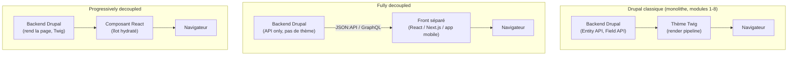

# Le découplé : pourquoi et les modes

Jusqu'ici (modules 1 à 8), Drupal jouait deux rôles à la fois : **backend de contenu**
(Entity API, Field API, Config Management) **et** moteur de rendu HTML (render pipeline,
thème Twig — module 5). Le **découplé** (*headless* ou *decoupled Drupal*) casse ce
couple : Drupal ne fait plus que la première moitié du travail, il devient un **entrepôt
de contenu exposé par API** (*content-as-a-service*), et un front séparé (React, Next.js,
une app mobile…) se charge du rendu.

> **Passerelle.** C'est exactement le même déplacement qu'un projet Symfony qui abandonne
> les vues Twig au profit d'**API Platform** consommé par une SPA React : le backend
> expose des ressources, le front décide seul de leur mise en forme. Les leçons 2 et 3
> détaillent les deux façons dont Drupal expose ces ressources — JSON:API (le pendant du
> format JSON:API d'API Platform) et GraphQL.

## Deux modes, pas un seul

« Headless » n'est pas une case binaire. Deux architectures coexistent, avec des
compromis différents :

| | Fully decoupled | Progressively decoupled |
|---|---|---|
| Qui rend le HTML ? | Le front, entièrement (React/Next/app mobile) | Drupal (Twig) rend la page ; des composants JS s'hydratent par-dessus |
| Le thème Drupal (module 5) sert-il encore ? | Non — plus de Twig, plus de `hook_preprocess_*` | Oui — le thème reste la base, le JS n'ajoute que des îlots interactifs |
| Cas d'usage typique | Site/app séparée avec un front moderne, appli mobile, multi-canal | Une recherche instantanée, un panier, un formulaire enrichi... dans un site sinon classique |
| Coût de mise en œuvre | Élevé (deux codebases, deux déploiements) | Faible à modéré (le site reste Drupal, on ajoute des composants ciblés) |

## Quand découpler (et quand ne pas le faire)

Découpler a du sens quand :

- **Multi-canal** : le même contenu doit alimenter un site web, une app mobile, un
  kiosque, un objet connecté — un seul CMS, plusieurs fronts qui consomment la même API.
- **Une équipe front existe déjà** avec une stack moderne (React/Next/TypeScript) et
  préfère ne pas apprendre Twig/le theming Drupal.
- **Le front a des exigences de perf/SEO** que seul un framework comme Next.js (SSG/ISR)
  apporte nativement.

Ne pas découpler (ou rester progressivement découplé) quand :

- Le site est un site vitrine/blog **simple**, où le thème Twig + Layout Builder
  suffisent amplement — découpler ajoute une codebase, un déploiement et une source de
  bugs pour un gain nul.
- L'équipe éditoriale dépend fortement de **l'édition en place** (*edit-in-place*, liens
  contextuels « Modifier ce bloc » directement sur la page) — fonctionnalité native à
  Drupal classique, à reconstruire à la main en headless.
- L'équipe n'a pas la capacité de maintenir **deux codebases** en parallèle (piège
  détaillé leçon 4).

> ⚠️ **Erreur fréquente — découpler « parce que c'est moderne ».** Le découplé n'est pas
> un gage de qualité en soi : il déplace de la complexité (rendu, cache, preview, SEO) du
> backend vers le front, il ne la supprime pas. Un site vitrine avec un CMS correctement
> thémé n'a souvent **aucun** intérêt à être découplé.

## Ce qu'on perd

- **Layout Builder / composition en place** : composer une page par glisser-déposer de
  blocs, avec prévisualisation immédiate — expérience native Drupal, absente par défaut
  en headless (à reconstruire, ou renoncer).
- **Édition en place** : les liens contextuels « Modifier » affichés directement sur la
  page rendue disparaissent — l'éditeur repasse par le back-office Drupal pur.
- **Rendu intégré au cache** : le render pipeline de Drupal (`#cache`, tags, contexts —
  module 3) optimise automatiquement le HTML final. En headless, cette optimisation ne
  couvre que l'API ; le cache du HTML final devient la responsabilité du front (leçon 4).
- **SEO « gratuit »** : les modules Metatag, Simple Sitemap génèrent balises et sitemap
  directement dans le HTML servi par Drupal. En headless, le front doit reproduire cette
  logique lui-même.

## Ce qu'on gagne

- **Un front moderne** : React/Next.js/TypeScript, le même écosystème que les cours
  `parcours-nextjs` et `parcours-graphql` — plutôt que Twig + jQuery.
- **Multi-canal réel** : une seule API sert le site web, l'app mobile, un partenaire
  externe.
- **Des stratégies de rendu avancées** : SSG, ISR (revalidation périodique), edge
  caching — au niveau du front, indépendamment du cycle de vie de Drupal.
- **Des équipes front et back qui avancent à leur rythme**, avec leurs propres cycles de
  déploiement (à condition d'accepter le coût de coordination — leçon 4).

> **Réflexe à prendre.** Face à une offre mentionnant « Drupal headless », la première
> question à te poser n'est pas « React ou Vue ? » mais **« fully ou progressively
> decoupled ? »** — cette réponse détermine si le thème Twig (module 5 de ce cours) reste
> pertinent ou non sur le projet.

## À retenir

- Le découplé transforme Drupal en **entrepôt de contenu (content-as-a-service)**
  consommé par un front séparé — même logique qu'API Platform + SPA côté Symfony.
- **Fully decoupled** : Drupal ne rend plus de HTML, tout part par API. **Progressively
  decoupled** : Drupal rend toujours la page, seuls des composants JS ciblés s'hydratent
  par-dessus.
- Découpler a un coût réel (perte de l'édition en place, du Layout Builder, du SEO
  « gratuit », deux codebases à maintenir) — ce n'est jamais un choix par défaut, seulement
  une réponse à un besoin précis (multi-canal, front déjà moderne, perf/SEO avancées).
