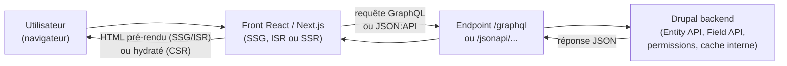

# GraphQL pour Drupal et le front React/Next

Le module contrib **GraphQL** (`drupal/graphql`) est l'alternative à JSON:API : plutôt
que d'exposer une ressource par type d'entité, on définit un **schéma** sur mesure et le
front écrit exactement la requête dont il a besoin — le même paradigme que celui du
module 1 de `parcours-graphql`.

> **Passerelle.** Tu connais déjà tout le raisonnement « quand choisir GraphQL » — c'est
> la même leçon que `parcours-graphql/01-paradigme/03-quand-choisir-graphql`, appliquée à
> Drupal plutôt qu'à NestJS ou API Platform : le **serveur** change (ici, un schéma
> généré à partir des types de contenu Drupal), le raisonnement côté client reste
> identique.

## JSON:API ou GraphQL : lequel choisir ?

| | JSON:API | GraphQL |
|---|---|---|
| Mise en place | Zéro config, natif au core | Module contrib à installer, schéma à définir |
| Un aller-retour pour plusieurs types indépendants (articles + bannière + menu) | Plusieurs appels (`include` limité aux relations existantes) | Une seule requête imbriquée |
| Sur-mesure du champ demandé | Sparse fieldsets (`fields[...]`) | Natif — on ne demande que ce qu'on liste |
| Cache HTTP standard (CDN, `ETag`) | Oui (GET classique) | Non par défaut (POST) — cache applicatif côté client (Apollo/urql) |
| Courbe d'apprentissage | Faible (REST-like) | Plus élevée (schéma, resolvers) |

Même logique que la leçon « Quand (ne pas) choisir GraphQL » du cours GraphQL : GraphQL
brille quand le front doit **agréger plusieurs sources en un aller-retour** — typiquement
une page d'accueil qui mélange articles, bannière promotionnelle et menu, trois types de
contenu sans relation entre eux, que JSON:API ne peut pas `include` ensemble.

## Installer et exposer un schéma

```bash
composer require drupal/graphql
drush en graphql
drush cr
```

Le module `graphql` seul demande d'écrire les types/resolvers à la main. En pratique, le
module compagnon **`graphql_compose`** est très utilisé : il **génère automatiquement**
un schéma à partir des types de contenu et champs existants (comme JSON:API le fait, mais
en GraphQL) — évite d'écrire un resolver par champ.

```bash
composer require drupal/graphql_compose
drush en graphql_compose graphql_compose_edges
drush cr
```

Un seul endpoint exposé (à la différence d'un endpoint par type en JSON:API) :
`POST /graphql`.

```graphql
# A single request aggregating three unrelated content sources — the case JSON:API handles poorly
query HomePage {
  nodeArticles(first: 5, sortKey: CREATED_AT, sortDirection: DESC) {
    nodes {
      id
      title
      path
    }
  }
  blockContentPromoBanner(id: "...") {
    title
    body
  }
  menu(name: MAIN) {
    links {
      label
      url
    }
  }
}
```

## Consommer depuis React/Next : rien de nouveau

Le client GraphQL ne sait pas — et n'a pas besoin de savoir — que le serveur est un
NestJS (`parcours-graphql` module 3) ou un Drupal. **Le même code Apollo Client** que
celui du module 4 de `parcours-graphql` fonctionne, il suffit de changer `uri`.

```ts
// lib/apollo-client.ts
import { ApolloClient, InMemoryCache } from "@apollo/client"

export const apolloClient = new ApolloClient({
  uri: "https://example.com/graphql", // Drupal's GraphQL endpoint instead of a Node.js server
  cache: new InMemoryCache(),
})
```

Dans un Server Component Next.js (SSG/ISR — `parcours-nextjs` module 3), on interroge
directement l'endpoint sans passer par les hooks React (réservés aux Client Components) :

```ts
// app/page.tsx — Server Component: fetch the GraphQL endpoint directly
async function getHomePage() {
  const res = await fetch("https://example.com/graphql", {
    method: "POST",
    headers: { "Content-Type": "application/json" },
    body: JSON.stringify({ query: HOME_PAGE_QUERY }),
    next: { revalidate: 60, tags: ["homepage"] }, // ISR: refresh at most once a minute
  })

  const { data } = await res.json()
  return data
}
```

> **Réflexe à prendre.** La même règle que `parcours-nextjs` module 3 s'applique : sans
> option, `fetch` n'est **pas** caché depuis Next.js 15 (SSR à chaque requête). Pour du
> SSG/ISR, il faut demander explicitement `cache: "force-cache"` ou `next: {
> revalidate }`. C'est encore plus important ici : un `fetch` `POST` vers `/graphql` sans
> revalidation régénère une requête complète à Drupal à **chaque** visite.

## Flux découplé, vue d'ensemble



## CORS, auth et preview : mêmes principes que JSON:API

- **CORS** : le module `graphql` respecte la même configuration `cors.config` que la
  leçon précédente — l'endpoint `/graphql` doit aussi autoriser les origines du front.
- **Auth** : un token Bearer (OAuth2, `simple_oauth`) passé en en-tête `Authorization`
  fonctionne de la même façon qu'en JSON:API — le schéma GraphQL respecte les permissions
  Drupal sous-jacentes (un champ non accessible à l'utilisateur courant renvoie `null` ou
  une erreur, jamais la donnée).
- **Preview d'un brouillon** : nécessite un utilisateur (ou token) avec la permission de
  voir le contenu non publié, **et** un moyen côté front de contourner son propre cache
  (le « draft mode » de Next.js désactive le cache de données pour la session de
  preview — détaillé en leçon 4).

## À retenir

- GraphQL (module contrib `drupal/graphql`, souvent avec `graphql_compose`) est
  **l'alternative** à JSON:API, pas un remplacement systématique : il brille quand un
  front doit agréger plusieurs types de contenu indépendants en une seule requête.
- Côté React/Next, **rien ne change** par rapport à ce que tu connais déjà (Apollo
  Client, `useQuery`, `fetch` + `revalidate` en Server Component) — seul `uri` pointe
  vers Drupal plutôt qu'un autre serveur GraphQL.
- CORS et authentification (OAuth2) suivent les mêmes règles que JSON:API ; la preview de
  contenu non publié demande un token dédié **et** un contournement du cache front
  (leçon suivante).
