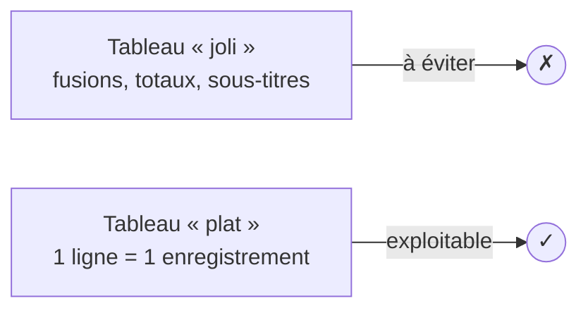

# Une donnée propre se reconnaît à l'œil

Avant d'analyser, ton jeu de données doit respecter une règle d'or : **1 ligne = 1
enregistrement, 1 colonne = 1 variable**. C'est ce qu'on appelle une donnée *tidy*, et
c'est aussi ce qu'attendent les TCD, SQL et Python.

## La checklist du jeu propre

- **Un en-tête unique** sur une seule ligne (pas de titre fusionné au-dessus).
- **Pas de lignes vides** ni de totaux au milieu des données.
- **Une seule information par cellule** : `"Nord - Office"` doit devenir deux colonnes
  `region` et `category`.
- **Types homogènes** par colonne : `amount` ne contient que des nombres, `order_date`
  que des dates.
- **Pas de cellules fusionnées** dans la zone de données.

## Trier sans casser les lignes

Avec un tableau structuré, le tri est intégré : clique sur la flèche d'un en-tête → *Trier
du plus grand au plus petit*. Excel déplace **la ligne entière**, donc `amount`, `region`
et `category` restent solidaires.

> **Piège classique —** sélectionner une seule colonne puis trier : tu désynchronises les
> lignes et tu corromps silencieusement le fichier. Avec un Tableau, ce risque disparaît.

## Filtrer pour explorer

Les flèches d'en-tête permettent aussi de **filtrer** : ne garder que `region = "Nord"`,
ou les `amount` au-dessus d'un seuil. Le filtre ne supprime rien, il **masque** : pratique
pour vérifier une hypothèse avant de lancer un calcul.

Pour des filtres plus visuels, on verra les **segments** (slicers) dans le module TCD.

> **À retenir —** vise une table plate : un en-tête, une ligne par enregistrement, un type
> par colonne. C'est le socle de tout le reste du parcours.
