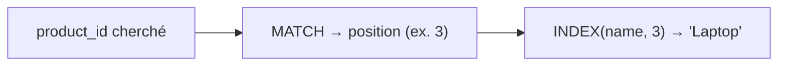

# INDEX + EQUIV : l'alternative universelle

Si `XLOOKUP` n'est pas disponible (versions plus anciennes), le couple `INDEX` + `MATCH`
(EQUIV) fait tout, et travaille partout :

```
=INDEX(Products[name], MATCH([@product_id], Products[product_id], 0))
```

Décomposition :

- `MATCH([@product_id], Products[product_id], 0)` trouve la **position** de la clé.
  Le `0` impose une correspondance **exacte**.
- `INDEX(Products[name], position)` renvoie la valeur de `name` à cette position.



C'est plus verbeux que `XLOOKUP`, mais parfaitement fiable et indépendant du numéro de
colonne.

## Recherche approchée : ranger dans des tranches

Toutes les recherches ne sont pas exactes. Pour classer un montant dans une **tranche**
(remise, tarif progressif), on utilise une recherche **approchée** sur une table de bornes
triée par ordre croissant.

Table `Tiers` triée par `min_amount` croissant :

| min_amount | discount |
|---|---|
| 0 | 0% |
| 200 | 5% |
| 500 | 10% |

```
// XLOOKUP in "closest value less than or equal to" mode
=XLOOKUP([@amount], Tiers[min_amount], Tiers[discount], 0, -1)

// Legacy equivalent: approximate MATCH (last argument = 1)
=INDEX(Tiers[discount], MATCH([@amount], Tiers[min_amount], 1))
```

Le `-1` de `XLOOKUP` (ou le `1` de `MATCH`) signifie « prends la borne juste en dessous ».
La table **doit** être triée croissante, sinon le résultat est faux.

> **À retenir —** `INDEX + MATCH(…, 0)` = recherche exacte universelle. Pour ranger une
> valeur dans des tranches, passe en mode **approché** (`-1`/`1`) sur une table de bornes
> triée.
