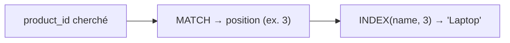
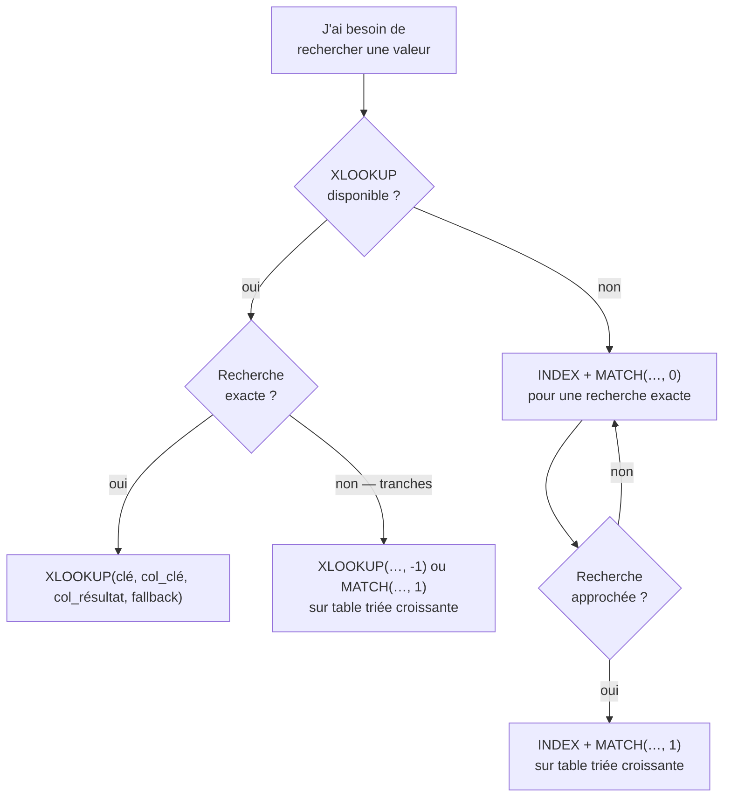

# INDEX + EQUIV : l'alternative universelle

Si `XLOOKUP` n'est pas disponible (versions plus anciennes), le couple `INDEX` + `MATCH`
(EQUIV) fait tout, et travaille partout :

```
=INDEX(Products[name], MATCH([@product_id], Products[product_id], 0))
```

Décomposition :

- `MATCH([@product_id], Products[product_id], 0)` trouve la **position** de la clé.
  Le `0` impose une correspondance **exacte**.
- `INDEX(Products[name], position)` renvoie la valeur de `name` à cette position.


```mermaid
flowchart LR
    K["product_id cherché"] --> M["MATCH → position (ex. 3)"]
    M --> I["INDEX(name, 3) → 'Laptop'"]
```

C'est plus verbeux que `XLOOKUP`, mais parfaitement fiable et indépendant du numéro de
colonne.

## Recherche approchée : ranger dans des tranches

Toutes les recherches ne sont pas exactes. Pour classer un montant dans une **tranche**
(remise, tarif progressif), on utilise une recherche **approchée** sur une table de bornes
triée par ordre croissant.

Table `Tiers` triée par `min_amount` croissant :

| min_amount | discount |
|---|---|
| 0 | 0% |
| 200 | 5% |
| 500 | 10% |

```
// XLOOKUP in "closest value less than or equal to" mode
=XLOOKUP([@amount], Tiers[min_amount], Tiers[discount], 0, -1)

// Legacy equivalent: approximate MATCH (last argument = 1)
=INDEX(Tiers[discount], MATCH([@amount], Tiers[min_amount], 1))
```

Le `-1` de `XLOOKUP` (ou le `1` de `MATCH`) signifie « prends la borne juste en dessous ».
La table **doit** être triée croissante, sinon le résultat est faux.

## Arbre de décision : quelle formule de recherche ?


```mermaid
flowchart TD
    A["J'ai besoin de\nrechercher une valeur"] --> B{"XLOOKUP\ndisponible ?"}
    B -->|oui| C{"Recherche\nexacte ?"}
    B -->|non| D["INDEX + MATCH(…, 0)\npour une recherche exacte"]
    C -->|oui| E["XLOOKUP(clé, col_clé, col_résultat, fallback)"]
    C -->|non — tranches| F["XLOOKUP(…, -1) ou MATCH(…, 1)\nsur table triée croissante"]
    D --> G{"Recherche\napprochée ?"}
    G -->|oui| H["INDEX + MATCH(…, 1)\nsur table triée croissante"]
    G -->|non| D
```

## Cas concret : grille tarifaire fournisseur

Un fournisseur applique un prix dégressif selon le volume commandé. La table `Pricing`
(triée croissante sur `min_qty`) :

| min_qty | unit_price |
|---|---|
| 1 | 12.00 |
| 50 | 10.50 |
| 200 | 9.00 |
| 500 | 7.50 |

```
// Retrieve the applicable unit price for the ordered quantity
=XLOOKUP([@quantity], Pricing[min_qty], Pricing[unit_price], 0, -1)

// With INDEX+MATCH (older Excel)
=INDEX(Pricing[unit_price], MATCH([@quantity], Pricing[min_qty], 1))
```

Pour une commande de 120 unités, le résultat est `10.50` (la borne `50 ≤ qty < 200`).

## Pas-à-pas : réconciliation de deux listes (rapprochement bancaire)

Contexte : tu as exporté deux fichiers. `Payments`
(`ref | payment_date | amount`) liste les paiements émis par ton entreprise.
`Invoices` (`ref | supplier | invoice_amount`) liste les factures attendues. Tu veux
vérifier que chaque paiement correspond à une facture et détecter les écarts.

**Étape 1 — Retrouver le montant facturé pour chaque paiement.**
Ajoute la colonne `invoice_amount` dans la table `Payments`. En `D2` :

```
// Retrieve invoice amount; 0 means no matching invoice found
=IFERROR(INDEX(Invoices[invoice_amount], MATCH([@ref], Invoices[ref], 0)), 0)
```

Si `MATCH` ne trouve pas la référence, `IFERROR` renvoie `0` — un `0` dans cette colonne
signale un paiement sans facture correspondante.

**Étape 2 — Calculer l'écart.**
Ajoute la colonne `discrepancy` en `E2` :

```
// Positive = paid more than invoiced; negative = underpaid
=[@amount] - [@invoice_amount]
```

**Étape 3 — Compter et sommer les anomalies.**
Dans un onglet `Reconciliation`, en `B2` et `B3` :

```
// Payments with no matching invoice (invoice_amount = 0)
=COUNTIFS(Payments[invoice_amount], 0)

// Payments with a non-zero discrepancy
=COUNTIFS(Payments[discrepancy], "<>0")
```

**Étape 4 — Récupérer le nom du fournisseur.**
Ajoute la colonne `supplier` dans `Payments` :

```
=IFERROR(INDEX(Invoices[supplier], MATCH([@ref], Invoices[ref], 0)), "NOT FOUND")
```

Tu peux maintenant faire un TCD sur `Payments` : `supplier` en lignes, SOMME de
`discrepancy` en valeurs — les fournisseurs avec les plus gros écarts remontent en tête.

## Pièges fréquents sur INDEX + MATCH

**Le `0` final de `MATCH` est indispensable.** Sans lui (ou en mettant `1`), Excel fait
une recherche approchée et renvoie la valeur la plus proche sans avertissement. Le résultat
paraît plausible mais peut être faux si la table n'est pas triée. Toujours mettre `0` pour
une recherche exacte.

**Types incompatibles entre les deux colonnes.** Si la clé dans `Payments[ref]` est un
nombre (`1042`) et que `Invoices[ref]` contient du texte (`"1042"`), `MATCH` renvoie
`#N/A` même si la valeur paraît identique. Vérifie le type : sélectionne une cellule,
observe l'alignement — gauche = texte, droite = nombre. Corrige avec `TEXT([@ref], "0")`
ou `VALUE([@ref])` selon le sens.

**`#REF!` après insertion ou suppression de colonne.** `INDEX(Invoices[invoice_amount],
...)` utilise le nom du Tableau — il résiste aux réorganisations de colonnes. En revanche,
la syntaxe ancienne `INDEX($C:$C, ...)` casse dès qu'on insère une colonne avant C. Migre
vers les Tableaux structurés pour éviter ce problème.

> **À retenir —** `INDEX + MATCH(…, 0)` = recherche exacte universelle. Pour ranger une
> valeur dans des tranches (remise, tarif progressif), passe en mode **approché** (`-1`/`1`)
> sur une table de bornes triée croissante. La table **doit** être triée — sinon le résultat
> est faux sans message d'erreur.
