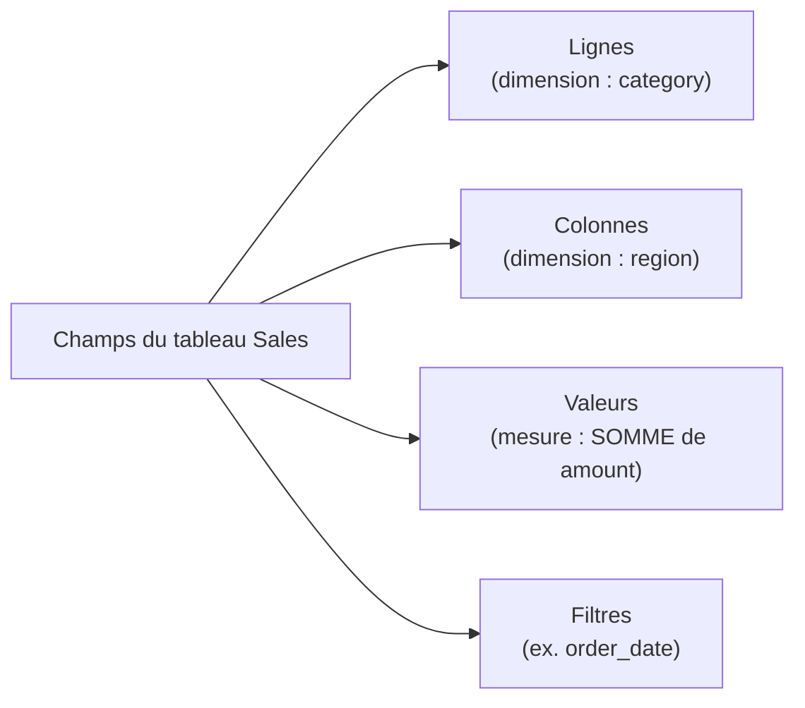

# Le tableau croisé dynamique : ton meilleur ami

Le **TCD** (*pivot table*) agrège des milliers de lignes en quelques clics, sans une seule
formule. C'est l'outil d'exploration n°1 de l'analyste Excel.

## La logique d'un TCD

Un TCD a quatre zones. Tu y glisses tes colonnes :

On met des **dimensions** (ce par quoi on découpe) en lignes/colonnes, et une **mesure**
(ce qu'on calcule, agrégée) en valeurs.

Pour visualiser l'anatomie complète :

## Exemple : CA par catégorie et région

À partir du tableau `Sales` :

1. Sélectionne le tableau → Insertion → **Tableau croisé dynamique**.
2. **Lignes** : `category`
3. **Colonnes** : `region`
4. **Valeurs** : `amount`, agrégation **Somme**

Résultat (lecture instantanée) :

| Somme de amount | Nord | Sud | Total |
|---|---|---|---|
| **Hardware** | 500 | 300 | 800 |
| **Office** | 200 | 150 | 350 |
| **Total** | 700 | 450 | 1150 |

## Changer l'agrégation

Clique sur le champ de valeur → *Paramètres des champs de valeurs* : Somme, **Moyenne**
(panier moyen), **Nombre** (nb de commandes), Max, Min… Une même dimension peut accueillir
**plusieurs mesures** côte à côte (ex. Somme *et* Nombre d'`amount`).

## Grouper les dates

Glisse `order_date` en Lignes, clic droit → **Grouper** → par Mois / Trimestre / Année. Tu
obtiens un CA mensuel sans aucune formule. (C'est l'équivalent automatique de la clé
`"AAAA-MM"` vue dans le module dates.)

## Cas d'usage concrets par métier

| Question métier | Lignes | Colonnes | Valeurs |
|---|---|---|---|
| CA par catégorie et région | `category` | `region` | SOMME `amount` |
| Nombre de commandes par mois | `order_date` (groupé mois) | — | NOMBRE `order_id` |
| Panier moyen par commercial | `salesperson` | — | MOYENNE `amount` |
| Masse salariale par département | `department` | — | SOMME `salary` |
| Achats par fournisseur et trimestre | `supplier` | `order_date` (groupé trim.) | SOMME `amount` |

> **Piège —** glisser une **mesure** (ex. `amount`) en zone Lignes plutôt qu'en Valeurs :
> Excel affiche chaque montant distinct comme une ligne. Tu t'en aperçois car le TCD
> ressemble à ta table source. Retire le champ et repose-le en Valeurs avec une agrégation.

> **Réflexe —** un TCD se **rafraîchit** : si les données changent, clic droit →
> *Actualiser*. Et si tu as ajouté des lignes hors du Tableau structuré, elles n'entreront
> pas — d'où l'importance du `Ctrl+L` du début.

> **À retenir —** TCD = glisser des **dimensions** (lignes/colonnes) et une **mesure**
> agrégée (valeurs). Pour explorer un jeu de données inconnu, commence toujours par là.
