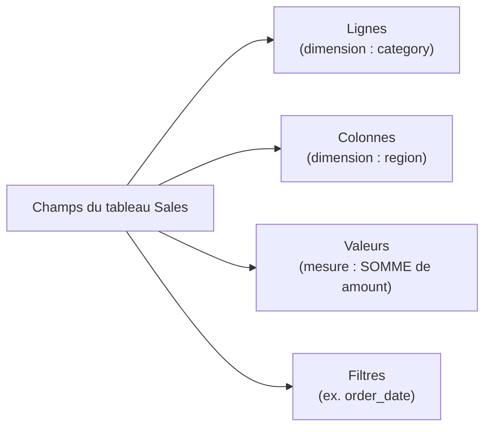

# Le tableau croisé dynamique : ton meilleur ami

Le **TCD** (*pivot table*) agrège des milliers de lignes en quelques clics, sans une seule
formule. C'est l'outil d'exploration n°1 de l'analyste Excel.

## La logique d'un TCD

Un TCD a quatre zones. Tu y glisses tes colonnes :

```mermaid
flowchart LR
    Champs["Champs du tableau Sales"] --> L["Lignes\n(dimension : category)"]
    Champs --> C["Colonnes\n(dimension : region)"]
    Champs --> V["Valeurs\n(mesure : SOMME de amount)"]
    Champs --> F["Filtres\n(ex. order_date)"]
```

On met des **dimensions** (ce par quoi on découpe) en lignes/colonnes, et une **mesure**
(ce qu'on calcule, agrégée) en valeurs.

Pour visualiser l'anatomie complète :

## Exemple : CA par catégorie et région

À partir du tableau `Sales` :

1. Sélectionne le tableau → Insertion → **Tableau croisé dynamique**.
2. **Lignes** : `category`
3. **Colonnes** : `region`
4. **Valeurs** : `amount`, agrégation **Somme**

Résultat (lecture instantanée) :

| Somme de amount | Nord | Sud | Total |
|---|---|---|---|
| **Hardware** | 500 | 300 | 800 |
| **Office** | 200 | 150 | 350 |
| **Total** | 700 | 450 | 1150 |

## Pas-à-pas détaillé : créer un TCD de A à Z

**Étape 1 — S'assurer d'avoir un Tableau structuré.**
Si tes données sont dans une plage normale (ex. `A1:F200`), clique sur n'importe quelle
cellule des données, puis `Ctrl+L` → OK. Excel crée un Tableau. Renomme-le `Sales` dans
l'onglet *Création de tableau* (champ « Nom du tableau » en haut à gauche). Un Tableau
structuré s'agrandit automatiquement — si tu ajoutes des lignes, le TCD les verra au
prochain rafraîchissement.

**Étape 2 — Insérer le TCD.**
Clique sur une cellule du Tableau `Sales` → onglet *Insertion* → *Tableau croisé
dynamique*. Dans la boîte de dialogue, vérifie que le champ *Source* affiche `Sales`
(et non `$A$1:$F$200` — une plage figée ne s'adapte pas aux nouvelles lignes). Choisis
*Nouvelle feuille de calcul* → OK.

**Étape 3 — Glisser les champs.**
Le volet « Champs de tableau croisé dynamique » apparaît à droite. Glisse :
- `category` → zone **Lignes**
- `region` → zone **Colonnes**
- `amount` → zone **Valeurs** (Excel choisit *Somme* automatiquement pour une colonne
  numérique)

**Étape 4 — Renommer et formater.**
Clique sur la cellule `Somme de amount` dans le TCD → *Paramètres des champs de valeurs*
→ renomme en `CA (€)` → bouton *Format numérique* → *Monétaire*. La lecture est
immédiatement plus claire dans un rapport.

**Étape 5 — Trier du plus grand au plus petit.**
Clique sur un montant dans la colonne `Total` → clic droit → *Trier* → *Du plus grand
au plus petit*. Les catégories se classent selon leur contribution au CA total.

> **Repère —** la décision la plus importante est la **source en Tableau structuré**. Elle
> garantit que le TCD reste à jour quand les données grossissent, sans jamais redéfinir la
> plage source manuellement.

## Changer l'agrégation

Clique sur le champ de valeur → *Paramètres des champs de valeurs* : Somme, **Moyenne**
(panier moyen), **Nombre** (nb de commandes), Max, Min… Une même dimension peut accueillir
**plusieurs mesures** côte à côte (ex. Somme *et* Nombre d'`amount`).

## Grouper les dates

Glisse `order_date` en Lignes, clic droit → **Grouper** → par Mois / Trimestre / Année. Tu
obtiens un CA mensuel sans aucune formule. (C'est l'équivalent automatique de la clé
`"AAAA-MM"` vue dans le module dates.)

## Cas d'usage concrets par métier

| Question métier | Lignes | Colonnes | Valeurs |
|---|---|---|---|
| CA par catégorie et région | `category` | `region` | SOMME `amount` |
| Nombre de commandes par mois | `order_date` (groupé mois) | — | NOMBRE `order_id` |
| Panier moyen par commercial | `salesperson` | — | MOYENNE `amount` |
| Masse salariale par département | `department` | — | SOMME `salary` |
| Achats par fournisseur et trimestre | `supplier` | `order_date` (groupé trim.) | SOMME `amount` |

## Cas d'usage RH : tableau de bord masse salariale

Contexte : tu as une table `Employees`
(`employee_id | name | department | job_level | salary | hire_date | location`).
Tu dois répondre à trois questions rapidement : quelle est la masse salariale par
département ? Quel est le salaire moyen par niveau ? Combien d'employés par site ?

Trois TCD, créés depuis la même source `Employees` :

| TCD | Lignes | Colonnes | Valeurs |
|---|---|---|---|
| Masse salariale | `department` | `job_level` | SOMME de `salary` |
| Salaire moyen | `department` | — | MOYENNE de `salary` |
| Effectifs | `location` | `department` | NOMBRE de `employee_id` |

Place les trois TCD sur un onglet `Dashboard_RH` et relie-les à un même **segment**
`department` (*Analyse du TCD → Insérer un segment → department*, puis clic droit
sur le segment → *Connexions de rapport* → coche les trois TCD). Un clic sur un
département filtre simultanément les trois tableaux.

> **Piège —** glisser une **mesure** (ex. `amount`) en zone Lignes plutôt qu'en Valeurs :
> Excel affiche chaque montant distinct comme une ligne. Tu t'en aperçois car le TCD
> ressemble à ta table source. Retire le champ et repose-le en Valeurs avec une agrégation.

> **Réflexe —** un TCD se **rafraîchit** : si les données changent, clic droit →
> *Actualiser*. Et si tu as ajouté des lignes hors du Tableau structuré, elles n'entreront
> pas — d'où l'importance du `Ctrl+L` du début.

> **À retenir —** TCD = glisser des **dimensions** (lignes/colonnes) et une **mesure**
> agrégée (valeurs). Pour explorer un jeu de données inconnu, commence toujours par là.
