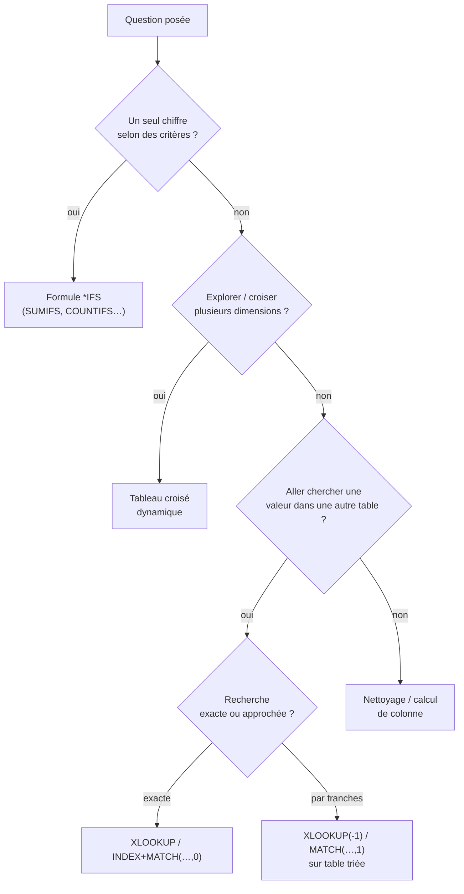

# Choisir le bon outil selon la question

Le vrai test en entretien (et au quotidien) n'est pas de connaître une formule, mais de
savoir **quelle** approche déclencher devant une question métier. Voici un guide de
décision, puis des cas vente / achat / RH.

## L'arbre de décision



En clair : **un chiffre ciblé** → une formule `*IFS` ; **une vue d'ensemble qui se
réarrange** → un TCD ; **une donnée venue d'ailleurs** → une recherche exacte ou approchée.

## Cas vente / achat

**« Quel est le CA de la région Nord en février 2024 ? »** → un chiffre, deux critères :

```
=SUMIFS(Sales[amount], Sales[region], "Nord",
        Sales[order_date], ">=" & DATE(2024,2,1),
        Sales[order_date], "<=" & DATE(2024,2,29))
```

**« Quelle est la répartition du CA par catégorie et par région ? »** → on croise deux
dimensions et on veut pouvoir réarranger : **TCD** (`category` en lignes, `region` en
colonnes, Somme d'`amount`), affiché en **% du total**.

**« Quel fournisseur me coûte le plus cher ? »** → TCD sur la table `Purchases` :
`supplier` en lignes, Somme de `amount` en valeurs, tri décroissant.

## Cas RH

**« Quelle est l'ancienneté moyenne par département ? »** → une mesure agrégée par
dimension : on peut faire un TCD (moyenne d'une colonne `seniority`) ou une formule, la
colonne `seniority` étant d'abord calculée :

```
// seniority column in the Employees table
=DATEDIF([@hire_date], TODAY(), "Y")

// Average seniority for the "Sales" department
=AVERAGEIFS(Employees[seniority], Employees[department], "Sales")
```

**« Combien d'employés gagnent plus de 50 000 dans chaque département ? »** → comptage
conditionnel :

```
=COUNTIFS(Employees[department], "IT", Employees[salary], ">50000")
```

**« Retrouver le manager de chaque employé à partir de son manager_id »** → recherche dans
la même table (auto-jointure) :

```
=XLOOKUP([@manager_id], Employees[employee_id], Employees[name], "—")
```

## Cas finance / contrôle de gestion

**« Quel est l'écart budget/réalisé par centre de coût ce mois-ci ? »**

On a `Budget` (`cost_center | month | planned`) et `Actuals` (`cost_center | month |
consumed`). Ce n'est pas un TCD (on veut une formule dans un tableau de synthèse) :

```
// Planned amount for cost center in column A, month in column B
=SUMIFS(Budget[planned], Budget[cost_center], A2, Budget[month], B2)

// Consumed amount
=SUMIFS(Actuals[consumed], Actuals[cost_center], A2, Actuals[month], B2)

// Variance
=C2 - D2
```

**« Quelle est la catégorie de dépenses la plus importante par département ? »**
→ TCD : `department` en lignes, `category` en colonnes, SOMME de `amount` en valeurs,
trié par total décroissant.

> **À retenir —** avant de taper une formule, classe la question : chiffre ciblé (`*IFS`),
> exploration multi-dimensions (TCD), valeur venue d'une autre table (recherche), ou besoin
> de nettoyage/structuration. Le bon réflexe vaut mieux que la formule la plus longue.
