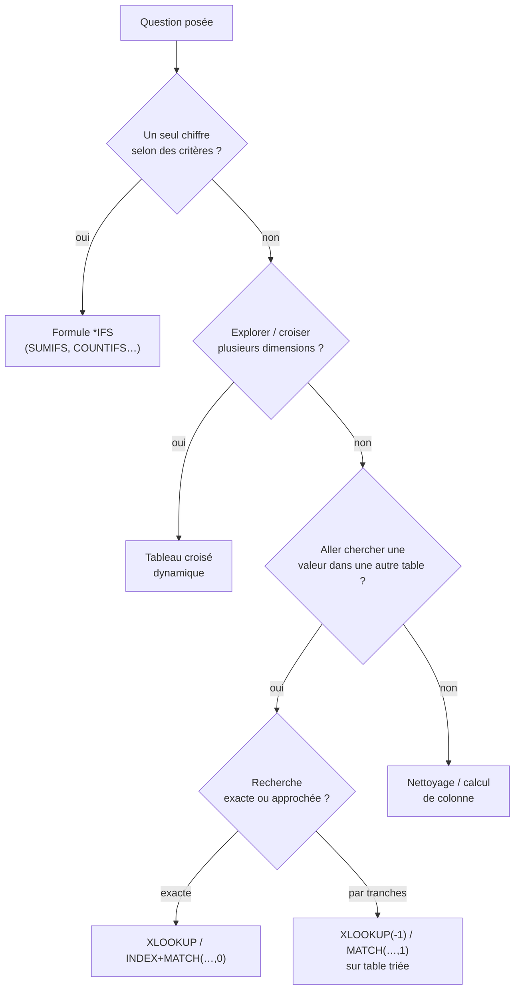

# Choisir le bon outil selon la question

Le vrai test en entretien (et au quotidien) n'est pas de connaître une formule, mais de
savoir **quelle** approche déclencher devant une question métier. Voici un guide de
décision, puis des cas vente / achat / RH.

## L'arbre de décision


```mermaid
flowchart TD
    Q["Question posée"] --> A{"Un seul chiffre\nselon des critères ?"}
    A -->|oui| F["Formule *IFS\n(SUMIFS, COUNTIFS…)"]
    A -->|non| B{"Explorer / croiser\nplusieurs dimensions ?"}
    B -->|oui| T["Tableau croisé\ndynamique"]
    B -->|non| C{"Aller chercher une\nvaleur dans une autre table ?"}
    C -->|oui| R{"Recherche\nexacte ou approchée ?"}
    R -->|exacte| L["XLOOKUP / INDEX+MATCH(…,0)"]
    R -->|par tranches| AP["XLOOKUP(-1) / MATCH(…,1)\nsur table triée"]
    C -->|non| D["Nettoyage / calcul\nde colonne"]
```

En clair : **un chiffre ciblé** → une formule `*IFS` ; **une vue d'ensemble qui se
réarrange** → un TCD ; **une donnée venue d'ailleurs** → une recherche exacte ou approchée.

## Cas vente / achat

**« Quel est le CA de la région Nord en février 2024 ? »** → un chiffre, deux critères :

```
=SUMIFS(Sales[amount], Sales[region], "Nord",
        Sales[order_date], ">=" & DATE(2024,2,1),
        Sales[order_date], "<=" & DATE(2024,2,29))
```

**« Quelle est la répartition du CA par catégorie et par région ? »** → on croise deux
dimensions et on veut pouvoir réarranger : **TCD** (`category` en lignes, `region` en
colonnes, Somme d'`amount`), affiché en **% du total**.

**« Quel fournisseur me coûte le plus cher ? »** → TCD sur la table `Purchases` :
`supplier` en lignes, Somme de `amount` en valeurs, tri décroissant.

## Cas RH

**« Quelle est l'ancienneté moyenne par département ? »** → une mesure agrégée par
dimension : on peut faire un TCD (moyenne d'une colonne `seniority`) ou une formule, la
colonne `seniority` étant d'abord calculée :

```
// seniority column in the Employees table
=DATEDIF([@hire_date], TODAY(), "Y")

// Average seniority for the "Sales" department
=AVERAGEIFS(Employees[seniority], Employees[department], "Sales")
```

**« Combien d'employés gagnent plus de 50 000 dans chaque département ? »** → comptage
conditionnel :

```
=COUNTIFS(Employees[department], "IT", Employees[salary], ">50000")
```

**« Retrouver le manager de chaque employé à partir de son manager_id »** → recherche dans
la même table (auto-jointure) :

```
=XLOOKUP([@manager_id], Employees[employee_id], Employees[name], "—")
```

## Cas finance / contrôle de gestion

**« Quel est l'écart budget/réalisé par centre de coût ce mois-ci ? »**

On a `Budget` (`cost_center | month | planned`) et `Actuals` (`cost_center | month |
consumed`). Ce n'est pas un TCD (on veut une formule dans un tableau de synthèse) :

```
// Planned amount for cost center in column A, month in column B
=SUMIFS(Budget[planned], Budget[cost_center], A2, Budget[month], B2)

// Consumed amount
=SUMIFS(Actuals[consumed], Actuals[cost_center], A2, Actuals[month], B2)

// Variance
=C2 - D2
```

**« Quelle est la catégorie de dépenses la plus importante par département ? »**
→ TCD : `department` en lignes, `category` en colonnes, SOMME de `amount` en valeurs,
trié par total décroissant.

## Cas complet : réconciliation comptable mensuelle (de A à Z)

Ce cas combine toutes les compétences du parcours dans un scénario réaliste. Une
comptable reçoit chaque fin de mois deux fichiers :

- `bank_statement.xlsx` : relevé bancaire (`date | ref | credit | debit`)
- `invoices.xlsx` : factures (`ref | supplier | invoice_amount | paid`)

Elle doit vérifier que chaque débit du relevé correspond à une facture enregistrée et
identifier les écarts.

**Étape 1 — Nettoyer les deux sources.**
Dans `bank_statement` : `TRIM` sur la colonne `ref` (les références bancaires ont souvent
des espaces invisibles). Dans `invoices` : vérifie que `invoice_amount` est numérique
(alignement à droite). Convertis si nécessaire.

**Étape 2 — Enrichir le relevé avec le fournisseur.**
Ajoute la colonne `supplier` dans `bank_statement` :

```
// Retrieve supplier name from the invoice ref; "NOT FOUND" flags missing invoices
=XLOOKUP([@ref], invoices[ref], invoices[supplier], "NOT FOUND")
```

**Étape 3 — Récupérer le montant facturé.**
Ajoute la colonne `invoice_amount` dans `bank_statement` :

```
// Retrieve invoiced amount; 0 if no matching invoice
=IFERROR(INDEX(invoices[invoice_amount], MATCH([@ref], invoices[ref], 0)), 0)
```

**Étape 4 — Calculer l'écart.**
Ajoute la colonne `discrepancy` :

```
// Positive = bank paid more than invoiced; negative = underpaid
=[@debit] - [@invoice_amount]
```

**Étape 5 — Synthèse des anomalies dans un onglet `Reconciliation`.**
En `Reconciliation!B2` et `B3` :

```
// Debits with no matching invoice
=COUNTIFS(bank_statement[supplier], "NOT FOUND")

// Total amount of unmatched debits
=SUMIFS(bank_statement[debit], bank_statement[supplier], "NOT FOUND")
```

En `Reconciliation!B4` :

```
// Debits with a non-zero discrepancy (matched but wrong amount)
=COUNTIFS(bank_statement[discrepancy], "<>0")
```

**Étape 6 — TCD de synthèse par fournisseur.**
Crée un TCD sur `bank_statement` : `supplier` en lignes, SOMME de `debit` et SOMME de
`invoice_amount` en valeurs. Ajoute un champ calculé `ecart` = `debit - invoice_amount`.
Trie par `ecart` décroissant : les fournisseurs avec les plus grands écarts remontent en
tête. Le TCD donne une vue d'ensemble impossible à lire ligne à ligne.

> **Repère —** ce flux (nettoyer → enrichir par XLOOKUP/INDEX+MATCH → calculer les écarts
> → synthétiser dans un TCD) est le schéma de toute réconciliation sous Excel. Maîtriser
> chaque brique séparément permet de l'assembler en moins d'une heure sur n'importe quel
> jeu de données.

> **À retenir —** avant de taper une formule, classe la question : chiffre ciblé (`*IFS`),
> exploration multi-dimensions (TCD), valeur venue d'une autre table (recherche), ou besoin
> de nettoyage/structuration. Le bon réflexe vaut mieux que la formule la plus longue.
