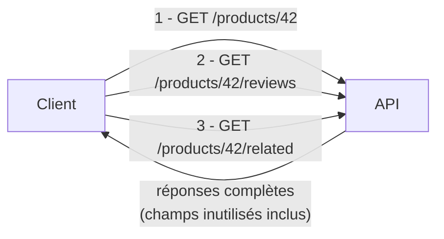

## Une page, plusieurs allers-retours

Imagine une page produit e-commerce : une carte résumé (nom, prix), la note
moyenne des avis, et trois produits similaires. Avec une API REST « classique »,
cette seule page déclenche typiquement **plusieurs appels HTTP** :

```bash
GET /api/products/42
GET /api/products/42/reviews
GET /api/products/42/related
```

Et la réponse du premier appel ressemble à ceci :

```json
{
  "id": 42,
  "name": "Casque audio X200",
  "price": 89.9,
  "description": "Un très long texte marketing...",
  "sku": "AUD-X200-BLK",
  "weight_grams": 250,
  "stock": 134,
  "supplier_id": 17,
  "created_at": "2024-02-01T10:00:00Z",
  "updated_at": "2026-06-30T08:12:00Z"
}
```

La carte produit n'affiche que **le nom et le prix**. Tout le reste (`sku`,
`weight_grams`, `stock`, `supplier_id`, les timestamps...) transite quand même
sur le réseau, est sérialisé, désérialisé... pour être jeté. C'est
l'**over-fetching** : la réponse contient plus que ce dont le client a besoin,
parce que la *forme* de la réponse est décidée **par le serveur**, une fois
pour toutes, pour tous les clients.

À l'inverse, l'**under-fetching** est le problème symétrique : une seule
requête REST ne donne **pas assez**, et il faut en enchaîner plusieurs pour
reconstituer ce dont l'écran a besoin — exactement les trois appels ci-dessus.
Sur mobile ou en 4G, chaque aller-retour ajoute de la latence ; multiplié par
le nombre d'écrans d'une appli, ça pèse.



> **REST → GraphQL.** GraphQL part d'un constat simple : la **forme des
> données** dont un écran a besoin varie selon l'écran (et selon le client :
> web, mobile, back-office...), alors qu'une ressource REST expose **une
> forme fixe**, la même pour tout le monde. GraphQL déplace la décision « quels
> champs, quelles relations » **du serveur vers le client**, requête par
> requête.

> **API Platform → GraphQL.** Tu as déjà croisé ce paradigme, mais en boîte
> noire : en activant le support GraphQL d'API Platform sur une ressource
> Doctrine, tu obtenais un point d'entrée `/graphql` qui laissait le client
> choisir ses champs, sans rien écrire de plus. Dans ce cours, on ouvre cette
> boîte noire : schéma, resolvers, exécution champ par champ — pour comprendre
> **le mécanisme**, pas juste consommer l'API qui en résulte.

## La même page, en une requête

Avec GraphQL, la même page produit tient en **une** requête, qui décrit
exactement — et seulement — ce dont l'écran a besoin :

```graphql
query ProductCard($id: ID!) {
  product(id: $id) {
    name
    price
    reviews {
      rating
    }
    relatedProducts {
      name
      price
    }
  }
}
```

Et la réponse épouse **exactement** cette forme : pas de `sku`, pas de
`weight_grams`, pas de `created_at`. Ni over-fetching (rien d'inutile), ni
under-fetching (tout est là, en un seul aller-retour réseau) :

```json
{
  "data": {
    "product": {
      "name": "Casque audio X200",
      "price": 89.9,
      "reviews": [{ "rating": 5 }, { "rating": 4 }],
      "relatedProducts": [
        { "name": "Casque audio X100", "price": 59.9 }
      ]
    }
  }
}
```

> 💡 **À retenir.** En REST, c'est le **serveur** qui décide de la forme de
> chaque ressource (une route = une forme figée). En GraphQL, c'est le
> **client** qui décide de la forme de chaque réponse (un schéma = tout ce
> qui est *possible*, une requête = ce qui est *demandé maintenant*). Les deux
> prochaines leçons détaillent comment, puis quand utiliser ce paradigme.

## À retenir

- **Over-fetching** : la réponse contient des champs que le client n'utilise
  pas — inévitable dès qu'une ressource REST doit servir plusieurs écrans.
- **Under-fetching** : une seule requête REST ne suffit pas ; il faut
  enchaîner plusieurs appels pour obtenir toutes les données d'un écran.
- GraphQL déplace le choix de la **forme de la réponse** du serveur vers le
  client, requête par requête — c'est le changement de paradigme central.
- Rien n'est encore « magique » : les prochaines leçons montrent comment ce
  choix se traduit concrètement (schéma, requêtes, puis — module 3 — les
  resolvers qui exécutent tout ça).
