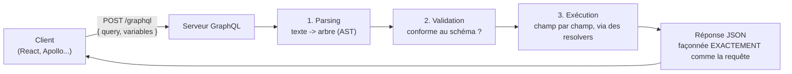

## Fini les routes, place aux requêtes

En REST, chaque ressource a sa **route** : `GET /products/42`,
`POST /products`, `GET /products/42/reviews`... Le verbe HTTP et l'URL
*sont* l'opération. En GraphQL, il n'y a (presque toujours) **qu'un seul
endpoint**, exposé en `POST` :

```bash
POST /graphql
```

Ce qui varie d'un appel à l'autre, ce n'est plus l'URL : c'est le **corps de
la requête**, qui contient un texte au format GraphQL (la *query* ou la
*mutation*) plus, éventuellement, des **variables** :

```bash
curl -X POST http://localhost:3000/graphql \
  -H "Content-Type: application/json" \
  -d '{
    "query": "query GetProduct($id: ID!) { product(id: $id) { name price } }",
    "variables": { "id": "42" }
  }'
```

```json
{
  "data": {
    "product": { "name": "Casque audio X200", "price": 89.9 }
  }
}
```

> **Réflexe à prendre.** Face à une API GraphQL, oublie le réflexe « quelle
> route pour quelle ressource ? ». La bonne question devient : « quel *champ*,
> sur quel *type*, avec quels *arguments* ? » Le routage HTTP disparaît quasi
> entièrement du raisonnement métier.

## Le schéma : ce qui est *possible*, pas ce qui est *demandé*

Un serveur GraphQL publie un **schéma** — un contrat, écrit dans un langage
dédié (le SDL, détaillé au module 2) — qui décrit **tous les champs
disponibles**, leurs types, leurs arguments. La requête, elle, ne demande
qu'un **sous-ensemble** de ce que le schéma autorise.

```graphql
# The CONTRACT (the schema): everything it is POSSIBLE to ask for
type Product {
  id: ID!
  name: String!
  price: Float!
  description: String!
  reviews: [Review!]!
  relatedProducts: [Product!]!
}
```

```graphql
# The QUERY: only what THIS screen needs, right now
query {
  product(id: "42") {
    name
    price
  }
}
```

Le serveur sait, en lisant la requête, que `description` et
`relatedProducts` ne sont **pas demandés** — il ne fera même pas le travail
de les calculer (on détaillera *comment* au module 3, avec les resolvers).

> 💡 **À retenir.** Un schéma large et un peu générique ne coûte rien tant
> que les clients ne demandent que ce qu'ils utilisent. C'est l'inverse du
> réflexe REST, où chaque champ ajouté à une ressource existante est renvoyé
> à **tout le monde**, qu'on le demande ou non.

## Le schéma s'auto-décrit : l'introspection

Un serveur GraphQL peut répondre à des questions sur **lui-même** : c'est
l'**introspection**. C'est ce qui permet à un client (ou à un outil comme
Apollo Sandbox / GraphiQL) de découvrir tous les types et champs disponibles,
sans documentation externe :

```graphql
query {
  __schema {
    types {
      name
    }
  }
}
```

C'est très pratique en développement (auto-complétion, exploration). C'est
aussi, comme on le verra au module 5, une porte qu'on **ferme en
production** : elle donne à quiconque une carte complète de ton API.

## Le flux d'une requête, vue d'ensemble

À un haut niveau, voici ce qui se passe entre l'envoi d'une requête et la
réponse — le module 3 rentrera dans le détail de l'étape « Exécution » :



Si la requête demande un champ qui n'existe pas, ou passe un argument du
mauvais type, l'étape de **validation** rejette la requête **avant** même
d'exécuter le moindre resolver — le serveur ne « devine » jamais, il vérifie
contre le contrat.

## À retenir

- **Un seul endpoint** (`POST /graphql`) : ce qui varie, c'est le corps de la
  requête, pas l'URL ni le verbe HTTP.
- Le **schéma** décrit tout ce qui est *possible* ; chaque requête ne demande
  qu'un sous-ensemble, *maintenant*.
- **L'introspection** permet d'interroger le schéma lui-même — pratique en
  dev, à fermer en production (module 5).
- Une requête traverse trois étapes : **parsing → validation → exécution**.
  Le module 3 ouvre entièrement la dernière étape.
