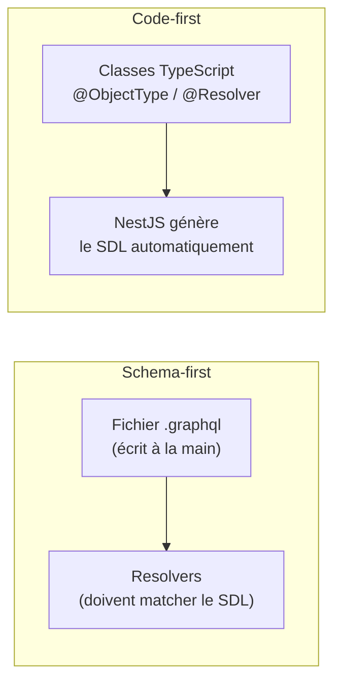

## Deux façons d'écrire un serveur GraphQL

Il existe deux approches pour construire un serveur GraphQL avec
`@nestjs/graphql` :

- **Schema-first** : tu écris le SDL à la main (des fichiers `.graphql`),
  puis tu implémentes des fonctions resolvers qui doivent correspondre
  **exactement** à ce schéma — à toi de garder les deux synchronisés.
- **Code-first** *(l'approche de ce cours, la plus répandue en NestJS)* : tu
  écris des **classes TypeScript décorées**, et NestJS **génère le SDL pour
  toi** à partir de ces décorateurs, à chaque démarrage.



> **Réflexe à prendre.** En code-first, le SDL n'est plus la **source de
> vérité** que tu maintiens — c'est une **projection**, régénérée à chaque
> démarrage à partir de tes classes. Tu raisonnes en TypeScript ; NestJS
> traduit en SDL derrière toi. C'est ce choix qui domine dans l'écosystème
> NestJS (cohérent avec les décorateurs déjà vus sur les contrôleurs REST).

## Installation et configuration

```bash
npm install @nestjs/graphql @nestjs/apollo @apollo/server graphql
```

`@nestjs/apollo` fournit le **driver** qui branche NestJS sur **Apollo
Server** (v4 ou v5 selon la version de `@nestjs/apollo` — le paquet historique
`apollo-server` autonome, lui, est déprécié : ne l'installe pas). `graphql`
(le paquet `graphql-js`) est le moteur d'exécution sous-jacent, utilisé quel
que soit le driver choisi.

```ts
// app.module.ts
import { Module } from "@nestjs/common"
import { GraphQLModule } from "@nestjs/graphql"
import { ApolloDriver, ApolloDriverConfig } from "@nestjs/apollo"
import { join } from "path"
import { BooksModule } from "./books/books.module"

@Module({
  imports: [
    GraphQLModule.forRoot<ApolloDriverConfig>({
      driver: ApolloDriver,
      // Code-first: the SDL file below is GENERATED from decorated classes,
      // never edited by hand. Commit it if you want a readable schema diff.
      autoSchemaFile: join(process.cwd(), "src/schema.gql"),
      sortSchema: true, // deterministic order in the generated SDL
    }),
    BooksModule,
  ],
})
export class AppModule {}
```

## Déclarer un type : `@ObjectType` / `@Field`

Chaque classe décorée `@ObjectType()` devient un `type` du SDL généré ; chaque
propriété décorée `@Field()` devient un champ.

```ts
// books/models/book.model.ts
import { Field, ID, ObjectType } from "@nestjs/graphql"
import { Author } from "../../authors/models/author.model"

@ObjectType()
export class Book {
  @Field(() => ID)
  id: string

  @Field()
  title: string // string -> String! is INFERRED (non-null by default)

  @Field({ nullable: true })
  publishedYear?: number

  // Not decorated with @Field: NEVER exposed in the GraphQL schema, even
  // though it exists on the class (useful for internal-only data).
  authorId: string
}
```

> ⚠️ **Erreur fréquente — oublier que `@Field` sans `{ nullable: true }` est
> NON-NULL par défaut.** Contrairement au SDL écrit à la main (où tout est
> nullable sauf mention du `!`), NestJS code-first **inverse** la valeur par
> défaut : un `@Field()` simple génère un `!` dans le SDL. Ajoute
> explicitement `{ nullable: true }` pour un champ optionnel.

## Déclarer les arguments : `@InputType` / `@ArgsType`

```ts
// books/dto/create-book.input.ts
import { Field, ID, InputType } from "@nestjs/graphql"
import { IsString, IsUUID, MinLength } from "class-validator"

@InputType()
export class CreateBookInput {
  @Field()
  @IsString()
  @MinLength(1)
  title: string

  @Field(() => ID)
  @IsUUID()
  authorId: string
}
```

> **Réflexe à prendre.** Ce sont les **mêmes** décorateurs `class-validator`
> que sur un DTO de contrôleur REST NestJS : `@IsString`, `@IsUUID`,
> `@MinLength`... La validation ne change pas de mécanisme, seulement de
> point d'entrée (`@Args()` d'un resolver, au lieu de `@Body()` d'un
> contrôleur).

## Déclarer les opérations : `@Resolver` / `@Query` / `@Mutation` / `@Args`

```ts
// books/books.resolver.ts
import { Args, ID, Mutation, Query, Resolver } from "@nestjs/graphql"
import { Book } from "./models/book.model"
import { CreateBookInput } from "./dto/create-book.input"
import { BooksService } from "./books.service"

@Resolver(() => Book)
export class BooksResolver {
  constructor(private readonly booksService: BooksService) {}

  @Query(() => [Book])
  books(): Book[] {
    return this.booksService.findAll()
  }

  @Query(() => Book, { nullable: true })
  book(@Args("id", { type: () => ID }) id: string): Book | undefined {
    return this.booksService.findById(id)
  }

  @Mutation(() => Book)
  createBook(@Args("input") input: CreateBookInput): Book {
    return this.booksService.create(input)
  }
}
```

Ces trois classes (`Book`, `CreateBookInput`, `BooksResolver`) génèrent,
**sans qu'on l'écrive nous-mêmes**, exactement le SDL suivant :

```graphql
type Book {
  id: ID!
  title: String!
  publishedYear: Int
}

input CreateBookInput {
  title: String!
  authorId: ID!
}

type Query {
  books: [Book!]!
  book(id: ID!): Book
}

type Mutation {
  createBook(input: CreateBookInput!): Book!
}
```

> **API Platform → NestJS/Apollo.** En API Platform, marquer une entité
> Doctrine `#[ApiResource(graphQlOperations: [...])]` suffisait : le SDL ET
> les resolvers étaient générés automatiquement depuis le mapping Doctrine
> — tu n'écrivais ni l'un ni l'autre. Ici, en code-first, **tu** écris les
> deux : les classes définissent le schéma, les méthodes du `@Resolver`
> définissent **comment** chaque champ est calculé. C'est plus de code à ta
> charge, mais c'est précisément ce qui va te permettre — dans la prochaine
> leçon — de comprendre ce qu'API Platform faisait pour toi en coulisses.

## À retenir

- **Code-first** : les classes TypeScript décorées sont la source de
  vérité ; le SDL est **généré**. C'est l'approche standard en NestJS.
- `@ObjectType`/`@Field` déclarent un type et ses champs — **non-null par
  défaut**, à l'inverse du SDL écrit à la main.
- `@InputType` déclare un type d'entrée, validé avec les mêmes décorateurs
  `class-validator` qu'un DTO REST.
- `@Resolver`/`@Query`/`@Mutation`/`@Args` déclarent les opérations et
  **comment** elles sont exécutées — c'est le sujet de la prochaine leçon.
