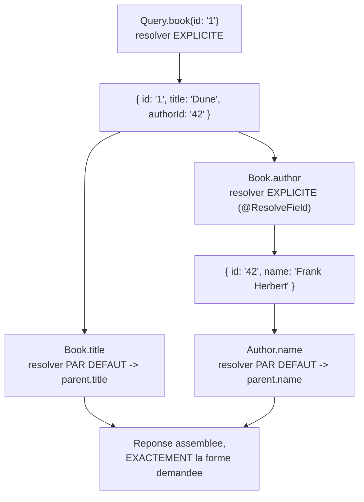

## Le cœur du cours : ce que fait VRAIMENT un serveur GraphQL

Cette leçon est la plus importante du parcours. Jusqu'ici, on a vu le
paradigme (module 1) et le langage du schéma (module 2). Il est temps
d'ouvrir la boîte : **comment**, concrètement, un serveur transforme une
requête texte en réponse JSON. Prenons un schéma minimal :

```graphql
type Author {
  id: ID!
  name: String!
}

type Book {
  id: ID!
  title: String!
  author: Author!
}

type Query {
  book(id: ID!): Book
}
```

Et cette requête :

```graphql
query {
  book(id: "1") {
    title
    author {
      name
    }
  }
}
```

Trois étapes se succèdent : **parsing**, **validation**, **exécution**.

## 1. Parsing : du texte à un arbre

Le texte de la requête n'est, au départ, qu'une chaîne de caractères. La
première étape le transforme en un **arbre syntaxique** (AST — *Abstract
Syntax Tree*) : une structure de données qui représente les champs demandés,
leurs arguments et leurs sous-sélections, de façon exploitable par le
moteur. Rien n'est encore vérifié à ce stade — seule la **syntaxe** est
analysée (des accolades bien fermées, etc.).

## 2. Validation : conforme au schéma ?

Le moteur compare ensuite cet arbre au **schéma**. Il vérifie que `book`
existe sur `Query`, que l'argument `id` est bien du type `ID!`, que `title`
et `author` existent sur `Book`, que `name` existe sur `Author`. **Si un
seul de ces contrôles échoue, la requête est rejetée intégralement — aucun
resolver n'est appelé.** C'est une garantie forte : au moment où l'exécution
démarre, tu **sais** que chaque champ demandé existe réellement dans le
schéma.

## 3. Exécution : champ par champ, via des resolvers

C'est l'étape essentielle. Le moteur ne « génère pas la réponse » d'un bloc
: il résout la requête **champ par champ**, récursivement, en appelant à
chaque fois **le resolver associé à ce champ**.

### La signature universelle d'un resolver

Chaque resolver — que tu l'écrives explicitement ou non — reçoit **toujours
quatre paramètres**, peu importe le langage ou le framework :

| Paramètre | Rôle |
|---|---|
| `parent` | la valeur déjà renvoyée par le resolver du champ **parent** (le contexte dans lequel ce champ est résolu) |
| `args` | les arguments de **ce champ précis**, dans **cette** requête |
| `context` | un objet **partagé par toute l'exécution de la requête** (utilisateur connecté, connexion DB, DataLoaders — voir la prochaine leçon) |
| `info` | des métadonnées sur le champ (son nom, l'AST, le chemin dans la requête...) — rarement utilisé directement |

### Traçons l'exemple, résolveur par résolveur

**Étape A — `Query.book`.** C'est le seul champ **racine** de la requête. Le
moteur appelle le resolver que nous avons écrit dans le module précédent :

```ts
book(parent, args, context, info)
// parent  = undefined (nothing precedes a root field)
// args    = { id: "1" }
// -> this.booksService.findById("1")
// -> returns { id: "1", title: "Dune", authorId: "42" }
```

Le resolver renvoie un objet JavaScript brut. **Ce n'est pas encore la
réponse finale** — c'est la nouvelle valeur `parent` pour tout ce qui est
demandé *à l'intérieur* de `book { ... }`.

**Étape B — `Book.title`.** La requête demande `title`, mais nous n'avons
**jamais écrit** de resolver pour ce champ ! C'est ici qu'intervient le
**resolver par défaut** de `graphql-js`, utilisé pour tout champ sans
resolver explicite :

```ts
// The DEFAULT resolver, used automatically for EVERY field
// that has no explicit resolver function:
function defaultFieldResolver(parent, args, context, info) {
  return parent[info.fieldName]
}
```

Autrement dit : `title` est résolu par un simple **accès de propriété** —
`parent.title`, soit `"Dune"`. C'est la raison pour laquelle un `@Field()`
NestJS n'a besoin d'aucune méthode associée : le resolver par défaut suffit
tant que la donnée existe déjà sur l'objet renvoyé par le resolver parent.

> 💡 **À retenir.** Un décorateur `@Field()` ne dit PAS « voici comment
> calculer ce champ » — il dit seulement « ce champ existe, voici son type ».
> Le **calcul** vient soit du resolver par défaut (accès de propriété), soit
> d'un resolver explicite que tu écris (`@ResolveField`, la suite de cette
> leçon).

**Étape C — `Book.author`.** Ce champ demande une **sous-sélection**
(`{ name }`) : il ne peut pas s'agir d'un simple scalar. Nous avons besoin
d'un resolver **explicite**, car l'objet `parent` (le livre) n'a qu'un
`authorId`, pas d'objet `author` tout prêt :

```ts
@ResolveField(() => Author)
author(@Parent() book: Book): Promise<Author> {
  // parent = the Book object returned in step A: { id: "1", title: "Dune", authorId: "42" }
  // args   = {} (no argument declared on this field)
  return this.authorsService.findById(book.authorId)
}
```

Ce resolver renvoie `{ id: "42", name: "Frank Herbert" }` — la nouvelle
valeur `parent` pour la sous-sélection `{ name }`.

**Étape D — `Author.name`.** Même mécanisme qu'à l'étape B : aucun resolver
explicite déclaré, donc le resolver par défaut fait `parent.name`, soit
`"Frank Herbert"`.

### Le résultat s'assemble en épousant la forme de la requête



```json
{
  "data": {
    "book": {
      "title": "Dune",
      "author": {
        "name": "Frank Herbert"
      }
    }
  }
}
```

Remarque : ni `id`, ni `authorId` n'apparaissent dans la réponse — le moteur
ne les a même pas *lus* pour construire la sortie finale, malgré leur
présence sur les objets intermédiaires. C'est la mécanique **exacte** qui
évite l'over-fetching : chaque champ de la réponse correspond à un appel de
resolver déclenché **uniquement** parce que le client l'a demandé.

> **API Platform → NestJS/Apollo.** C'est précisément cette chaîne de
> resolvers — un par champ, un resolver par défaut pour les scalars, un
> resolver explicite pour les relations — qu'API Platform générait pour toi
> depuis le mapping Doctrine. Maintenant que tu l'as tracée à la main, la
> prochaine leçon montre le piège qu'elle cache dès qu'une liste entre en
> jeu : le fameux problème **N+1**.

## À retenir

- Une requête traverse **parsing → validation → exécution** ; si la
  validation échoue, aucun resolver n'est jamais appelé.
- L'exécution résout la requête **champ par champ, récursivement** : chaque
  champ a son propre resolver, avec la signature universelle
  `(parent, args, context, info)`.
- Sans resolver explicite, GraphQL utilise un **resolver par défaut** qui
  fait un simple accès de propriété (`parent[fieldName]`) — c'est pour ça
  qu'un champ scalar n'a besoin d'aucun code dans NestJS.
- Le résultat final épouse **exactement** la forme de la requête : les
  champs non demandés ne sont ni lus, ni renvoyés.
