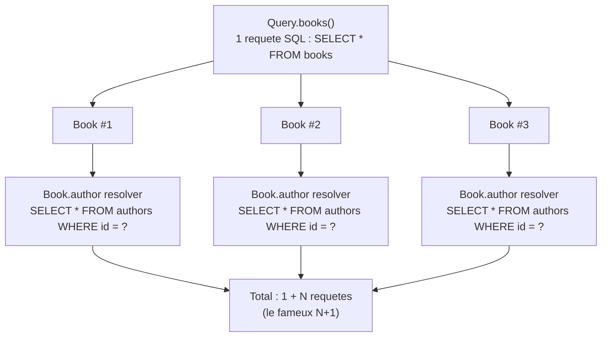
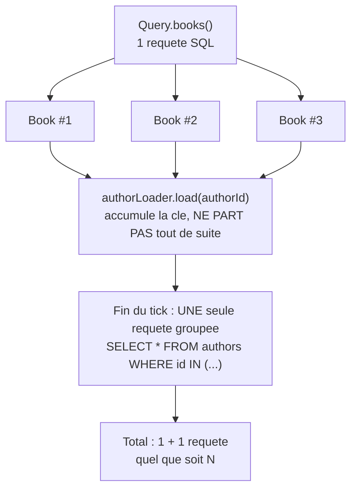

## Le piège caché derrière une liste

La leçon précédente a tracé la résolution d'**un seul** livre. Ajoutons une
liste, et le piège devient visible :

```graphql
query {
  books {
    title
    author {
      name
    }
  }
}
```

```ts
@Resolver(() => Book)
export class BooksResolver {
  constructor(
    private readonly booksService: BooksService,
    private readonly authorsService: AuthorsService,
  ) {}

  @Query(() => [Book])
  books(): Book[] {
    return this.booksService.findAll() // ONE call: returns N books
  }

  // NAIVE version: looks correct, hides a serious performance bug.
  @ResolveField(() => Author)
  author(@Parent() book: Book): Promise<Author> {
    return this.authorsService.findById(book.authorId)
  }
}
```

Souviens-toi de la mécanique de la leçon précédente : **chaque objet résolu
par un resolver de liste redémarre, indépendamment, la résolution de ses
propres champs.** `books` renvoie 5 livres → le moteur appelle
`Book.author` **cinq fois**, une fois par livre, chacun avec son propre
`parent`. S'il s'agit d'appels base de données, ça donne : **1 requête**
pour la liste, **+ 5 requêtes**, une par livre. Généralisé à `N` livres :
**N+1 requêtes** — le nombre de requêtes croît avec la taille de la liste,
alors qu'une seule jointure SQL suffirait.



> ⚠️ **Erreur fréquente — ne voir le N+1 qu'en production, sous charge.** Un
> resolver `@ResolveField` qui fait un `findById` un par un **fonctionne**
> parfaitement en développement, sur un jeu de données de 3 lignes. Le
> problème n'explose qu'avec de vrais volumes (50, 500 livres) — d'où
> l'importance de comprendre le mécanisme **avant** d'écrire le premier
> `@ResolveField` d'une relation, pas après un incident de performance.

## DataLoader : regrouper les appels sur un même tick

L'idée de **DataLoader** (la librairie `dataloader`, standard de fait dans
l'écosystème GraphQL) est simple : au lieu d'exécuter chaque appel
`.load(id)` immédiatement, on **accumule** les clés demandées pendant le
tick d'exécution en cours, puis on déclenche **un seul appel groupé** — le
*batching* — à la fin de ce tick, avant de redistribuer chaque résultat à
la bonne promesse en attente.



Les trois appels `author()` sont déclenchés **de façon synchrone** pendant
la même phase d'exécution (le moteur GraphQL exécute les champs d'une liste
sans attendre entre chacun) : DataLoader profite exactement de cette fenêtre
pour les regrouper avant qu'aucune requête ne parte réellement.

```ts
// authors/author.loader.ts
import DataLoader from "dataloader"
import { Author } from "./models/author.model"
import { AuthorsService } from "./authors.service"

export function createAuthorLoader(authorsService: AuthorsService) {
  return new DataLoader<string, Author>(async (ids) => {
    // ONE query for ALL the ids accumulated during this tick,
    // instead of one query PER book.
    const authors = await authorsService.findByIds([...ids])
    const byId = new Map(authors.map((author) => [author.id, author]))
    // DataLoader REQUIRES the output array to match the input order exactly.
    return ids.map((id) => byId.get(id))
  })
}
```

> ⚠️ **Erreur fréquente — oublier de respecter l'ordre des résultats.** La
> `batchFn` reçoit un tableau de clés et **doit** renvoyer un tableau de
> même longueur, **dans le même ordre** — pas un tableau filtré ou trié
> différemment. DataLoader redistribue le résultat `i` à la promesse `i`,
> sans re-matcher par identifiant.

Il faut créer **un DataLoader par requête HTTP entrante**, pas un singleton
partagé entre toutes les requêtes (sinon le cache d'un utilisateur fuiterait
vers un autre). NestJS fournit le point d'extension via `context` :

```ts
// app.module.ts
GraphQLModule.forRootAsync<ApolloDriverConfig>({
  driver: ApolloDriver,
  imports: [AuthorsModule],
  inject: [AuthorsService],
  useFactory: (authorsService: AuthorsService) => ({
    autoSchemaFile: true,
    // A NEW loader is created for EVERY incoming GraphQL request.
    context: () => ({ authorLoader: createAuthorLoader(authorsService) }),
  }),
})
```

```ts
// books/books.resolver.ts
import { Context, Parent, ResolveField, Resolver } from "@nestjs/graphql"
import DataLoader from "dataloader"
import { Book } from "./models/book.model"
import { Author } from "../authors/models/author.model"

@Resolver(() => Book)
export class BooksResolver {
  @ResolveField(() => Author)
  author(
    @Parent() book: Book,
    @Context("authorLoader") authorLoader: DataLoader<string, Author>,
  ) {
    // Same call site as the naive version — but now BATCHED across
    // the whole request, transparently.
    return authorLoader.load(book.authorId)
  }
}
```

Le code du resolver ne change presque pas : `authorsService.findById(id)`
devient `authorLoader.load(id)`. Tout le travail de regroupement est
encapsulé **dans le loader**, pas dans le resolver.

> 💡 **À retenir.** DataLoader ne réduit jamais le nombre de resolvers
> **appelés** (toujours N appels à `author()`) — il réduit le nombre
> d'appels **réels vers la source de données** (1 requête groupée, au lieu
> de N). C'est un problème d'**exécution**, résolu par du **batching**, pas
> par une modification du schéma ou de la requête du client.

> En production, une instance `PubSub`/cache en mémoire comme celle de
> DataLoader ne survit qu'à **une** requête (c'est voulu) ; pour un cache
> partagé entre requêtes (ex. données rarement modifiées), c'est un rôle
> pour Redis ou un cache HTTP applicatif, pas pour DataLoader.

L'exercice interactif qui suit cette leçon te fait **construire toi-même**,
en TypeScript pur, la mécanique de regroupement au cœur de DataLoader — sans
aucune dépendance externe.

## À retenir

- Le **N+1** apparaît dès qu'un `@ResolveField` sur un champ de liste
  déclenche un appel individuel par élément — 1 requête pour la liste, + N
  pour la relation.
- **DataLoader** accumule les clés `.load(...)` demandées pendant le même
  tick d'exécution, puis déclenche **une seule** `batchFn` groupée.
- La `batchFn` doit renvoyer un tableau **de même longueur, dans le même
  ordre** que les clés reçues.
- Un DataLoader se crée **par requête HTTP**, jamais en singleton partagé
  entre requêtes.
