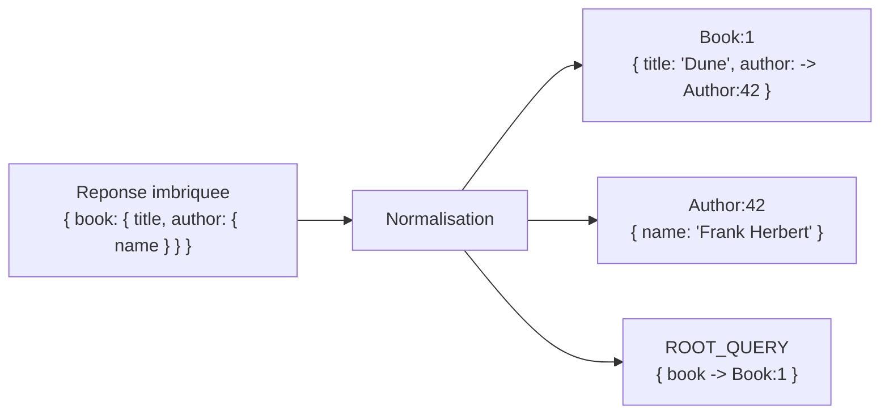

## Le vrai intérêt d'un client GraphQL

Un client REST classique (comme TanStack Query côté REST) met en cache **par
URL** : `GET /books/1` et `GET /books` sont deux entrées de cache totalement
indépendantes, même si elles contiennent, quelque part, **le même livre**.
Apollo Client fait radicalement autre chose : il **découpe** chaque réponse
en entités individuelles, et les range dans un **cache plat**, unique pour
toute l'application. C'est le mécanisme le plus important à comprendre pour
utiliser Apollo Client correctement — pas juste son API.

## De la réponse imbriquée au cache plat

Prends cette requête, qui renvoie une réponse **imbriquée** :

```graphql
query {
  book(id: "1") {
    id
    title
    author {
      id
      name
    }
  }
}
```

```json
{
  "data": {
    "book": {
      "__typename": "Book",
      "id": "1",
      "title": "Dune",
      "author": {
        "__typename": "Author",
        "id": "42",
        "name": "Frank Herbert"
      }
    }
  }
}
```

Apollo Client ne stocke **pas** cet objet imbriqué tel quel. Il le
**décompose** en identifiant chaque objet qui a un `__typename` **et** un
`id` : c'est une **entité**, elle mérite sa propre place dans le cache.
Chaque référence à cette entité, où qu'elle apparaisse, est ensuite
remplacée par un simple **pointeur** :



Le cache final ressemble, conceptuellement, à ceci — une table plate,
indexée par `Type:id` :

```json
{
  "ROOT_QUERY": { "book({\"id\":\"1\"})": { "__ref": "Book:1" } },
  "Book:1": { "title": "Dune", "author": { "__ref": "Author:42" } },
  "Author:42": { "name": "Frank Herbert" }
}
```

> 💡 **À retenir.** La clé par défaut d'une entité est `${__typename}:${id}`
> — **exactement** l'information que tu manipules depuis le module 2 (la
> leçon sur `union`/`__typename`) et le module 3 (les resolvers qui
> produisent `id`). Rien de magique : Apollo a juste besoin que chaque objet
> important porte ces deux champs pour savoir où le ranger.

## Pourquoi ça change tout : déduplication et mise à jour automatique

Imagine une deuxième query, ailleurs dans l'app, qui affiche la liste des
livres — et donc, à nouveau, l'auteur `Author:42` (le même auteur, cité
dans deux livres différents) :

```graphql
query {
  books {
    id
    title
    author {
      id
      name
    }
  }
}
```

Apollo Client ne crée **pas** une deuxième copie de `Frank Herbert` : il
reconnaît `Author:42` (déjà en cache) et se contente d'y **pointer** à
nouveau. Deux conséquences directes, qui expliquent l'essentiel de ce que
« fait » Apollo Client en pratique :

- **Déduplication** : la même entité, demandée par deux requêtes
  différentes, n'existe **qu'une seule fois** en mémoire.
- **Mise à jour automatique de l'UI** : si `Author:42` est modifié
  **n'importe où** (une mutation, une autre query qui rafraîchit ses
  champs...), **tous** les composants qui affichent cet auteur — la fiche
  livre ET la liste — se re-rendent automatiquement avec la nouvelle valeur,
  sans code de synchronisation manuel. C'est parce qu'ils ne stockent pas
  chacun leur copie : ils pointent tous vers **la même entrée** du cache
  plat.

> **Réflexe à prendre.** Pense au cache normalisé comme à une base de
> données relationnelle miniature, en mémoire : une table par type, une
> ligne par entité, des clés étrangères (`__ref`) entre elles — plutôt qu'un
> gros document JSON dupliqué à chaque requête.

## Le piège : un objet sans `id` ne peut pas être normalisé

> ⚠️ **Erreur fréquente — oublier `id` dans une sous-sélection.** Apollo
> Client ajoute automatiquement `__typename` à chaque objet de chaque
> requête (tu n'as rien à faire pour ça) — mais **pas** `id`. Si tu
> écris une requête qui sélectionne `author { name }` sans `id`, cet objet
> `author` reste **imbriqué tel quel** dans `Book:1`, jamais normalisé : pas
> d'entrée `Author:42` séparée, pas de déduplication, pas de mise à jour
> croisée. Demande systématiquement `id` sur tout ce qui est une vraie
> entité.

Pour un type dont l'identifiant n'est pas un simple champ `id` (une clé
composite, par exemple), `InMemoryCache` accepte une configuration
`keyFields` par type — un détail que tu ne croiseras que rarement, la
convention `id` couvrant l'immense majorité des schémas.

## Inspecter le cache

Le point d'entrée le plus direct pour **voir** ce mécanisme en action est
l'extension navigateur **Apollo Client Devtools** : elle affiche le cache
normalisé tel quel, entité par entité — la meilleure façon de vérifier
qu'une entité est bien dédupliquée, ou de comprendre pourquoi un composant
ne se met pas à jour comme prévu.

## À retenir

- Apollo Client ne stocke jamais une réponse imbriquée telle quelle : il la
  **décompose** en entités (`Type:id`), reliées par des références
  (`__ref`) — un cache **normalisé**, pas un simple cache par requête.
- Deux requêtes différentes qui touchent la **même** entité partagent la
  **même** entrée de cache : déduplication et mise à jour automatique de
  l'UI en découlent directement.
- Sans `id` dans la sous-sélection, un objet reste imbriqué — jamais
  normalisé, jamais dédupliqué.
- C'est ce mécanisme, précisément, que l'exercice qui suit la leçon 3 te
  fait reconstruire, en miniature.
