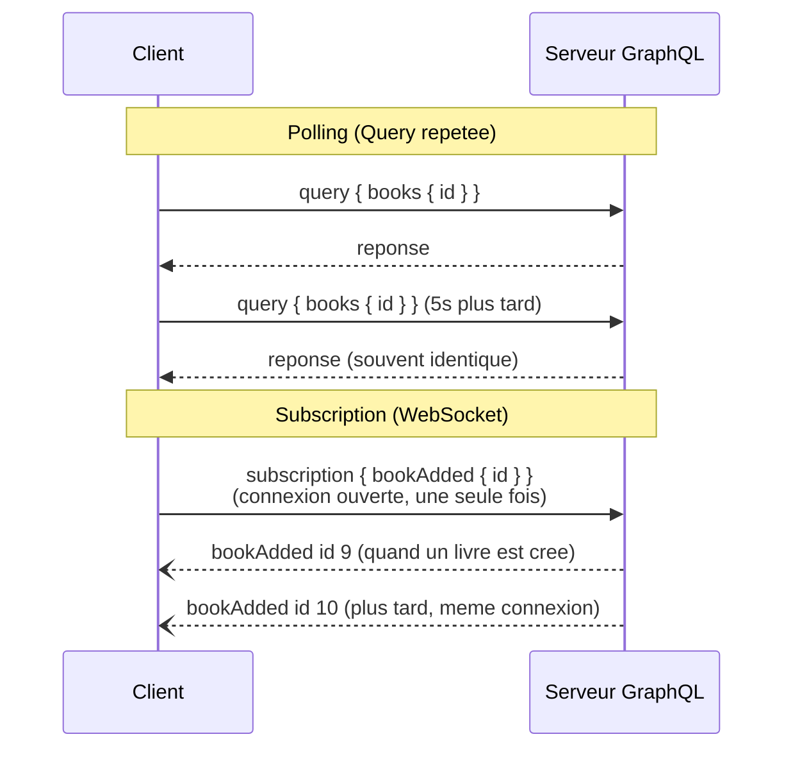

## La troisième racine, enfin détaillée

Le module 2 a introduit les trois types racines d'un schéma —
`Query`, `Mutation`, et `Subscription`, « détaillé au module 5 ». On y est.
Une `Subscription` n'est **pas** une requête ponctuelle : c'est un
**abonnement** qui reste ouvert, et qui pousse une nouvelle donnée au client
**chaque fois** qu'un événement survient côté serveur — sans que le client
ait besoin de redemander quoi que ce soit.

```graphql
type Subscription {
  bookAdded: Book!
}
```

## Pourquoi pas simplement re-interroger en boucle ?

Une alternative existe, et elle est parfois **suffisante** : le **polling**
— relancer une `Query` à intervalle régulier (`useQuery(QUERY, { pollInterval:
5000 })` côté Apollo Client). C'est simple, ça fonctionne sur la même
connexion HTTP classique, mais ça a deux défauts : de la **latence**
(jusqu'à `pollInterval` avant de voir un changement) et du **gaspillage**
(une requête complète toutes les 5 secondes, même si rien n'a changé 99%
du temps).

Une `Subscription`, elle, garde une connexion **persistante** — un
**WebSocket** — ouverte entre le client et le serveur : le serveur **pousse**
la donnée dès qu'un événement se produit, sans round-trip HTTP répété.



> **Réflexe à prendre.** Ne dégaine pas une `Subscription` par réflexe dès
> qu'une donnée « peut changer ». Réserve-les à ce qui a vraiment besoin
> d'un affichage **immédiat** (un chat, une notification, un tableau de bord
> qui suit un traitement en cours) — pour le reste, une `Query` avec
> `pollInterval`, ou même un simple rechargement au focus de l'onglet,
> suffit largement et coûte beaucoup moins d'infrastructure.

## Le protocole : `graphql-ws`

Historiquement, l'écosystème GraphQL utilisait `subscriptions-transport-ws`
— aujourd'hui **déprécié, non maintenu**. Le standard actuel est
**`graphql-ws`**, aussi bien côté serveur que côté client Apollo.

```bash
npm install graphql-ws graphql-subscriptions
```

```ts
// app.module.ts
GraphQLModule.forRoot<ApolloDriverConfig>({
  driver: ApolloDriver,
  autoSchemaFile: true,
  subscriptions: {
    "graphql-ws": true, // enables the graphql-ws protocol over the SAME endpoint
  },
})
```

## Publier un événement, côté serveur

`graphql-subscriptions` fournit un `PubSub` en mémoire — un simple bus
d'événements nommés :

```ts
// books/books.resolver.ts
import { Resolver, Mutation, Subscription, Args } from "@nestjs/graphql"
import { PubSub } from "graphql-subscriptions"
import { Book } from "./models/book.model"
import { CreateBookInput } from "./dto/create-book.input"
import { BooksService } from "./books.service"

const pubSub = new PubSub()

@Resolver(() => Book)
export class BooksResolver {
  constructor(private readonly booksService: BooksService) {}

  @Mutation(() => Book)
  async createBook(@Args("input") input: CreateBookInput): Promise<Book> {
    const book = await this.booksService.create(input)
    pubSub.publish("bookAdded", { bookAdded: book }) // notify every active subscriber
    return book
  }

  @Subscription(() => Book)
  bookAdded() {
    return pubSub.asyncIterableIterator("bookAdded")
  }
}
```

Chaque `createBook` réussi **publie** l'événement `"bookAdded"` — tout
client actuellement abonné reçoit alors, sur sa connexion WebSocket déjà
ouverte, le livre fraîchement créé.

> ⚠️ **Erreur fréquente — un `PubSub` en mémoire ne survit pas à plusieurs
> instances du serveur.** Dès que l'app tourne derrière plusieurs pods/
> instances (mise à l'échelle horizontale), un événement publié sur
> l'instance A n'atteint **pas** les clients connectés à l'instance B. En
> production, on remplace ce `PubSub` en mémoire par une implémentation
> adossée à **Redis** (`graphql-redis-subscriptions`), qui relaie
> l'événement à toutes les instances.

## Côté client : `useSubscription`, et un lien réseau à part

Une `Subscription` ne passe pas par le même transport qu'une `Query`/
`Mutation` (HTTP) : Apollo Client a besoin d'un **lien WebSocket** dédié, et
d'un **aiguillage** (`split`) qui envoie chaque opération au bon transport
selon son type :

```ts
// lib/apollo-client.ts
import { ApolloClient, InMemoryCache, HttpLink, split } from "@apollo/client"
import { GraphQLWsLink } from "@apollo/client/link/subscriptions"
import { createClient } from "graphql-ws"
import { getMainDefinition } from "@apollo/client/utilities"

const httpLink = new HttpLink({ uri: "http://localhost:3000/graphql" })
const wsLink = new GraphQLWsLink(createClient({ url: "ws://localhost:3000/graphql" }))

const splitLink = split(
  ({ query }) => {
    const definition = getMainDefinition(query)
    return definition.kind === "OperationDefinition" && definition.operation === "subscription"
  },
  wsLink, // subscriptions -> WebSocket
  httpLink, // queries/mutations -> HTTP, as usual
)

export const apolloClient = new ApolloClient({ link: splitLink, cache: new InMemoryCache() })
```

```tsx
const BOOK_ADDED = gql`
  subscription OnBookAdded {
    bookAdded {
      id
      title
    }
  }
`

function LiveBookFeed() {
  const { data, loading } = useSubscription(BOOK_ADDED)
  if (loading) return <p>Waiting for the first event...</p>
  return <p>New book: {data.bookAdded.title}</p>
}
```

## À retenir

- Une `Subscription` garde une connexion **WebSocket persistante** ouverte :
  le serveur **pousse** la donnée dès qu'un événement survient, sans
  round-trip HTTP répété — contrairement au **polling**.
- Réserve les subscriptions au **vraiment temps réel** ; le polling reste
  souvent suffisant, et beaucoup plus simple à faire tenir en charge.
- **`graphql-ws`** est le protocole actuel (`subscriptions-transport-ws` est
  déprécié) ; `PubSub` publie/écoute des événements nommés côté serveur.
- Un `PubSub` en mémoire ne fonctionne qu'avec **une seule** instance
  serveur — en production, un backend Redis relaie les événements entre
  instances.
