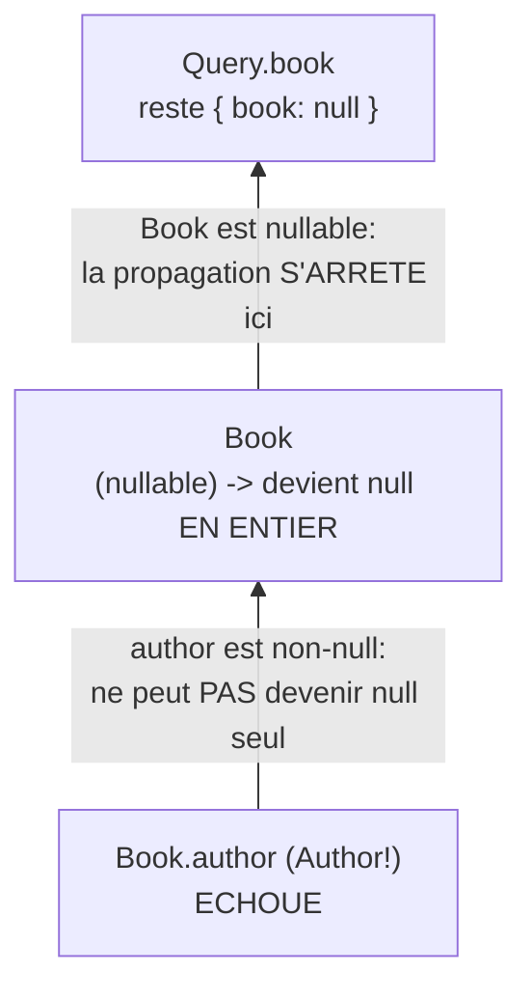

## Le contraste avec REST : jamais vraiment « tout ou rien »

En REST, une réponse a un statut : `200` (succès, corps complet) ou une
erreur (`4xx`/`5xx`, corps différent, souvent juste un message). GraphQL
fonctionne autrement : une réponse HTTP `200` peut contenir **à la fois**
des données valides **et** des erreurs, champ par champ.

```json
{
  "data": {
    "book": {
      "title": "Dune",
      "author": null
    }
  },
  "errors": [
    {
      "message": "Author service unavailable",
      "path": ["book", "author"],
      "extensions": { "code": "AUTHOR_SERVICE_DOWN" }
    }
  ]
}
```

Ici, `title` a été résolu avec succès, `author` a échoué — et la réponse
contient **les deux informations en même temps**. C'est une conséquence
directe du modèle d'exécution du module 3 : chaque champ est résolu
**indépendamment**, donc chaque champ peut échouer **indépendamment**.

> 💡 **À retenir.** Un client GraphQL bien écrit ne doit **jamais** se fier
> uniquement au code HTTP pour savoir si « tout s'est bien passé » — il doit
> lire `errors` **et** `data`, potentiellement partielle, à chaque réponse.

## La forme d'une erreur

Chaque entrée de `errors` suit une forme standard, définie par la
spécification GraphQL elle-même :

| Champ | Rôle |
|---|---|
| `message` | description lisible de l'erreur |
| `path` | le chemin exact, dans l'arbre de la requête, du champ qui a échoué |
| `locations` | la position (ligne/colonne) dans le **texte** de la requête |
| `extensions` | **libre** : un `code` machine-lisible (`UNAUTHENTICATED`, `NOT_FOUND`...), et tout ce que le serveur veut y ajouter |

## La propagation du `null`, en détail

Le module 2 a annoncé ce mécanisme sans le détailler : quand un champ
**non-null** (`!`) échoue, GraphQL ne peut **pas** simplement mettre `null`
à sa place — ce serait rompre le contrat `!`. Il **remonte** alors l'échec
au champ **parent le plus proche qui, lui, est nullable**, et y met `null`
à la place — **même si ce parent avait d'autres champs déjà résolus avec
succès**.

Reprenons un schéma où `author` est marqué non-null :

```graphql
type Book {
  id: ID!
  title: String!
  author: Author!   # NON-NULL: un engagement fort
}

type Query {
  book(id: ID!): Book   # nullable: pas de "!" ici
}
```

Si le resolver de `author` échoue :



```json
{
  "data": { "book": null },
  "errors": [{ "message": "...", "path": ["book", "author"] }]
}
```

Remarque le détail important : **`title` avait pourtant été résolu avec
succès** — mais comme `Book` tout entier devient `null` (parce qu'un de ses
champs non-null a échoué), `title` disparaît **aussi** de la réponse
finale. La propagation ne s'arrête qu'au premier ancêtre **nullable**
rencontré en remontant.

> ⚠️ **Erreur fréquente — sous-estimer la portée d'un `!` mal choisi.**
> Plus il y a de `!` en cascade entre le champ qui peut réellement échouer et
> le premier ancêtre nullable, plus une seule erreur ponctuelle « efface »
> de données valides dans la réponse. C'est l'argument le plus concret pour
> le conseil du module 2 : réserve `!` aux champs **vraiment** toujours
> présents.

## Émettre une erreur, côté NestJS

Un `throw` classique dans un resolver est automatiquement capturé et
formaté en entrée `errors[]` :

```ts
import { NotFoundException } from "@nestjs/common"

@Query(() => Book, { nullable: true })
async book(@Args("id", { type: () => ID }) id: string): Promise<Book> {
  const book = await this.booksService.findById(id)
  if (!book) {
    throw new NotFoundException(`Book ${id} not found`)
  }
  return book
}
```

Pour contrôler précisément le `code` renvoyé dans `extensions` (utile pour
que le client distingue un `NOT_FOUND` d'un `UNAUTHENTICATED`), on lève
directement une `GraphQLError` :

```ts
import { GraphQLError } from "graphql"

throw new GraphQLError(`Book ${id} not found`, {
  extensions: { code: "BOOK_NOT_FOUND" },
})
```

> **Passerelle.** C'est l'équivalent GraphQL d'une exception métier
> Symfony (`NotFoundHttpException`, une exception applicative dédiée...)
> convertie en réponse JSON par un `ExceptionListener` — sauf qu'ici,
> l'erreur d'**un seul champ** ne fait pas nécessairement échouer toute la
> requête : le reste de l'arbre continue d'être résolu normalement.

## Côté client : distinguer erreur réseau et erreurs GraphQL

Apollo Client expose les deux catégories séparément sur l'objet `error` :

```ts
const { data, error } = useQuery(GET_BOOK, { variables: { id } })

if (error?.networkError) {
  // The request never reached the server, or the server didn't respond
  // (DNS, timeout, CORS...).
}
if (error?.graphQLErrors?.length) {
  // The server DID respond, with one or more entries in `errors[]`.
  for (const gqlError of error.graphQLErrors) {
    console.log(gqlError.extensions?.code, gqlError.message)
  }
}
```

Un `errorLink` (`onError` de `@apollo/client/link/error`) centralise ce
traitement pour toute l'app — par exemple rediriger vers l'écran de
connexion dès qu'un `code: "UNAUTHENTICATED"` apparaît, quelle que soit la
requête concernée.

## À retenir

- Une réponse GraphQL peut être **partiellement** réussie : `data` (parfois
  incomplète) **et** `errors[]` coexistent dans la même réponse HTTP `200`.
- Un champ **non-null** qui échoue fait remonter l'échec au premier parent
  **nullable**, effaçant au passage tout ce que ce parent contenait — même
  des champs résolus avec succès.
- `extensions.code` est l'endroit conventionnel pour un code d'erreur
  machine-lisible, distinct du `message` humain.
- Côté client, toujours distinguer `networkError` (rien n'a atteint le
  serveur) de `graphQLErrors` (le serveur a répondu, avec des erreurs).
