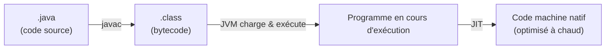
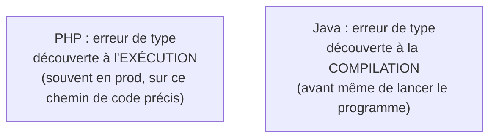

## Le changement de paradigme n°1 : Java est compilé

Depuis 13 ans, ton réflexe PHP est : tu modifies un fichier, tu rafraîchis la page, PHP
**interprète** ton script à la volée (ligne par ligne, à chaque requête — OPcache met en
cache le bytecode compilé, mais le modèle mental reste « j'édite, ça tourne »). Avec Java,
ce réflexe **casse** : il y a une étape de **compilation explicite**, obligatoire, qui a
lieu **avant** toute exécution.



> **PHP → Java.** En PHP, `php script.php` interprète directement le fichier. En Java, il
> faut **d'abord** compiler avec `javac MonFichier.java` (qui produit `MonFichier.class`),
> **puis** lancer la JVM avec `java MonFichier`. Deux commandes, deux étapes — et si le
> code ne compile pas, **rien ne s'exécute**, pas même la première ligne.

```bash
# 1) Compile: source -> bytecode (produces HelloWorld.class)
javac HelloWorld.java

# 2) Run: the JVM loads the .class and executes it
java HelloWorld
```

## Le bytecode : ni du code source, ni du binaire natif

Le fichier `.class` produit par `javac` n'est **pas** du code machine pour ton processeur
(comme le ferait un compilateur C ou Go) : c'est du **bytecode**, un format intermédiaire
compris uniquement par la JVM (*Java Virtual Machine*). C'est le fameux slogan de Sun en
1995 : **« Write Once, Run Anywhere »**.

- Le même `.class` tourne **sans recompilation** sur Linux, Windows, macOS — à condition
  qu'une JVM soit installée.
- La JVM **interprète** ce bytecode instruction par instruction, mais surveille aussi les
  portions de code exécutées très souvent (« chemins chauds ») et les recompile à la volée
  en code machine natif optimisé : c'est le **JIT** (*Just-In-Time compiler*). Un
  programme Java devient donc **plus rapide** après quelques secondes/minutes d'exécution
  — contre-intuitif si tu viens du monde PHP où chaque requête repart de zéro.

> **Passerelle.** OPcache (PHP) met en cache le bytecode compilé **entre les requêtes**
> pour éviter de reparser le fichier à chaque fois — c'est déjà une forme de bytecode. La
> vraie différence est le **JIT** : la JVM réoptimise le code **en fonction de ce qu'elle
> observe à l'exécution** (quels types passent réellement dans telle méthode, quelle
> branche est la plus prise), un mécanisme bien plus poussé que le simple cache d'OPcache.

## Pourquoi cette contrainte a une vraie valeur

Compiler avant d'exécuter n'est pas juste une lourdeur historique : le compilateur
**vérifie ton code avant que quiconque ne l'exécute** — types incompatibles, méthode
inexistante, argument manquant : tout ça est détecté **à la compilation**, jamais en
production au runtime comme un `Call to undefined method` PHP découvert en prod.



> ⚠️ **Erreur fréquente — croire que « ça compile » veut dire « ça marche ».** La
> compilation garantit la **cohérence des types**, pas l'absence de bugs logiques. Un
> `NullPointerException` ou une boucle infinie compilent très bien. Java élimine une
> classe d'erreurs (les erreurs de type), pas toutes les erreurs.

## À retenir

- Java est **compilé** (`javac`) avant d'être **exécuté** (`java`) — deux étapes, pas une.
- Le fichier produit est du **bytecode** (`.class`), portable, exécuté par la **JVM**.
- Le **JIT** recompile à chaud les portions de code les plus utilisées en code machine
  natif : un programme Java « chauffe » et accélère après quelques instants.
- Le compilateur détecte les erreurs de **type** avant l'exécution — un vrai changement
  de filet de sécurité par rapport à PHP, qui les découvre à l'exécution.
