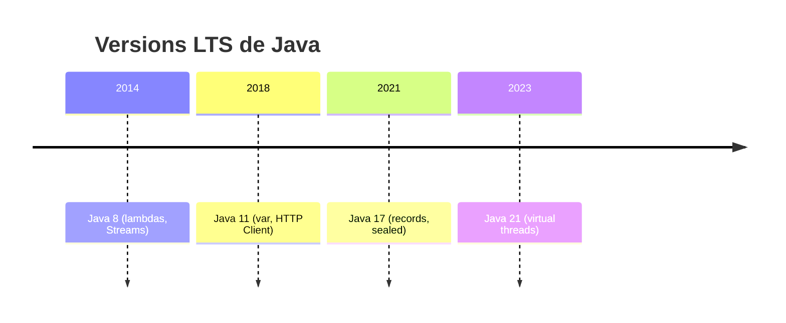

## JDK vs JRE : lequel installer ?

Historiquement, Java distinguait deux paquets :

- **JRE** (*Java Runtime Environment*) : uniquement de quoi **exécuter** un programme
  Java déjà compilé (la JVM + les bibliothèques standard). Pas de `javac`.
- **JDK** (*Java Development Kit*) : le JRE **+** les outils pour **développer** :
  `javac` (compilateur), `javadoc`, `jar`, débogueur, etc.

> **Passerelle.** C'est un peu la distinction entre `php` (le runtime que tu déploies en
> prod) et une installation complète avec Xdebug, PHPUnit, etc. pour développer en local
> — sauf que côté Java, la distinction est **officiellement packagée** en deux
> téléchargements différents.

> ⚠️ **Erreur fréquente — cette distinction est en réalité obsolète.** Depuis **Java 11**,
> Oracle ne distribue plus de JRE séparé : on installe **toujours un JDK**, y compris sur
> un serveur de production. Tu verras encore le terme « JRE » dans de la doc ou des
> tutoriels anciens, mais dans la pratique moderne (Java 11+), **installe un JDK, point.**

## Les versions LTS : 8, 11, 17, 21

Java sort une nouvelle version **tous les 6 mois**, mais toutes ne se valent pas : Oracle
et la communauté OpenJDK désignent certaines versions comme **LTS** (*Long-Term Support*),
maintenues (correctifs de sécurité) pendant **plusieurs années**. Les autres versions
(dites « feature releases ») ne sont supportées que 6 mois — à éviter en production.

| Version | Année | Statut | À savoir |
|---|---|---|---|
| **Java 8** | 2014 | LTS (encore très présent en entreprise) | lambdas, Streams introduits ; énormément de code legacy tourne encore dessus |
| **Java 11** | 2018 | LTS | `var`, HTTP Client standard, retrait du JRE séparé |
| **Java 17** | 2021 | LTS | `records`, `sealed`, pattern matching `instanceof`, `switch` expressions |
| **Java 21** | 2023 | LTS (référence de cette formation) | pattern matching complet, **virtual threads**, séquences de collections |

> **Passerelle.** C'est le même enjeu que PHP 7.4 vs 8.1 vs 8.3 en entreprise : tu croises
> encore beaucoup de code Java 8 en mission (souvent des applications monolithiques
> anciennes), alors qu'un projet neuf démarre directement en 21. Contrairement à PHP où
> une seule version est généralement installée sur la machine, il est **courant** d'avoir
> plusieurs JDK installés en parallèle et de choisir celui utilisé par projet.



> 💡 **À retenir — Java 21 : les threads virtuels.** Historiquement, un thread Java
> coûtait cher (mémoire, contexte système), un peu comme gérer manuellement des workers
> système en PHP-FPM. Java 21 introduit les **virtual threads** (*Project Loom*) : des
> threads ultra-légers gérés par la JVM, permettant d'écrire du code bloquant classique
> (facile à lire) qui **scale** comme du code asynchrone (des millions de threads
> virtuels possibles). Retiens le nom pour l'instant — ça dépasse le cadre de ce module.

## Gérer plusieurs versions : SDKMAN!

Comme tu changes de version PHP avec `phpbrew`, `asdf` ou les paquets `php8.x` de ton
système, l'outil de référence côté Java est **SDKMAN!** :

```bash
# List installable Java versions
sdk list java

# Install a specific distribution/version
sdk install java 21.0.2-tem   # "tem" = Eclipse Temurin (build OpenJDK)

# Switch version for the current shell
sdk use java 21.0.2-tem

# Check the active version
java -version
```

> **Repère.** « Temurin », « Corretto » (Amazon), « Zulu » (Azul) sont des **distributions
> OpenJDK** différentes — même code source ouvert, packagé/supporté par des éditeurs
> différents. Aucune n'est « la vraie » : ce sont des équivalents fonctionnels, comme
> choisir entre plusieurs images Docker `php:8.3` (officielle, Bitnami, Alpine…).

## À retenir

- Depuis Java 11, **plus de distinction JDK/JRE** dans la pratique : installe un JDK.
- Retiens les **4 LTS courantes** : 8 (legacy fréquent), 11, 17, 21 (référence ici).
- Une version LTS bénéficie d'un support long ; une version intermédiaire, 6 mois — à
  réserver à l'expérimentation, jamais à la production.
- `SDKMAN!` gère plusieurs JDK en parallèle, comme `asdf`/`phpbrew` côté PHP.
