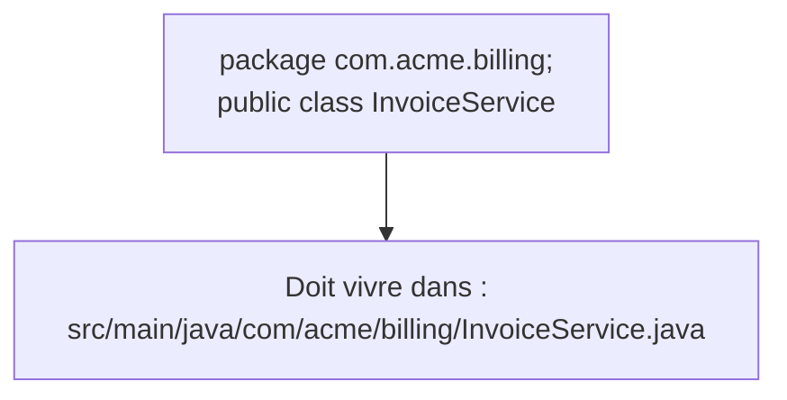

## Une règle stricte que PHP n'impose pas

En PHP, un fichier peut contenir plusieurs classes, une classe peut vivre dans un fichier
dont le nom ne correspond à rien de précis, et le namespace est une convention (PSR-4)
appliquée par l'autoloader — mais **rien n'empêche techniquement** de tricher. En Java,
trois règles sont imposées **par le compilateur lui-même**, pas par convention :

1. Un fichier `.java` ne peut contenir **qu'une seule classe publique**.
2. Cette classe publique doit **porter exactement le nom du fichier**.
3. Le **chemin du dossier** doit correspondre **exactement** au `package` déclaré.



```java
// File: src/main/java/com/acme/billing/InvoiceService.java
package com.acme.billing;

public class InvoiceService {
    // The class name MUST match the file name: InvoiceService.java
}
```

> **PHP → Java.** Le `package com.acme.billing;` joue le même rôle que
> `namespace App\Billing;` en PHP (PSR-4) — mais alors que Symfony/Composer **tolèrent**
> une petite incohérence de chemin (l'autoloader plante juste à l'exécution), Java
> **refuse de compiler** si le dossier ne correspond pas au package. C'est une erreur de
> compilation, pas une erreur d'exécution différée.

> ⚠️ **Erreur fréquente — nommer le fichier différemment de la classe publique.** Si ton
> fichier s'appelle `Facture.java` mais que tu déclares `public class Invoice { }`
> dedans, `javac` refuse de compiler avec une erreur explicite (« class Invoice is public,
> should be declared in a file named Invoice.java »). Ce n'est pas un style à respecter,
> c'est une règle du langage.

## La structure standard d'un projet

Les outils de build (Maven, Gradle — module 6) imposent une arborescence conventionnelle,
héritée de Maven et adoptée quasi universellement :

```
mon-projet/
├─ src/
│  ├─ main/
│  │  ├─ java/
│  │  │  └─ com/acme/billing/
│  │  │     ├─ InvoiceService.java
│  │  │     └─ Invoice.java
│  │  └─ resources/        # fichiers non-Java embarqués (config, templates…)
│  └─ test/
│     └─ java/
│        └─ com/acme/billing/
│           └─ InvoiceServiceTest.java   # miroir exact du package testé
└─ pom.xml (ou build.gradle)
```

> **Passerelle.** C'est l'équivalent de `src/` + `tests/` dans un projet Symfony, avec une
> différence notable : le dossier de test **reproduit exactement** l'arborescence des
> packages du code testé (`src/test/java/com/acme/billing/` en miroir de
> `src/main/java/com/acme/billing/`), alors que la convention PHPUnit/Symfony est plus
> souple sur ce point.

## Le point d'entrée : `main`

PHP n'a pas de fonction d'entrée obligatoire : le premier fichier appelé s'exécute de haut
en bas (`public/index.php` pour Symfony, via le front controller). Java, lui, exige une
**signature exacte** pour démarrer un programme :

```java
public class HelloWorld {
    public static void main(String[] args) {
        // Entry point: this is what "java HelloWorld" runs first
        System.out.println("Hello, PHP developer!");
    }
}
```

- `public` : accessible depuis l'extérieur de la classe (la JVM doit pouvoir l'appeler).
- `static` : appelable **sans instancier** `HelloWorld` — la JVM n'a pas encore d'objet
  à ce stade.
- `void` : ne retourne rien.
- `String[] args` : les arguments de ligne de commande (équivalent de `$argv` en PHP CLI).

> 💡 **À retenir.** Change **un seul mot** de cette signature (enlève `static`, ou passe
> `args` en `int`) et `java HelloWorld` refuse de démarrer avec une erreur explicite
> (« main method not found »). Ce n'est pas de la magie de framework comme le routeur
> Symfony : c'est une règle fixe du langage, la même dans tout projet Java.

## À retenir

- **1 fichier = 1 classe publique**, et son **nom doit correspondre au fichier**.
- Le **package** déclaré doit correspondre **exactement** au chemin du dossier — vérifié
  à la compilation, pas seulement à l'exécution.
- Structure standard : `src/main/java/...` (code), `src/test/java/...` (tests, en miroir).
- Le point d'entrée est la méthode `public static void main(String[] args)` — signature
  exacte et non négociable.
