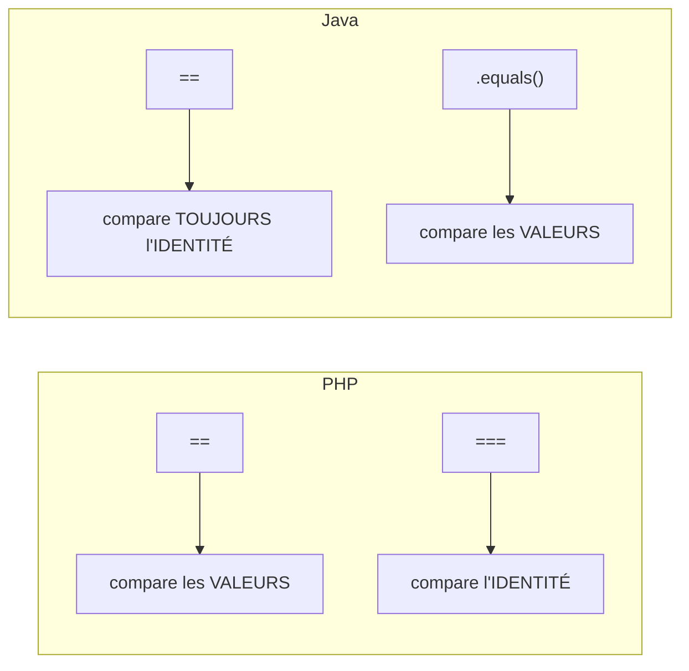

## Les modificateurs d'accès : un niveau de plus qu'en PHP

PHP connaît `public`, `protected`, `private`. Java ajoute un **quatrième niveau**, sans
mot-clé : le **package-private** (aucun modificateur écrit), visible uniquement au sein
du même package.

| Modificateur | Visible depuis | Équivalent PHP |
|---|---|---|
| `public` | partout | `public` |
| `protected` | même package + sous-classes | `protected` (mais PHP n'a pas la notion de package) |
| *(aucun mot-clé)* | même package uniquement | **aucun équivalent direct** |
| `private` | la classe elle-même uniquement | `private` |

> ⚠️ **Erreur fréquente — oublier le package-private.** Une classe ou méthode **sans**
> modificateur n'est **pas** publique par défaut (contrairement à PHP où l'absence de
> mot-clé équivaut à `public`) : elle n'est visible que dans son propre package. C'est un
> niveau de visibilité intermédiaire utile pour des classes internes à un module, sans les
> exposer à tout le projet.

## `final` : trois usages différents

```java
final int MAX_RETRIES = 3;          // final variable: cannot be reassigned (like PHP's const)

final class ImmutablePoint { }      // final class: cannot be extended — no subclass allowed

public class Base {
    final void doSomething() { }    // final method: cannot be overridden by a subclass
}
```

> **Passerelle.** `final` sur une variable ressemble à `const` PHP (au niveau local, pas
> classe). Les deux autres usages (`final class`, `final void method()`) **n'ont pas
> d'équivalent en PHP** — le plus proche est `final class`/`final function` de PHP 8
> lui-même (syntaxe quasi identique, en fait), mais Hassane connaît déjà bien ce mot-clé
> côté Symfony (entités `final` recommandées par les bonnes pratiques DDD).

## Héritage simple, interfaces multiples

Java n'autorise **qu'un seul parent** (`extends`), comme PHP, mais **plusieurs
interfaces** (`implements`), également comme PHP. Rien de nouveau ici — la vraie
différence culturelle est ailleurs :

> **Réflexe à prendre.** La communauté Java **privilégie fortement la composition à
> l'héritage** (« *favor composition over inheritance* », principe du Gang of Four très
> insisté en Java). PHP n'a pas cette réserve aussi marquée culturellement, en partie
> grâce aux **traits** (absents en Java) qui permettent de partager du comportement sans
> hiérarchie de classes. En Java, préfère **injecter une dépendance** plutôt que
> d'hériter pour réutiliser du comportement — même réflexe que Symfony/DI, en fait.

## Le piège n°1 : `==` sur des objets ne fait PAS ce que tu crois

C'est **la** surprise majeure pour un dev PHP. En PHP, `==` sur deux objets compare leurs
**propriétés** (égalité de valeur), et `===` compare l'**identité** (même instance). En
Java, c'est **inversé et plus strict** : `==` sur des objets compare **toujours**
l'identité (la même case mémoire), **jamais** les valeurs — il n'existe pas de `===` en
Java, `.equals()` est la méthode qui compare les valeurs.

```java
String a = new String("hello");
String b = new String("hello");

System.out.println(a == b);        // false — two DIFFERENT objects in memory!
System.out.println(a.equals(b));   // true — same VALUE, compared via equals()
```



> ⚠️ **Erreur fréquente — comparer des `String` avec `==`.** C'est LE piège classique
> repéré par tout linter Java sérieux. Deux littéraux de chaîne identiques (`"hello" ==
> "hello"`) peuvent donner `true` **par accident** (la JVM les met en cache dans un
> "string pool"), ce qui masque le bug — jusqu'au jour où l'une des deux chaînes vient
> d'un `new String(...)`, d'une lecture fichier ou d'une concaténation, et là `==` renvoie
> `false` de façon totalement inattendue. **Règle absolue : toujours `.equals()` pour
> comparer le contenu de deux objets, jamais `==`.**

## Le contrat `equals()`/`hashCode()`

Si tu redéfinis `equals()` sur une classe, tu **dois** aussi redéfinir `hashCode()` — sans
quoi la classe se comporte de façon incohérente dans une `HashMap`/`HashSet` (voir module
3) : deux objets « égaux » selon `equals()` mais avec des `hashCode()` différents peuvent
finir dans des « paniers » (*buckets*) différents, et une recherche par clé échouera alors
qu'elle « devrait » réussir.

```java
public class Point {
    private final int x;
    private final int y;

    public Point(int x, int y) { this.x = x; this.y = y; }

    @Override
    public boolean equals(Object obj) {
        if (this == obj) return true;
        if (!(obj instanceof Point other)) return false;
        return x == other.x && y == other.y;
    }

    @Override
    public int hashCode() {
        return Objects.hash(x, y);   // must stay consistent with equals()
    }
}
```

> 💡 **À retenir.** Si tu utilises un `record` (voir leçon précédente), ce contrat est
> **généré automatiquement et correctement** pour toi — c'est une bonne raison
> supplémentaire de préférer un `record` à une classe manuelle dès que l'objet ne porte
> que des données.

## À retenir

- 4 niveaux de visibilité : `public`, `protected`, *(package-private, sans mot-clé)*,
  `private` — le package-private n'a pas d'équivalent PHP.
- `final` : variable non réassignable, classe non héritable, ou méthode non redéfinissable.
- Composition **préférée** à l'héritage, culturellement plus marqué qu'en PHP (pas de
  traits en Java).
- **`==` sur des objets compare l'identité, jamais les valeurs** — utilise toujours
  `.equals()`. C'est l'inverse de l'intuition héritée de PHP.
- Si tu redéfinis `equals()`, redéfinis **toujours** `hashCode()` en cohérence (ou utilise
  un `record`, qui le fait pour toi).
